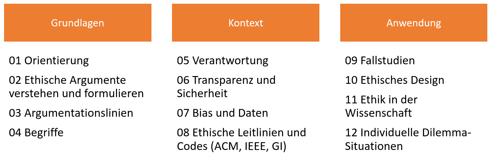
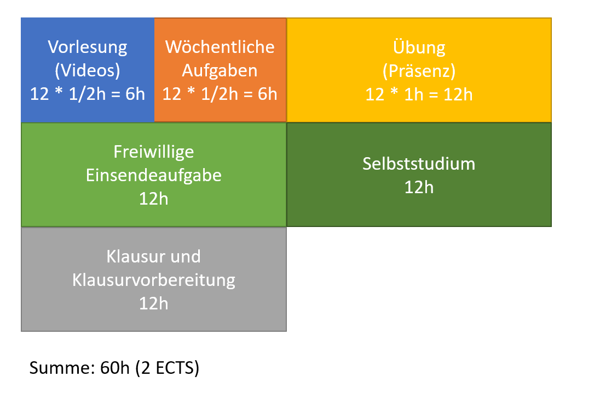

<!--
author:   Gregor Große-Bölting

email:    ggb@informatik.uni-kiel.de

icon:     img/Logo_cau-norm-de-lilagrey-rgb-0720_2022.png

version:  0.1.0

language: de

narrator: Deutsch Female

comment:  Vorlesungsinhalte "Ethik in der Informatik": Eine einführende Veranstaltung in die Ethik für Informatikstudierende.

tags:     Ethik, Informatik, Privatheit, Verantwortung, Forschungsethik, Machine Learning, Daten
\-->

# infEthik-01a: Ethik in der Informatik

Längst haben Informatiksysteme in den unterschiedlichsten Facetten den Alltag erreicht. Sie helfen bei der Navigation auf der Straße oder bei der Verarbeitung immer größer werdender Wissensbestände. Lernende Maschinen entscheiden darüber, ob ein Kredit vergeben oder eine Versicherung abgeschlossen werden kann. Sie optimieren Warenflüsse und Roboter oder Softwaresysteme übernehmen die Arbeit von Menschen in den unterschiedlichsten Bereichen: In gefährlichen, wie als Minensucher oder Feuerwehrfrau, im klassischen Niedriglohnsektor, aber auch im Journalismus oder der Justiz.

Damit kommt Informatiker:innen eine besondere Verantwortung als Entwickler:innen dieser Systeme zu: Sie müssen absehen und bewerten können, welche Personengruppen ein von ihnen entwickeltes System betrifft und was mögliche Folgen sind. Der damit verbundene Diskurs erfolgt im Anschluss an das philosophische Arbeitsfeld der Ethik, so dass als besondere Erschwernis für Informatiker:innen der solide Umgang mit Begriffen und Praktiken aus einem anderen Fach zu erlernen ist.

**Lerninhalte**

* Einführung in das Thema und Verhältnis zu bzw. Verortung in anderen Bereichsethiken
* Grundsätzliche Positionen in der Ethik und wichtige Begriffe
* Ziele und Techniken ethischer Argumentation
* Ethische Fragestellungen in der Informatik: Verantwortung, Transparenz, Sicherheit und Verzerrungen
* Standesethik und ethische Richtlinien
* Fallstudien und Anwendungsbereiche
* Ethisches Design von Anwendungen
* Umgang mit (individuellen) Dilemma-Situationen
* Ethik in der Wissenschaft

## Allgemeines

Die zwölf Themen der Vorlesung teilen sich in drei große Bereiche auf: Grundlagen, Kontext und Anwendung.

Im Grundlagenbereich werden Sie mit wichtigen Voraussetzungen der ethischen Argumentation vertraut gemacht. Es wird das "richtige" Argumentieren ebenso thematisiert, wie verschiedene Argumentationsschemata. Sie werden wichtige Argumentationslinien kennen lernen und anhand der Methode des Gedankenexperiments ausprobieren. Außerdem werden fundamentale Begriffe der Ethik diskutiert und die Frage in den Blick genommen, was Begriffe überhaupt sind und warum sie für die ethische Argumentation gleichermaßen schwierig wie notwendig sind.

Der Kontextbereich stellt den Bezug zwischen den ethischen Grundlagen und der Informatik anhand zentraler Begriffe her: Verantwortung, Transparenz, Sicherheit und Privatheit werden den Kern von allein zwei Vorlesungen bilden. Daneben wird das wichtige Thema diskutiert, was Daten und die Verarbeitung von Daten - beispielsweise im Bereich des Machine Learning - ethisch problematisch werden lässt. Den Abschluss dieses Bereichs bildet die Diskussion von ethischen Rahmenwerken, die gezielt für den Einsatz in informatischen Kontexten entwickelt wurden: Den ethischen Leitlinien der GI und Codes of Conduct, wie sie häufig von Open Source-Projekten verwendet werden.

Der Anwendungsbereich zeigt dann auf, welche Rolle ethische Entscheidungen in wirtschaftlichen und akademischen Projekten spielen. Dabei wird thematisiert, wie man Projekte in dem jeweiligen Umfeld unter ethischen Gesichtspunkten entwerfen kann und welche Fallstricke es dabei möglicherweise gibt. Außerdem wird darauf eingegangen, wie man mit individuellen Dilemmasituationen umgehen kann: Was tut man bspw., wenn der Arbeitgeber etwas eindeutig unethisches von einem verlangt? Wie kann mit so einer Situation umgegangen werden?

**Zeitplanung**

Das Modul *Ethik in der Informatik* ist in den jeweiligen Studienordnungen mit 2 ECTS verbucht, was einem Workload von etwa 60 Stunden entspricht. Diese 60 Stunden verteilen sich in der Veranstaltung jeweils wie folgt auf die einzelnen Bestandteile:

Bitte berücksichtigen Sie die jeweiligen Zeiten in Ihrem Wochenplan für Ihr Semester.

**Veranstaltungsorganisation**

Die Vorlesungsinhalte werden als Videos zur Verfügung gestellt, jede Woche etwa 20 bis 30 Minuten. Die Übung arbeitet die Inhalte der Vorlesung auf und vertieft sie; teilweise werden auch in der Übung Inhalte eingeführt. Die Teilnahme an den Übungen ist freiwillig, wird aber dringend empfohlen. Bitte beachten Sie, dass die Übungssitzungen jeweils eine Zeitstunde in Anspruch nehmen.

Die Vorbereitungsaufgabe und Vorlesungen sollten zur jeweiligen Woche, die im Moodle angegeben ist, vorbereitet werden. Weitere Hinweise entnehmen Sie bitte den umfangreichen Informationen im Moodle.

**Technische Hinweise:**

* Aktuell ist noch ein Login im Mediaportal der CAU für die Ansicht der Videos notwendig. Das wird (nach einer weiteren Überarbeitung der Videos) im Laufe des Semester nicht mehr notwendig sein.
* Wenn die Videos bei der Wiedergabe knistern, verwenden Sie bitte einen anderen Browser!
* Die Videos lassen sich auch beschleunigt wiedergeben…

### Wie sie erfolgreich an dieser Veranstaltung teilnehmen

* Nehmen Sie regelmäßig an der Übung teil!
* Bringen Sie bitte nach Möglichkeit einen Laptop o. ä. mit, da wir in den Übungen immer wieder Onlinetools zur gemeinsamen Arbeit verwenden werden.
* Erledigen Sie die wöchentlichen Vorbereitungsaufgaben: Planen Sie dafür jeweils eine halbe Stunde Bearbeitungszeit ein.
* Beteiligen Sie sich und stellen Sie Fragen.
* Nutzen Sie die Zeit des Selbststudiums um mit den Quiz-Aufgaben Ihr Wissen zu überprüfen oder verfolgen Sie Themen, die Sie Interessieren in den Quellen und der vertiefenden Literatur zu jedem Thema weiter.
* Setzen Sie sich frühzeitig mit den Einsendeaufgaben auseinander. Wenn Sie nicht viel (akademische) Schreiberfahrung haben, dann nehmen Sie unsere vielfältigen Hilfsangebote (Sprechstunden, Hinweise weiter unten, Vorbereitungsaufgaben) in Anspruch.

### Status dieses Dokuments

Dieses Dokument, sowie die damit verbundenen Materialien, befinden sich derzeit noch in aktiver Entwicklung. Während die Inhalte größtenteils gesetzt und vollständig behandelt sind, kann sich an der Form der Präsentation im Laufe des Semesters noch einiges ändern. Dies betrifft insbesondere die folgenden "Baustellen":

* Alle Videos werden im Laufe des Semesters überarbeitet. Nach der Überarbeitung ist für das jeweilige Video kein Login für das Mediaportal der CAU mehr notwendig.
* Alle Videos werden mit Untertiteln ausgestattet.
* Quizze: Die Quiz-Formulierungen werden im Laufe des Semesters durchgesehen; es werden weitere Quiz-Fragen ergänzt (insbesondere für den letzten Teil der Vorlesung, wo derzeit noch gar keine Quizze vorhanden sind).
* Die Literaturangaben werden durchgesehen, erweitert und voraussichtlich in einem anderen Format angegeben. Die Literatur wird außerdem als bibtex-Datei zur Verfügung gestellt.
* Die Seiten mit den jeweiligen Obterthemen (bspw. "03 Argumentationslinien") sind derzeit noch größtenteils leer. Dort sollen Bilder und kurze Texte das jeweilige Vorlesungsthema vorstellen.

### Schreibaufgaben

Dieses Modul verlangt von Ihnen als Prüfungsleistung eine ethische Analyse, als Prüfungsvorleistung eine schriftliche Ausarbeitung in Form einer Einsendeaufgabe. Beides muss den Ansprüchen genügen, die an wissenschaftliche Texte gelegt werden: Überzeugende Argumentation, korrekte Formalia, vertrauenswürdiger Umgang mit Quellen.

Uns ist bewusst, dass es für viele von Ihnen das erste Mal ist, dass Sie in Ihrem Studium einen längeren Text verfassen müssen, an den solche Ansprüche gestellt werden. Daher haben wir verschiedene Hilfsmittel vorbereitet und versuchen, Sie in dem Prozess zu unterstützen (s. Erläuterungen unten).

Besonders wichtig dabei ist, dass wir versucht haben, Vorbereitungs- und Einsendeaufgaben dergestalt zu entwickeln, dass sie aufeinander aufbauen und die für das wissenschaftliche Schreiben notwendigen Kompetenzen iterativ vermittelt werden. Das heißt, wenn Sie sich mit allen Vorbereitungs- und Einsendeaufgaben in dem vorgesehenen Maß auseinandersetzen, sollten Sie nicht nur eine gute Vorbereitung auf die Prüfungsleistung in dieser Veranstaltung haben, sondern Ihre Schreibfertigkeiten insgesamt ausbauen.

**Einsendeaufgaben**

Die Einsendeaufgaben sind längere schriftliche Ausarbeitungen von zwei bis drei Seiten, die Ihnen die detailliertere Auseinandersetzung mit einem Thema oder Abschnitt der Vorlesung erlauben. Das Bestehen einer dieser Aufgaben ist zudem notwendige Voraussetzung (zusammen mit dem Bestehen eines mdl. Testats) zum Erwerb der Prüfungsvorleistung.

Um Ihnen die Anfertigung der Einsendeaufgaben zu erleichtern, gibt es im Weiteren detaillierte Informationen zu den Formalia, sowie bei den jeweiligen Aufgaben die Kriterien, die Sie erfüllen müssen, damit Ihre Einsendung als *sinnvoll bearbeitet* bewertet wird. Außerdem findet jeweils etwa eine Woche vor dem Abgabetermin einer Einsendeaufgabe eine öffentliche Sprechstunde bzw. ein Tutorial statt, in dem Ihnen erklärt wird, wie Sie die Aufgabe am besten angehen. Im Rahmen dieser Sprechstunde ist es Ihnen möglich, individuelle Fragen zu klären.

Jeder Einsendeaufgabe ist eine unterschriebene Eigenständigkeitserklärung (s. Vorlage weiter unten) beizulegen, die bestätigt, dass alle Quellen und zusätzlichen Hilfsmittel in der Einsendung korrekt ausgewiesen wurden. Fehlt die Erklärung oder die Unterschrift unter der Erklärung, wird die Einsendung grundsätzlich als *nicht sinnvoll bearbeitet* bewertet. Achten Sie also unbedingt darauf!

**Vorbereitungsaufgaben**

Die Vorbereitungsaufgaben sind kurze Aufgaben, die Ihnen die Auseinandersetzung mit dem Stoff einer Vorlesung ermöglichen und der Vorbereitung der Übungen dienen. In der Regel werden die Ergebnisse der Vorbereitungsaufgaben in der jeweiligen Übungssitzung thematisiert, was natürlich nur gut funktioniert, wenn die Aufgaben erledigt wurden.

Die Aufgaben sollten in etwa 30 Minuten bearbeitet werden und bearbeitbar sein. Am besten planen Sie sich einen festen Termin in der Woche, um die Aufgaben zu erledigen: Stellen Sie sich zu dem Termin einen Timer und arbeiten Sie 30 Minuten konzentriert an der gegebenen Aufgabenstellung. Wenn Sie nicht fertig werden, dann ist das nicht schlimm: In der Regel reichen bereits Teilergebnisse für eine vertiefte Auseinandersetzung und als Beitrag für eine spannende Übungssitzung.

#### Formalia

Bitte geben Sie auf der ersten Seite Ihren vollen Namen, Matrikelnummer und (für die Abschlussprüfung) die von Ihnen gewählte Aufgabe an. Verwenden Sie am besten [diese Vorlage](https://cloud.rz.uni-kiel.de/index.php/s/jnECr3q3GP5T64j).

**Weitere Formalia**

* Textausrichtung Blocksatz
* Silbentrennung aktiviert
* Seitenrand links/rechts 3cm, oben/unten 2,5 cm
* Fließtext: 12 pt. Times New Roman (oder vergleichbare Serifenschrift), Zeilenabstand eineinhalbfach
* Fußnoten: 10 pt. Times New Roman (oder vergleichbare Serifenschrift), Zeilenabstand einfach
* Seitenzählung arabisch, die Nummerierung der Seiten beginnt nach dem Deckblatt

Legen Sie jeder Abgabe (Einsendeaufgaben, Prüfung) eine unterschriebene Eigenständigkeitserklärung (Vorlage s. u.) bei. Die Eigenständigkeitserklärung zählt nicht zur Gesamtlänge. Ohne unterschriebene Eigenständigkeitserklärung wird Ihre Abgabe als nicht sinnvoll bearbeitet bzw. nicht bestanden bewertet.

 

**Vorlage: Eigenständigkeitserklärung**

 

**Name, Vorname:** \________________________________________________________________________\_

 

**Matrikelnummer:** \_______________________________________________________________________\_

Hiermit versichere ich, dass ich die Abschlussarbeit im Modul "Ethik in der Informatik" selbständig verfasst und keine anderen als die angegebenen Quellen und Hilfsmittel benutzt habe. Ich habe alle Passagen, die ich aus gedruckten Schriften oder digital verfügbaren Dokumenten übernommenen habe, gekennzeichnet und korrekt zitiert. Ferner versichere ich, dass ich die vorliegende Arbeit in keinem anderen Prüfungsverfahren eingereicht habe.

<Ihre Unterschrift>

#### Richtiges Zitieren von Forschungsliteratur

Wir haben Ihnen hier umfangreiche [Hinweise für das Zitieren von Forschungsliteratur](https://cloud.rz.uni-kiel.de/index.php/s/BNA5SG8bzmg2XjX) zusammengestellt.

#### ChatGPT und ähnliche Software zur Unterstützung des Schreibens

**Frage:** Darf ich ChatGPT oder [andere LLMs](https://en.wikipedia.org/wiki/Large_language_model) für die Beantwortung der Einsendeaufgaben und Prüfungsleistung in infEthik-01a verwenden?

**Antwort:** Prinzipiell ja, dabei gelten jedoch zwei wichtige Einschränkungen bzw. Voraussetzungen:

1. Der Umfang, in dem Sie ChatGPT verwenden, darf keinen Zweifel daran aufkommen lassen, dass es sich weiterhin um eine eigene, wissenschaftliche Leistung *von Ihnen* handelt. Wann besteht dieser Zweifel? Wenn Sie sich diese Frage stellen, ist das ein guter Hinweis darauf, dass Sie möglicherweise bereits die Linie überschritten haben. Wenn Sie unsicher sind, sollten Sie das Gespräch mit den Übungsleitungen suchen.
2. Die Verwendung von ChatGPT und ähnlicher Software ist ein Hilfsmittel. Hilfsmittel müssen – ähnlich wie verwendete Literatur – im Anhang Ihrer Arbeit angegeben werden. Dabei sollten Sie das verwendete Hilfsmittel, den Umfang der Verwendung (wie viel und welcher Text wurde übernommen) und die verwendeten Prompts angeben.

In der Eigenständigkeitserklärung sichern Sie zu, dass Sie alle Hilfsmittel angegeben haben. Sollten Sie entsprechend ChatGPT verwenden ohne dies anzugeben, müssen wir das als Täuschungsversuch werten.

In Woche 11 der Vorlesung geht um „Ethik in der Wissenschaft“, dort wird auch das Thema Plagiate behandelt. Eine Verwendung von ChatGPT die nicht den Regeln oben folgt, ist aus den gleichen Gründen ethisch problematisch, die auch für Plagiate (in der Wissenschaft) gelten: Es ist intransparent und verhindert die Nachvollzieh- und Reproduzierbarkeit wissenschaftlicher Ergebnisse; es schadet damit nicht nur der wissenschaftlichen Methode, sondern auch dem Ansehen der Wissenschaft überhaupt.

#### Der "letzte Check" vor der Abgabe

Bevor Sie Ihre Einsendeaufgabe oder Prüfungsleistung einreichen, können Sie sich anhand der folgenden Fragen vergewissern, ob Ihre Abgabe den wichtigsten (formalen) Anforderungen entspricht.

**Formulierungen:**

* Habe ich zweideutige oder undeutliche Formulierungen benutzt? Versteht der Leser auf Anhieb, was ich sagen will? Hilfreich kann es sein, den Text von Außenstehenden lesen zu lassen.
* Habe ich lange, verschachtelte Sätze benutzt? Wo kann ich vielleicht lieber einen Punkt setzen?
* Habe ich Umgangssprache benutzt? Wirkt meine Wortwahl seriös und informiert (Fachbegriffe)?
* Habe ich ein Rechtschreibprogramm benutzt? Habe ich die Regeln der Kommasetzung richtig angewendet? Habe ich das/dass richtig unterschieden?

**Argumentation:**

* Wird bei jedem Absatz deutlich, welches Argument er enthält und was dieses Argument für meine Ursprungsfrage bedeutet? Jeder Absatz/Satz des Textes soll eine Funktion für die Argumentation haben. Stelle möglichst immer einen Rückbezug zur Ausgangsfrage her. Vermeide Abschweifungen und konzentriere dich auf die wichtigsten Informationen.
* Habe ich für jede These eine Begründung und ein Beispiel angeführt? (Aktuelle) Beispiele machen die Argumentation überzeugender.
* Habe ich unbegründet wertende Aussagen vermieden? Habe ich Behauptungen, Übertreibungen oder unbegründete Vermutungen/Unterstellungen vermieden? Halte deinen Stil neutral, halte die Maßstäbe der Richtigkeit und Wahrheit ein! Ein Designdokument/Impact Statement soll keine Werbung für die Anwendung machen und auch keine unwahrscheinlichen Szenarien behandeln. Wenn du etwas nicht sicher abschätzen kannst, verwende immer den Konjunktiv.
* Wird im Schluss mein stärkstes Argument aufgegriffen? Im Schluss sollten keine neuen Aspekte oder Argumente genannt werden, die nicht in der Argumentation erläutert wurden.

**Sekundärliteratur:**

* Habe ich Sekundärliteratur richtig gekennzeichnet? (Regeln im Moodle)
* Ist mein Einsatz von Sekundärliteratur wirklich notwendig oder handelt es sich um Allgemeinwissen/gesunden Menschenverstand?

**Layout:**

* Habe ich Absätze sparsam eingesetzt? Es sollte nicht hinter jedem Satz ein Zeilenumbruch gemacht werden. Zu viele Absätze behindern den Lesefluss.
* Habe ich Zwischenüberschriften verwendet? (Nummerierte) Zwischenüberschriften sorgen für eine bessere Leserführung.

### Ethik in der Informatik in der Popkultur

Falls Sie weitere Vorschläge haben, dann schreiben Sie diese gerne in den [Wetalk-Channel](https://elearn.informatik.uni-kiel.de/mod/url/view.php?id=4154); die Liste wird nach und nach ergänzt. Voraussetzung für die Aufnahme in die Liste ist ein klarer Bezug zur Informatik auf der einen und ethischen bzw. gesellschaftlichen Problemstellungen auf der anderen Seite.

**In Filmen...**

* [Ex Machina](https://www.imdb.com/title/tt0470752/)
* [Her](https://www.imdb.com/title/tt1798709/)
* [Ghost in the Shell](https://www.imdb.com/title/tt0113568/)
* [Blade Runner](https://www.imdb.com/title/tt0083658/) und [Blade Runner 2049](https://www.imdb.com/title/tt1856101/)

**In Serien...**

* [Black Mirror](https://www.imdb.com/title/tt2085059/)
* [Westworld](https://www.imdb.com/title/tt0475784/)

**In Dokumentationen...**

* [Das Dilemma mit den Sozialen Medien](https://de.wikipedia.org/wiki/Klara_und_die_Sonne)(Netflix)
* [Coded Bias](https://de.wikipedia.org/wiki/Klara_und_die_Sonne)(Netflix)
* <iframe width="640" height="360" src="https://www.youtube.com/embed/jZjmlJPJgug" title="Facial Recognition: Last Week Tonight with John Oliver (HBO)" frameborder="0" allow="accelerometer; autoplay; clipboard-write; encrypted-media; gyroscope; picture-in-picture" allowfullscreen></iframe>
* <iframe width="640" height="360" src="https://www.youtube.com/embed/F8aegvTVy5g" title="Die Schwachstelle von KI – wir Menschen  | ZDF Magazin Royale" frameborder="0" allow="accelerometer; autoplay; clipboard-write; encrypted-media; gyroscope; picture-in-picture" allowfullscreen></iframe>

**In Büchern (inkl. Graphic Novels und Comics)...**

* [Träumen Androiden von elektrischen Schafen?](https://de.wikipedia.org/wiki/Tr%C3%A4umen_Androiden_von_elektrischen_Schafen%3F) (Romanvorlage von Blade Runner, s. o.)
* [Ghost in the Shell](https://de.wikipedia.org/wiki/Ghost_in_the_Shell) (Manga, Vorlage für den gleichnamigen Film, s. o.)
* [Klara und die Sonne](https://de.wikipedia.org/wiki/Klara_und_die_Sonne)

**In Musik...**

* [Twitter Thread](https://twitter.com/alxndrt/status/1450739426515111936) mit diversen Musikempfehlungen

### Vertiefende Literatur

Eine umfangreiche Literaturliste wird zu Beginn der Veranstaltung zur Verfügung gestellt. Zur Einführung eignen sich die folgenden Artikel/Bücher:

* J. Sullins: [Information Technology and Moral Values](https://plato.stanford.edu/entries/it-moral-values/), In: The Stanford Encyclopedia of Philosophy (Spring 2021 Edition)
* M. Noorman: [Computing and Moral Responsibility](https://plato.stanford.edu/entries/computing-responsibility/), In: The Stanford Encyclopedia of Philosophy (Spring 2020 Edition)
* P. Grimm, Tobias Keber, Oliver Zöllner: Digitale Ethik. Reclam. Stuttgart, 2019
* S. Vallor: Technology and the Virtues. Oxford University Press. Oxford, 2018
* R. Elliott Smith: Rage Inside the Machine. Bloomsbury Business. London, 2019
* K. Crawford: Atlas of AI. New Haven/London: Yale University Press, 2021.
* C. D'Ignazio, Lauren F. Klein: Data Feminism. Cambridge/London: MIT Press, 2020.
* B.-Ch. Han, Infokratie. Digitalisierung und die Krise der Demokratie. Berlin: Matthes & Seitz, 2021.
* E. Pariser, Filter Bubble. Wie wir im Internet entmündigt werden. München: Carl Hanser, 2012.
* P. Schaar, Das digitale Wir. Unser Weg in die transparente Gesellschaft. Hamburg: Körber-Stiftung, 2015.

Weitere Hinweise finden Sie bei den einzelnen Themen der Veranstaltung. Diese Liste wird nach und nach erweitert.

## 01 Orientierung

### 01-01 Philosophisches Staunen, Epoché (Urteilsenthaltung)

<iframe title="01-01 Philosophisches Staunen und Epoché" width="900" height="600" frameborder="0" scrolling="auto" marginheight="0" marginwidth="0" src="https://videoportal.rz.uni-kiel.de/Mediasite/Play/cc36e102533448da8d5bd18e527ce86b1d" allowfullscreen msallowfullscreen allow="fullscreen"></iframe>

[Folien: Philosophisches Staunen und Epoché](https://cloud.rz.uni-kiel.de/index.php/s/EWbfr4Ro3wDrsgS)

---

                           {{1}}
**Quiz**

Welche der folgenden Aspekte sind nicht Teil der Epoché (Urteilsenthaltung)?

          [[ ]] Alle Perspektiven eines Problems unvoreingenommen offen legen
          [[ ]] Meinungen und Gefühle zum Thema zurückhalten und rein faktenbasiert urteilen
          [[x]] Erst ein Urteil bilden und dieses später hinterfragen
          [[ ]] Empathie für andere Positionen haben/entwickeln
          [[ ]] Nicht urteilen, solange man kein klares Bild aller Umstände entwickelt hat

---

                          {{2}}
**Quellen und vertiefende Literatur**

* Aßmann, Lothar, Reiner Bergmann, Roland W. Henke, Matthias Schulze, and Eva-Maria Sewing. 2020. Zugänge zur Philosophie. Einführungsphase. Cornelsen Schulverlage.
* Engstler, Achim. 1995. [“Urteilsenthaltung und Glück. Eine Verteidigung ethisch motivierter Skepsis.”](http://www.jstor.org/stable/20483706) Zeitschrift für philosophische Forschung. Vittorio Klostermann GmbH.
* Vogt, Katja. 2021. [“Ancient Skepticism.”](https://plato.stanford.edu/archives/sum2021/entries/skepticism-ancient/) In The Stanford Encyclopedia of Philosophy, edited by Edward N. Zalta, Summer 2021. Metaphysics Research Lab, Stanford University.
* Morison, Benjamin. 2019. [“Sextus Empiricus.”](Https://plato.stanford.edu/archives/fall2019/entries/sextus-empiricus/) In The Stanford Encyclopedia of Philosophy, edited by Edward N. Zalta, Fall 2019. Metaphysics Research Lab, Stanford University.
* Bett, Richard. 2018. [“Pyrrho.”](Https://plato.stanford.edu/archives/win2018/entries/pyrrho/) In The Stanford Encyclopedia of Philosophy, edited by Edward N. Zalta, Winter 2018. Metaphysics Research Lab, Stanford University.

### 01-02 Was ist Ethik?

<iframe title="01-02 Was ist Ethik?" width="900" height="600" frameborder="0" scrolling="auto" marginheight="0" marginwidth="0" src="https://videoportal.rz.uni-kiel.de/Mediasite/Play/7d285c476fac49a99150db38703106001d" allowfullscreen msallowfullscreen allow="fullscreen"></iframe>

[Folien: Was ist Ethik?](https://cloud.rz.uni-kiel.de/index.php/s/Z5J7AoSQe6Gs8FW)

---

                           {{1}}
**Quiz**

Entscheiden Sie, um was für eine Art der Fragestellung es sich bei den folgenden Fragen handelt (Moral, Ethik, Metaethik):

Welche Schlüsse kann ich aus der Auswertung von Benutzerdaten schließen, sodass diese weiter „natürlich“ und wertfrei bleiben?

[[Ethik]]

Sollte ich meine Benutzerdaten an die Hersteller des Programms weitergeben?

[[Moral]]

Wie kann die „Natürlichkeit“ und Wertfreiheit von genommenen Daten bewertet werden?

[[Metaethik]]

## 02 Argumentation

### Vorbereitungsaufgabe

In dieser Woche beschäftigen wir uns mit dem Lesen und Verfassen von Argumentationen, einem Thema, dass uns die gesamte Veranstaltung über beschäftigen wird. Gut zu argumentieren ist zudem Voraussetzung für das Bestehen der Prüfungsleistung.

Die folgenden beiden Aufgaben bereiten die Übung und zudem die erste Einsendeaufgabe vor: Die Ergebnisse, wie auch die Ergebnisse der Übungsdiskussion können Sie gerne für die Bearbeitung der EA verwenden.

Lesen Sie dazu bitte zunächst den folgenden Text: [Moshe Y. Vardi: Are We Having An Ethics Crisis in Computing?](https://dl.acm.org/doi/10.1145/3292822)

Beantworten Sie außerdem die beiden Fragen:

1. Welche Argumente benennt der Text, um seine Position zu belegen? Versuchen Sie, die Argumente in eigenen Worten, in Stichpunkten oder als Fließtext aufzuschreiben.
2. Wie haben Sie den Text gelesen, um sich dessen Sinn (argumentative Struktur etc.) zu erschließen? Verfassen Sie eine kurze Beschreibung Ihres Vorgehens.

### 02-01 Ethische Texte lesen

<iframe title="02-01 Ethische Texte lesen" width="900" height="600" frameborder="0" scrolling="auto" marginheight="0" marginwidth="0" src="https://videoportal.rz.uni-kiel.de/Mediasite/Play/f31256f86952408a87034f5f34c3eb3f1d" allowfullscreen msallowfullscreen allow="fullscreen"></iframe>

[Folien: Ethische Texte lesen](https://cloud.rz.uni-kiel.de/index.php/s/FMxstx488j73N2B)

---

                           {{1}}
**Quiz**

Welche der folgenden Fragen sind für den ersten Zugang zu einem Text relevant?

          [[X]] Wer ist der Autor des Textes?
          [[X]] Bezieht sich der Text auf Aktuelles oder Vergangenes?
          [[X]] In welchem Land wurde der Text veröffentlicht?
          [[ ]] Wie fühle ich mich beim Lesen des Textes?
          [[X]] Welches Fazit kann man aus dem Text ziehen?
          [[ ]] Wie lang ist der Text?
          [[ ]] Welche Wörter nutzt der Autor besonders häufig?
          [[X]] Wann ist der Text erschienen?
          [[X]] Was ist das (Haupt-)Thema des Textes?

### 02-02 Argumente analysieren

<iframe title="02-02 Argumente analysieren" width="900" height="600" frameborder="0" scrolling="auto" marginheight="0" marginwidth="0" src="https://videoportal.rz.uni-kiel.de/Mediasite/Play/7b5c8640074e4a1a9e4f3e18ea085a041d" allowfullscreen msallowfullscreen allow="fullscreen"></iframe>

[Folien: Argumente analysieren](https://cloud.rz.uni-kiel.de/index.php/s/o7NZAzZpoDdmdFY)

---

                           {{1}}
**Quiz**

Ordnen Sie den folgenden Argumenten zu, ob es sich um normative, indirekte, Fakten, ad populum oder ad hominem Argumente handelt.

1. Die Verwendung von Smartphones als Hilfsmittel spielt in unserem privaten Leben eine immer größer werdende Rolle, weshalb sie auch im Unterricht als Hilfsmittel erlaubt werden sollten.

   [( )] normatives Argument
   [(X)] indirektes Argument
   [( )] Faktenargument
   [( )] Argument ad populum
   [( )] Argument ad hominem

2. Wir sollten Person X nicht vertrauen, sie hat uns schon mehrfach angelogen.

   [( )] normatives Argument
   [( )] indirektes Argument
   [( )] Faktenargument
   [( )] Argument ad populum
   [(X)] Argument ad hominem

3. Abschreiben sollte mit einer schlechten Note bestraft werden, weil man für seine Taten einstehen soll.

   [(X)] normatives Argument
   [( )] indirektes Argument
   [( )] Faktenargument
   [( )] Argument ad populum
   [( )] Argument ad hominem

4. Marke X ist führend in Europa, also solltest du ihre Produkte kaufen.

   [( )] normatives Argument
   [( )] indirektes Argument
   [( )] Faktenargument
   [(X)] Argument ad populum
   [( )] Argument ad hominem

5. Bei 90 Prozent der 2.000 Versuchspersonen traten unmittelbar nach Verzehr des Produktes Atembeschwerden, Hautreizungen und akute Kopfschmerzen auf. Deshalb hätte es erst gar nicht verkauft werden dürfen.

   [( )] normatives Argument
   [( )] indirektes Argument
   [(X)] Faktenargument
   [( )] Argument ad populum
   [( )] Argument ad hominem

Welche der genannten Argumente würden sie als seriös einschätzen?

   [[X]] 1.
   [[ ]] 2.
   [[X]] 3.
   [[ ]] 4.
   [[X]] 5.

### 02-03 Logisches Schließen

<iframe title="02-03 Schließen" width="900" height="600" frameborder="0" scrolling="auto" marginheight="0" marginwidth="0" src="https://videoportal.rz.uni-kiel.de/Mediasite/Play/e2acc27e830745d482ef8690d0b95ad91d" allowfullscreen msallowfullscreen allow="fullscreen"></iframe>

[Folien: Logisches Schließen](https://cloud.rz.uni-kiel.de/index.php/s/j9ydjNtktzN4m2G)

---

                           {{1}}
**Quiz**

Liegt im folgenden Fall ein naturalistischer Fehlschluss vor?

Das Klonen von Tieren ist technisch möglich. Die Natur klont alle Tage. Das heißt das Klonen von Tieren ist moralisch in Ordnung.

   [(X)] Ja
   [( )] Nein

Wir wollen die Zahl der Verkehrsunfälle verringern. Durch ein Verbot von Handys ohne Freisprecheinrichtung geht die Anzahl der Unfälle um x % zurück. Also sollte man ein 	Verbot von Handys ohne Freisprecheinrichtung beim Fahren einführen.

   [( )] Ja
   [(X)] Nein

### 02-04 Texte verfassen

<iframe title="02-04 Texte verfassen" width="900" height="600" frameborder="0" scrolling="auto" marginheight="0" marginwidth="0" src="https://videoportal.rz.uni-kiel.de/Mediasite/Play/778cd2e99d9e4bfebcd4a348485b98a21d" allowfullscreen msallowfullscreen allow="fullscreen"></iframe>

[Folien: Texte verfassen](https://cloud.rz.uni-kiel.de/index.php/s/oZ5b747DNi5QsK4)

---

                           {{1}}
**Quiz**

Welche der folgenden Vorteile bietet das Rogerian Argument gegenüber anderen Argumentationsstrukturen?

   [[X]] Es hilft die eigene Position zu reflektieren.
   [[ ]] Es ist leichter die Gegenseite immer wieder falsch dazustellen.
   [[X]] Konsensorientierung hilft verschiedene Positionen anzunähern.
   [[ ]] Es ist besonders geeignet für kürzere Meinungsbeiträge.
   [[X]] Es erleichtert das Einnahmen der Gegenposition durch vorherige Annäherung.

### Quellen und vertiefende Literatur

* Kruse, Otto. 2017. Argumentieren, begründen und reflektieren. In: Ders. ["Kritisches Denken und Argumentieren."](https://katalog.ub.uni-kiel.de/DB=1/XMLPRS=N/PPN?PPN=881421464) UTB.
* Ahrens, S. 2017. Das Zettelkasten-Prinzip: Erfolgreich wissenschaftlich Schreiben und Studieren mit effektiven Notizen. Books on Demand.
* Aßmann, Lothar, Reiner Bergmann, Roland W. Henke, Matthias Schulze, and Eva-Maria Sewing. 2020. Zugänge zur Philosophie. Einführungsphase. 1. Cornelsen Schulverlage.
* Dutilh Novaes, Catarina. 2021. [“Argument and Argumentation.”](Https://plato.stanford.edu/archives/fall2021/entries/argument/) In The Stanford Encyclopedia of Philosophy, edited by Edward N. Zalta, Fall 2021. Metaphysics Research Lab, Stanford University.
* Pfeifer, V. 2009. Ethisch argumentieren: eine Anleitung anhand von aktuellen Fallanalysen. Ethisch argumentieren / Eine Anleitung anhand von aktuellen Fallanalysen. Schöningh.
* Smith, Robin. 2020. [“Aristotle’s Logic.”](Https://plato.stanford.edu/archives/fall2020/entries/aristotle-logic/) In The Stanford Encyclopedia of Philosophy, edited by Edward N. Zalta, Fall 2020. Metaphysics Research Lab, Stanford University.
* T. Edward Damer. 2008. Attacking Faulty Reasoning: A Practical Guide to Fallacy-Free Arguments. Wadsworth/Cengage Laerning.
* Weitere prakt. Tipps gibt es zum Beispiel beim Schreibportal der Uni Leipzig und der Schreibwerkstatt der Uni Kiel (UB).

**Zusätzlicher Hintergrund zum Text von M. Vardi**

* Doctorow, Cory. 2020. How to Destroy ‘Surveillance Capitalism.’ Medium. OneZero. https://onezero.medium.com/how-to-destroy-surveillance-capitalism-8135e6744d59
* Zuboff, Shoshana. 2018. Das Zeitalter des Überwachungskapitalismus. Frankfurt am Main: Campus Verlag.

### Erste Einsendeaufgabe: Gegenargumentation

In der ersten Einsendeaufgabe sollen Sie eine Gegenargumentation zum Text von Moshe Vardi zu verfassen. Dafür ist es erforderlich, sich zunächst mit den Argumenten Vardis vertraut zu machen (Aufgabe 1), um in Anschluss wirkungsvolle Gegenargumente in einem eigenen Text vorzubringen (Aufgabe 2).

Diese Auseinandersetzung mit und die Formulierung eigener Argumente soll Ihr Verständnis für das Formulieren eigener, strukturierter Argumentationen vertiefen und Sie damit auf die Prüfungsleistung vorbereiten.

**Aufgabe 1**

Halten Sie in einer Tabelle (s. [Vorlage](https://cloud.rz.uni-kiel.de/index.php/s/xPqLaekabFGPHqd)) fest:

Welche These bzw. Thesen vertritt Vardi, welche Argumente bringt er für die These bzw. Thesen vor? Welche Argumenttypen benutzt er? Welche Belege und Beispiele liefert er für seine Argumentation? Sind die Beispiele treffend? Bewerten Sie in ein bis zwei Sätzen die Schlüssigkeit und Überzeugungskraft der einzelnen Argumente.

**Aufgabe 2**

Verfassen Sie eine Gegenargumentation zum Text von Moshe Vardi. Achten Sie darauf, dass Ihre Argumente stimmig (d. h. dem in der Vorlesung vorgestellten Aufbau entsprechen) sind und die Gesamtargumentation einem der vorgestellten Schemata folgt (bspw. Rogerian). Ihre Gegenargumentation sollte nicht länger sein als der Text von Vardi und als Fließtext erfolgen.

**Bewertungskriterien**

Diese Aufgabe wird anhand der folgenden Kriterien bewertet:

* Die unter "Allgemeines" angeführten Formalia (Layout, Titelseite etc.) wurden beachtet.
* Die unter "Allgemeines" angeführten Zitationsregeln und bibliographischen Hinweise wurden beachtet.
* Es wurde eine Rechtschreibkorrektur verwendet, d. h. offensichtliche Fehler kommen nicht oder nur in sehr geringem Umfang vor.
* Die Längenvorgabe wurde beachtet.
* Die in der Vorlesung bis zum Thema der Einsendeaufgabe vorgestellten Begriffe wurden berücksichtigt.
* Die in der Einsendeaufgabe verwendeten Begriffe wurden korrekt verwendet.
* Die Einträge in der Tabelle (Aufgabe 1) sind vollständig und korrekt.
* Es wird eines der in der Vorlesung vorgestellten Argumentationsschemata verwendet.
* Die verwendeten Argumente sind in sich stimmig (d. h. sie verwenden den in der Vorlesung vorgestellten Aufbau).

Zum Bestehen müssen Sie mindestens 7 von 9 Kriterien erreichen/nicht verletzen.

**Hinweis:** Unabhängig von den hier genannten Kriterien werden Einsendungen, die nicht oder nicht sinnvoll auf die gestellten Aufgaben eingehen als "nicht sinnvoll bearbeitet" bewertet. Es können nur Texte und Textabschnitte für die Bewertung berücksichtigt werden, die sprachlich verständlich sind.

## 03 Argumentationslinien

### Vorbereitungsaufgabe

[CSV-Datei mit Daten](https://cloud.rz.uni-kiel.de/index.php/s/pX66t2ArMLJqnAt)

**Achtung:** Sollten Sie bisher wenig Programmiererfahrung haben, konzentrieren Sie sich bitte auf Aufgabe 2 und 4. Aufgabe 1 und 3 (die eigentliche Implementierung) sind als optionale Aufgabenteile zu verstehen.

> Willkommen zu Ihrem ersten Arbeitstag beim neuen, wegweisenden Unternehmen für selbstfahrende Autos: Messla. Weil wir bei Messla die Vorreiter in Sachen selbstfahrender Autos sind, müssen wir schneller Innovationen gestalten als alle anderen da draußen. Um unsere Autos bis Ende des Jahres auf die Straße zu bringen, müssen wir den besten Algorithmus finden, um ein Problem zu lösen, das allen unseren "selbstfahrenden" Konkurrenten im Weg steht: Das Trolley-Problem, also die Frage nach der Abwägung zwischen Menschenleben im Fall eines unvermeidlichen Unfalls.

Ihre erste Aufgabe ist es, einen Algorithmus zu entwickeln, der festlegt, wie sich unsere selbstfahrenden Autos im Falle eines unvermeidlichen Zusammenstoßes verhalten sollen. Wir nennen unseren Algorithmus die *Moral Machine*.

Dies wird in 3 Schritten geschehen:

1. Verwenden Sie die Daten, die wir von früheren unvermeidbaren Zusammenstößen haben, um Ihr Modell zu erstellen.
2. Legen Sie die Kriterien fest, nach denen unsere Autos entscheiden sollen, wer getötet und wer gerettet werden soll.
3. Testen Sie Ihr Modell an unseren Daten und sehen Sie, wie gut es funktioniert!

Das sollte doch einfach sein, … oder?

**Teil 1**

Die mitgelieferte CSV-Datei repräsentiert alle Personen, die an einer unvermeidlichen Kollision mit einem unserer autonomen Fahrzeuge beteiligt waren. Sie können diese Datei folgendermaßen interpretieren:

Gerade Zeilen stehen für die demografischen Daten von Fußgäng:innen, der zum Zeitpunkt des Zusammenstoßes gerade die Straße überquert haben. Jede ungerade Zeile steht für die demografischen Daten der Fahrer:innen. Das bedeutet, dass alle zwei Zeilen dieser CSV-Datei einen Unfall darstellen. Bei einigen dieser Unfälle trugen Fahrer:innen die Schuld, bei anderen  Fußgänger:innen: Dies wird in der 5. Spalte eines jeden Eintrags angegeben.

Die Daten sind wie folgt formatiert:

RowNumber, Age, Gender, Country, Fault

* Wobei *RowNumber* die Nummer der Zeile ist; gerade Zahlen sind Fußgänger:innen, ungerade Zahlen  Fahrer:innen
* *Age* ist das Alter
* *Gender* ist das Geschlecht
* *Country* ist das Herkunftsland von Fahrer:innen und Fußgänger:innen
* *Fault* gibt an, wer den Zusammenstoß verschuldet hat

Lesen Sie die Daten mit einer Programmiersprache Ihrer Wahl ein (die Musterlösung wird in Python ausgegeben). Achten Sie darauf, dass die Daten mit korrekten Typen repräsentiert werden (bspw. *Age* als Ganzzahl).

**Teil 2**

Nehmen Sie sich ein paar Minuten Zeit, um darüber nachzudenken, nach welchen Kriterien Sie entscheiden würden, welche der beiden Personen bei jedem Unfall gerettet und welche getötet werden sollte. Schreiben Sie Ihre Gedanken und Kriterien in Stichworten auf. Sie sollten mindestens 4 Kriterien auswählen, die für die Ihnen zur Verfügung stehenden Daten relevant sind. Überlegen Sie, was Ihre Grenzfälle sind, wie würde Ihr Entscheidungsbaum aussehen?

**Teil 3**

Nun, da Sie die Kriterien für Ihren Algorithmus für das Trolley-Problem kennen, ist es an der Zeit, ihn zu programmieren! Erstellen Sie eine Funktion mit zwei Parametern: *pedestrian* und *driver* - die beiden Personen, die an einer bestimmten unvermeidbaren Kollision mit einem selbstfahrenden Auto beteiligt sind. Sowohl *pedestrian*, wie auch *driver* sind jeweils eine Liste mit *Age*, *Gender*, *Country* und *Fault*.

Ihre Funktion soll (basierend auf Ihren Kriterien) als String zurückgeben, wen das Auto retten soll.

Verwenden Sie die Funktion, um Entscheidungen für alle historischen Daten (aus der CSV-Datei) zu treffen.

**Teil 4**

Nachdem Sie nun Ihren eigenen Algorithmus für eine "moralische Maschine" geschrieben haben, nehmen Sie sich einen Moment Zeit, um über den Prozess nachzudenken.

Wie haben Sie sich gefühlt, als Sie die Verantwortung für die Designentscheidungen und die Kriterien zur Auswahl der zu rettenden Personen hatten? Was, glauben Sie, hätten Sie anders oder besser machen können? Was hätten Sie getan, wenn Sie in einem echten Unternehmen für selbstfahrende Autos arbeiten und mit der Entwicklung dieses Algorithmus beauftragt worden wären?

(In Anlehnung an: https://drive.google.com/drive/folders/1EKQNVeSCz8AWNmb2zQ65apfPUKhhG9Sq)

### 03-01 Gedankenexperimente und Dilemmata

<iframe title="03-01 Gedankenexperimente und Dilemmata" width="900" height="600" frameborder="0" scrolling="auto" marginheight="0" marginwidth="0" src="https://videoportal.rz.uni-kiel.de/Mediasite/Play/387a9a9e4a6a40c5a1167d1eb393c7ad1d" allowfullscreen msallowfullscreen allow="fullscreen"></iframe>

[Folien: Gedankenexperimente und Dilemmata](https://cloud.rz.uni-kiel.de/index.php/s/dRRtx4E5sRTSsWG)

---

                        {{1}}
**Quiz**

Welcher der folgenden Teile ist nicht Teil eines Gedankenexperiments?

   [[ ]] Einleitung durch philosophische Fragestellung
   [[ ]] Kontrafaktisches Szenario
   [[X]] Unterscheidung zur realen Situation
   [[ ]] Auswertung des Szenarios in Bezug auf die Fragestellung

Welche der folgenden Aussagen treffen auf ein moralisches Dilemma zu? Kreuzen Sie die richtigen Antworten an!

   [[X]] In einer Dilemmasituation gibt es immer zwei moralisch fragwürdige Möglichkeiten.
   [[X]] Eine Dilemmasituation besteht aus einer moralischen Entscheidung.
   [[X]] Keine einzelne Entscheidung ist moralisch zu 100% richtig.
   [[ ]] Man ist nicht gezwungen eine unmoralische Entscheidung zu treffen.
   [[ ]] Bei einem Dilemma geht es darum sich zwischen zwei angenehmen Optionen zu entscheiden.
   [[ ]] Bei einem Dilemma gibt es immer eine richtige Lösung.

---

                           {{2}}
**Quellen und vertiefende Literatur**

Gedankenexperimente:

* Aßmann, Lothar, Reiner Bergmann, Roland W. Henke, Matthias Schulze, and Eva-Maria Sewing. 2020. Zugänge zur Philosophie. Einführungsphase. 1. Cornelsen Schulverlage.
* Bertram, G.W., ed. 2016. Philosophische Gedankenexperimente: ein Lese- und Studienbuch. Reclam-Taschenbuch. Reclam.
* McConnell, Terrance. 2018. [“Moral Dilemmas.”](Https://plato.stanford.edu/archives/fall2018/entries/moral-dilemmas/) In The Stanford Encyclopedia of Philosophy, edited by Edward N. Zalta, Fall 2018. Metaphysics Research Lab, Stanford University.

Trolley-Dilemma:

* Awad, Edmond, Sohan Dsouza, Jean-François Bonnefon, Azim Shariff, and Iyad Rahwan. 2020. [“Crowdsourcing moral machines.”](https://dl.acm.org/doi/abs/10.1145/3339904) Communications of the ACM.
* Jaques, Abby Everett. 2019. “Why the moral machine is a monster.” University of Miami School of Law.
* Loh, Janina. 2019. Roboterethik: Eine Einführung. Originalausgabe. Frankfurt am Main: Suhrkamp Verlag.
* Wilde, Edda. 2018. “Philosophische Gedankenexperimente.” In , edited by Georg W. Bertram, 263–69. Stuttgart: Philipp Reclam jun Verlag GmbH.
* Absurd Trolley Problems

### 03-02 Moral Machine

Besuchen Sie die [Moral Machine](https://www.moralmachine.net/) und entscheiden Sie, wie ein selbstfahrendes Auto agieren sollte; versuchen Sie das in Zusammenhang mit 03-01 (Gedankenexperimente und Dilemmata) und 03-03 (Argumentationslinien) zu bringen.

### 03-03 Ethische Argumentationslinien

<iframe title="03-03 Ethische Argumentationslinien" width="900" height="600" frameborder="0" scrolling="auto" marginheight="0" marginwidth="0" src="https://videoportal.rz.uni-kiel.de/Mediasite/Play/51005ed3339a47e8b2fbd5635a04d9031d" allowfullscreen msallowfullscreen allow="fullscreen"></iframe>

[Folien: Ethische Argumentationslinien](https://cloud.rz.uni-kiel.de/index.php/s/NjD39jkNzDDWXwM)

Weiterführende Informationen zu den verschiedenen Argumentationslinien bieten die kurzen Übersichtsartikel (mit Video) des [Ethics Centre](https://ethics.org.au):

* [Ethics Explainer: Consequentialism](https://ethics.org.au/ethics-explainer-consequentialism/)
* [Ethics Explainer: Virtue Ethics](https://ethics.org.au/ethics-explainer-virtue-ethics/)
* [Ethics Explainer: Deontology](https://ethics.org.au/ethics-explainer-deontology/)

---

                           {{1}}
**Quiz**

Welcher Argumentationslinie (Utilitarismus, Deontologie und Kontraktualismus) folgen die Akteure in den folgenden Beispielen.

In den Marvelfilmen will Thanos die Hälfte der gesamten Population auslöschen. Er begründet das damit, dass durch die Ressourcenknappheit sonst früher oder später der ganze Planet zugrunde geht.

   [[X]] Utilitarismus
   [[ ]] Deontologie
   [[ ]] Kontraktualismus

In dem Film "Bridge of Spies" vertritt James Donovan als Strafverteidiger Abel, einen russischen Spion, weil auch dieser ein verfassungsmäßiges Recht auf einen Anwalt hat.

   [[ ]] Utilitarismus
   [[ ]] Deontologie
   [[X]] Kontraktualismus

---

                           {{2}}
**Quellen und vertiefende Literatur**

* Vallor, Shannon. 2016. Technology and the Virtues: A Philosophical Guide to a Future Worth Wanting. Oxford University Press.
* Aristoteles. 1985. Philosophische Bibliothek, Bd.5, Nikomachische Ethik. 4., durchges. u. erw. Hamburg: Meiner.
* Carugati, Federica. 2020.[“A Council of Citizens Should Regulate Algorithms.”](https://www.wired.com/story/opinion-a-council-of-citizens-should-regulate-algorithms/) Wired.
* Jürgen Habermas. 2009. “Diskursethik (Philosophische Texte).” In , Studienausgabe in fünf Bänden, 3:31–115. Frankfurt am Main: Suhrkamp.
* Noddings, Nel. 1986. Caring: A Feminine Approach to Ethics and Moral Education. University of California Press.
* Norlock, Kathryn. 2019. [“Feminist Ethics.”](Https://plato.stanford.edu/archives/sum2019/entries/feminism-ethics/) . In The Stanford Encyclopedia of Philosophy, edited by Edward N. Zalta, Summer 2019. Metaphysics Research Lab, Stanford University.
* Rawls, John. 1979. Eine Theorie der Gerechtigkeit. Frankfurt am Main: Suhrkamp Verlag.
* Bentham, J. 2007. An Introduction to the Principles of Morals and Legislation. Dover philosophical classics. Dover Publications.
* Hutcheson, F., and W. Leidhold. 1986. Eine Untersuchung über den Ursprung unserer Ideen von Schönheit und Tugend. Über moralisch Gutes und Schlechtes. Philosophische Bibliothek. Felix Meiner Verlag.
* Kant, I., and J. Kopper. 2012. Kritik der praktischen Vernunft: Reclams Universal-Bibliothek. Reclams Universal-Bibliothek. Reclam Verlag.
* Kant, I., and T. Valentiner. 2012. Grundlegung zur Metaphysik der Sitten: Reclams Universal-Bibliothek. Reclams Universal-Bibliothek. Reclam Verlag.
* Mill, J.S., and D. Birnbacher. 2006. Utilitarianism /Der Utilitarismus: Reclams Universal-Bibliothek. Reclam.
* Regenbogen, A., and U. Meyer. 2013. Wörterbuch der philosophischen Begriffe. Philosophische Bibliothek. Meiner, F.
* Sidgwick, H., and M.G. Singer. 2000. Essays on Ethics and Method. British Moral Philosophers. Clarendon Press.

## 04 Begriffe

### Vorbereitungsaufgabe

Ein wichtiger Aspekt guter Argumentation ist der korrekte Gebrauch von Begriffen. Daher betrachten wir in dieser Woche Begriffe näher und welche Schwierigkeiten es im Umgang mit Begriffen gibt. Manchmal kann der unterschiedliche Gebrauch eines Begriffs darüber entscheiden, wie ein Sachverhalt bewertet wird. Das werden wir anhand der sog. Akteurschaft (Agency) von Maschinen bzw. Softwaresystemen ins Auge nehmen.

Ihre Aufgabe: Finden und sammeln Sie Gründe für und gegen die Aussage „Maschinen (d. h. bspw. auch Roboter oder durch Software gesteuerte Agenten) können moralisch handeln.“

Finden Sie Gründe, in dem Sie die Methode des *Seriensprints* verwenden (siehe unten). Führen Sie zwei Seriensprints durch, einen mit dem Satzanfang "Maschinen können moralisch handeln, weil..." und einen mit dem Satzanfang "Maschinen können *nicht* moralisch handeln, weil...".

Priorisieren Sie die Gründe und versuchen Sie eine systematische Darstellungsweise (bspw. als Visualisierung) zu finden.

> **Übung "Seriensprint" - ca 3. Minuten**
>
> Schreiben Sie fünf- bis siebenmal denselben Satzanfang und führen Sie ihn jeweils mit den Worten weiter, die Ihnen spontan zuerst und unzensiert in den Kopf kommen.
>
> Sobald Sie einen Satz fertig haben, setzen Sie wieder neu mit demselben Satzanfang an und führen diesen wiederum fort. Schreiben Sie auf diese Weise so schnell wie möglich, ohne den Stift abzusetzen, ca. drei Minuten lang.
>
> Wenn Sie die Sätze fertiggestellt haben, lesen Sie sie noch einmal durch und markieren die Satzteile oder Wörter, die Ihnen besonders interessant erscheinen.
>
> (U. Scheuermann: Schreibdenken, 2016)

### 04-01 Begriffe und Begriffsdifferenzierungen

<iframe title="04-01 Begriffe und Begriffsdifferenzierung" width="900" height="600" frameborder="0" scrolling="auto" marginheight="0" marginwidth="0" src="https://videoportal.rz.uni-kiel.de/Mediasite/Play/00794395a6484627a40315d6e139bf1c1d" allowfullscreen msallowfullscreen allow="fullscreen"></iframe>

[Folien: Der Begriff des Begriffs und Begriffsdifferenzierungen](https://cloud.rz.uni-kiel.de/index.php/s/MgnjiBnJnLc2y7A)

---

                           {{1}}
**Quiz**

Welche der folgenden Eigenschaften muss ein System erfüllen, um als moralischer Akteur angesehen zu werden?

   [[X]] Interaktivität
   [[ ]] Versatilität
   [[X]] Autonomie
   [[X]] Adaptivität
   [[ ]] Dualität
   [[ ]] Dignität

---

                           {{2}}
**Quellen und vertiefende Literatur**

Der Begriff des Begriffs:

* Thiel, Christian. 1994. “Der klassische und der moderne Begriff des Begriffs.” In Information Systems and [Data](https://elearn.informatik.uni-kiel.de/mod/folder/view.php?id=2476) Analysis, edited by Hans-Hermann Bock, Wolfgang Lenski, and Michael M. Richter, 175–90. Berlin, Heidelberg: Springer Berlin Heidelberg.
* Aßmann, Lothar, Reiner Bergmann, Roland W. Henke, Matthias Schulze, and Eva-Maria Sewing. 2020. Zugänge zur Philosophie. Einführungsphase. 1. Cornelsen Schulverlage.
* Bauer, T. 2018. Die Vereindeutigung der Welt: Über den Verlust an Mehrdeutigkeit und Vielfalt. [Was bedeutet das alles?]. Reclams Universal-Bibliothek. Reclam Verlag.
* Margolis, Eric, and Stephen Laurence. 2021. [“Concepts.”](Https://plato.stanford.edu/archives/spr2021/entries/concepts/)  In The Stanford Encyclopedia of Philosophy, edited by Edward N. Zalta, Spring 2021. Metaphysics Research Lab, Stanford University.

Autonomie:

* Floridi, Luciano, and J.W. Sanders. 2004. [“On the Morality of Artificial Agents.”](https://doi.org/10.1023/B:MIND.0000035461.63578.9d) Minds and Machines.
* Jonas, Hans. 1997. Das Prinzip Leben: Ansätze zu einer philosophischen Biologie. 2nd ed. Frankfurt am Main: Suhrkamp Verlag.
* Misselhorn, Catrin. 2018. “Maschinenethik und ‘Artificial Morality’: Können und sollen Maschinen moralisch handeln?” Aus Politik und Zeitgeschichte.
* Wallach, Wendell, and Colin Allen. 2008. Moral machines: Teaching robots right from wrong. Oxford University Press.

### 04-02 Concept Maps

<iframe title="04-02 Concept Maps" width="900" height="600" frameborder="0" scrolling="auto" marginheight="0" marginwidth="0" src="https://videoportal.rz.uni-kiel.de/Mediasite/Play/05de2a47a35744d497785016e042945b1d" allowfullscreen msallowfullscreen allow="fullscreen"></iframe>

[Folien: Concept Maps](https://cloud.rz.uni-kiel.de/index.php/s/rFZb3Dg232DtJdk)

---

                           {{1}}
**Quiz**

Welche der folgenden Eigenschaften sollte eine Concept Map haben?

   [[ ]] Die Map ist ein Baum.
   [[X]] Die Map ist hierarchisch organisiert.
   [[X]] Die Map verfügt über Querverbindungen.
   [[ ]] Die Verbindungen sind nicht beschriftet.
   [[X]] Zwei Knoten und die Verbindung dazwischen lassen sich wie ein Satz lesen.
   [[ ]] Jeder Knoten ist ein Attribut.

---

                           {{2}}
**Quellen und vertiefende Literatur**

* Novak, Joseph D, D Bob Gowin, and Gowin D Bob. 1984. Learning how to learn. cambridge University press.

### 04-03 Wichtige Begriffe

<iframe title="04-03 Wichtige Begriffe" width="900" height="600" frameborder="0" scrolling="auto" marginheight="0" marginwidth="0" src="https://videoportal.rz.uni-kiel.de/Mediasite/Play/06383154f3664efaa7f85caa9d72ee421d" allowfullscreen msallowfullscreen allow="fullscreen"></iframe>

[Folien: Wichtige Begriffe](https://cloud.rz.uni-kiel.de/index.php/s/AS5gaAyeBdmSJg3)

---

                           {{1}}
**Quiz**

Was sind Werttypen?

   [[ ]] Alle numerischen Datentypen. Boolean, Char und Date.
   [[X]] Verschiedene Begründungen für unsere Wertevorstellungen.

Handelt es sich bei den folgenen Aussagen um Normen oder Werte? (Eingabe: Wert, Norm, Beides, Keines)

Das Leben ist schützenswert.

[[Wert]]

Wir müssen unsere Umwelt schützen.

[[Norm]]

Um die Sicherheit unserer Daten zu schützen sollten wir große Firmen bei der Erfassung von Daten mehr einschränken.

[[Beides]]

---

                           {{2}}
**Quellen und vertiefende Literatur**

* Frick, M.L. 2017. Zivilisiert streiten: Zur Ethik der politischen Gegnerschaft. [Was bedeutet das alles?]. Reclams Universal-Bibliothek. Reclam
* Pfeifer, V. 2009. Ethisch argumentieren: eine Anleitung anhand von aktuellen Fallanalysen. Ethisch argumentieren / Eine Anleitung anhand von aktuellen Fallanalysen. Schöningh.
* Prechtl, Peter, and Franz-Peter Burkard. 2015. Metzler Lexikon Philosophie: Begriffe und Definitionen. Springer-Verlag.
* Stahl, Bernd Carsten, Job Timmermans, and Brent Daniel Mittelstadt. 2016. [“The Ethics of Computing: A Survey of the Computing-Oriented Literature.”](https://doi.org/10.1145/2871196)  ACM Computing Surveys.

## 05 Verantwortung

### Vorbereitungsaufgabe

In der Vorlesung haben wir uns mit dem relationalen Charakter von Begriffen beschäftigt und die Methode „Concept Map“ kennengelernt, die sich sehr gut eignet, um diesen Aspekt von Begriffen deutlich zu machen.

In dieser Woche beschäftigen wir uns mit dem – für die Informatikethik – sehr wichtigen Begriff der Verantwortung. Dazu wollen wir uns in der Übung mit einigen von Ihnen vorbereiteten Concept Maps zur Verantwortung beschäftigen:

Erstellen Sie bitte eine Concept Map zum Begriff der Verantwortung vor dem Hintergrund der Informatik: Wie gestaltet sich die Verantwortung von Informatiker:innen in der Forschung und in Unternehmen?

Zur Anfertigung der Concept Map können Sie das Online-Tool CoMapEd.de (Code: infEthik_Verantwortung) verwenden. Merken Sie sich in diesem Fall den von CoMapEd.de generierten Code (am oberen Rand in der Mitte), damit Sie die Map später erneut aufrufen können (bspw. zur Präsentation in der Übung).

Sie können Ihre Map auch mit Stift und Papier oder mit einem Tool Ihrer Wahl erstellen.

### 05-01 Der Begriff der Verantwortung

<iframe title="05-01 Der Begriff Verantwortung" width="900" height="600" frameborder="0" scrolling="auto" marginheight="0" marginwidth="0" src="https://videoportal.rz.uni-kiel.de/Mediasite/Play/4e1e0ae326a648899e61e5ac7f96c1921d" allowfullscreen msallowfullscreen allow="fullscreen"></iframe>

[Folien: 05-01 Der Begriff der Verantwortung](https://cloud.rz.uni-kiel.de/index.php/s/pCngQxkJA4BDPNs)

---

                           {{1}}
**Quiz**

Welche der folgenden Punkte sind Vorraussetzung um laut Andreas Matthias (“The responsibility gap: Ascribing responsibility for the actions of learning automata.”) Verantwortung zu zuschreiben?

   [[X]] Der Akteur muss Auskunft über seine Handlungsgründe geben können.
   [[ ]] Der Akteur muss unabhängig äußerer Umständen seine Taten begründen können.
   [[X]] Der Aktuer muss die Folgen seiner Handlungen in angemessenem Masse überschauen können.
   [[X]] Der Akteur muss andere Handlungsmöglichkeiten gehabt haben.
   [[ ]] Der Akteur darf nicht im Auftrag einer anderen Person gehandelt haben.

---

                           {{2}}
**Verantwortung**

* [Peter Parker Principle](https://knowyourmeme.com/memes/with-great-power-comes-great-responsibility) erklärt
* Pfeifer, V. 2009. Ethisch argumentieren: eine Anleitung anhand von aktuellen Fallanalysen. Ethisch argumentieren / Eine Anleitung anhand von aktuellen Fallanalysen. Schöningh.
* Shafer-Landau, Russ. 2012. Ethical theory: an anthology. Vol. 13. John Wiley & Sons.
* Talbert, Matthew. 2019. [“Moral Responsibility.”](https://plato.stanford.edu/archives/win2019/entries/moral-responsibility/) In The Stanford Encyclopedia of Philosophy, edited by Edward N. Zalta, Winter 2019. Metaphysics Research Lab, Stanford University.
* Weber, Max. 1971. Politik als Beruf. In Gesammelte politische Schriften. Mohr, Tübingen. (Zitat von den Folien: S. 551f.)

### 05-02 Typische Probleme

<iframe title="05-02 Typische Probleme" width="900" height="600" frameborder="0" scrolling="auto" marginheight="0" marginwidth="0" src="https://videoportal.rz.uni-kiel.de/Mediasite/Play/29315639c93d40e593454eea779910a21d" allowfullscreen msallowfullscreen allow="fullscreen"></iframe>

[Folien: 05-02 Typische Probleme](https://cloud.rz.uni-kiel.de/index.php/s/zsqYn5M5dsxj9s9)

---

                           {{1}}
**Quiz**

(1.) Wodurch kann eine sogenannte Verantwortungslücke ("Responsibility Gap") entstehen?

   [[ ]] Neuronale Netzwerke können gerichtlich nicht verfolgt werden.
   [[X]] Der Programmierer kann nicht für das Verhalten seiner Schöpfung verantwortlich gemacht werden.
   [[ ]] Die Verhaltensmuster bei maschinellem Lernen müssen immer als optimal angesehen werden.

(2.) Wer hat bei den folgenden Mensch Maschinen Interaktionen die Kontrolle (Mensch, Maschine, Beide, Keiner)?

On-the loop?

   [[Beide]]

In-the-loop?

   [[Mensch]]

(3.) Welche Probleme ergeben sich laut Misselhorn durch größere Projekte und Arbeitsteilung?

   [[X]] Rechtfertigung durch Organisationsstruktur
   [[ ]] Größere Verantwortung auf Leitern eines Projektes
   [[ ]] Leichtere Abwälzung von Fehlern auf Einzelpersonen
   [[X]] Erschwerte Wahrnehmung der Verantwortung von Beteiligten selbstfahrende
   [[X]] Erschwerte Verantwortungszuweisung

(4.) Was steckt hinter der sogenannten "Dual Use" Problematik?

   [[ ]] Neue Entwicklungen sind zu spezifisch und lassen sich nur in maximal zwei Einsatzgebieten nutzen
   [[X]] Neue Entwicklungen lassen sich für unmoralische Taten missbrauchen
   [[ ]] Neue Entwicklungen sind nach nur kurzen Einsatzzeiten nichtmehr zu gebrauchen und sind zu spezifisch um anderweitig eingesetzt zu werden

(5.) Schauen Sie die ersten 70 Sekunden dieses [Videos](https://www.youtube.com/watch?v=BYVZh5kqaFg&t=1060s) an und überlegen Sie was für Einsatzmöglichkeiten für eine solche Technologie am naheliegendsten sind?

   [[ ]] Umweltschutzmaßnahmen
   [[X]] Millitärische Einsatzzwecke
   [[ ]] Keine Ahnung scheint nicht wirklich nützlich

Antwort in etwas spannderer Formulierung [hier](https://youtu.be/BYVZh5kqaFg?t=653).

---

                           {{2}}
**Quellen und vertiefende Literatur**

* Anders, Günther. 2002. Die Antiquiertheit des Menschen Bd. I: Über die Seele im Zeitalter der zweiten industriellen Revolution. 2nd ed. München: C.H.Beck.
* Brundage, Miles, Shahar Avin, Jack Clark, Helen Toner, Peter Eckersley, Ben Garfinkel, Allan Dafoe, et al. 2018. [“The Malicious Use of Artificial Intelligence: Forecasting, Prevention, and Mitigation.”](http://arxiv.org/abs/1802.07228)arXiv:1802.07228 [cs].
* Matthias, Andreas. 2004. [“The responsibility gap: Ascribing responsibility for the actions of learning automata.”](https://doi.org/10.1007/s10676-004-3422-1) Ethics and Information Technology.
* Misselhorn, Catrin. 2018. “Maschinenethik und ‘Artificial Morality’: Können und sollen Maschinen moralisch handeln?” Aus Politik und Zeitgeschichte.
* Novitzky, Peter, Ben Kokkeler, and Peter-Paul Verbeek. 2018. “The Dual-use of Drones.” ["Tijdschrift voor Veiligheid."](https://doi.org/10.5553/tvv/187279482018017102007) Boom Uitgevers Den Haag.
* https://www.deutschlandfunk.de/gefahr-im-anflug-wie-holt-man-drohnen-vom-himmel-100.html und https://www.zeit.de/gesellschaft/zeitgeschehen/2015-04/shinzo-abe-japan-drohne-radioaktiv als konkrete Beispiele für die Dual Use-Gefahr durch Drohnen

### 05-03 Anthropomorphismen

<iframe title="05-03 Anthropomorphismen" width="900" height="600" frameborder="0" scrolling="auto" marginheight="0" marginwidth="0" src="https://videoportal.rz.uni-kiel.de/Mediasite/Play/da4fd27a30f543bd81428f3357b068721d" allowfullscreen msallowfullscreen allow="fullscreen"></iframe>

[Folien: 05-03 Anthropomorphismen](https://cloud.rz.uni-kiel.de/index.php/s/nLNKn7XEj6TP9q4)

---

                           {{1}}
**Quellen und vertiefende Literatur**

* Prechtl, Peter, and Franz-Peter Burkard. 2015. Metzler Lexikon Philosophie: Begriffe und Definitionen. Springer-Verlag.
* Westerkamp, Dirk. 2019. Das schweigende Tier: Sprachphilosophie und Ethologie. Hamburg: Felix Meiner Verlag.

## 06 Privat, Sicherheit und Transparenz

### Vorbereitungsaufgabe

Selbstkontrollfragen:

1. Nennen Sie Beispiele für die Verankerung der Privatheit in den bundesdeutschen Grundrechten!
2. Nennen und erläutern Sie kurz zwei Funktionen der Privatsphäre für das Zusammenleben der Menschen!
3. Inwiefern ist Machtasymmetrie ein wesentliches Kennzeichen von panoptistischen Systemen?
4. Transparenz kann positiv und negativ verstanden werden. Erläutern Sie, warum die Wertung vom Begriff der Öffentlichkeit/Privatheit abhängt!
5. Nennen Sie einen typischen Wertekonflikt, der im Zusammenhang mit Sicherheit in der Öffentlichkeit häufig diskutiert wird!

Mit den Selbstkontrollfragen oben steht Ihnen ein Instrument zur Verfügung, um ihr Verständnis des Stoffes zur überprüfen und Sie können mit den kurzen Fragestellungen üben prägnante Antworten zu formulieren.

Ihre Vorbereitungsaufgabe in dieser Woche lautet:

1. Beantworten Sie *eine* Selbstkontrollfrage.
2. Bitten Sie eine:n Mitstudierende darum Ihnen die Antwort zur Verfügung zu stellen, damit Sie Feedback äußern können: Versuchen Sie positive und negative Aspekte zu benennen. Formulieren Sie ihre Hilfe konstruktiv, das heißt mit konkreten Vorschlägen, wie die Antwort verbessert werden könnte.

### 06-01 Privatheit

<iframe title="06-01 Privatheit" width="900" height="600" frameborder="0" scrolling="auto" marginheight="0" marginwidth="0" src="https://videoportal.rz.uni-kiel.de/Mediasite/Play/a2fdc30b0ddd41938e9375c76c53b2061d" allowfullscreen msallowfullscreen allow="fullscreen"></iframe>

[Folien: 06-01 Privatheit](https://cloud.rz.uni-kiel.de/index.php/s/NdNj5HFfizjSSX6)

---

                           {{1}}
**Quiz**

Welche Faktoren führen dazu das in Grimms Zwiebelmodell der Privatssphäre selbst die intimsten Bereiche direkt an Gesellschaft, Staat und Wirtschaft anliegen?

   [[X]] Soziale Medien
   [[X]] Digitalisierung
   [[ ]] Staatliche Vorschriften
   [[ ]] Fehlende Aluhüte

Was sind die Funktionen von Privatsphäre?

   [[ ]] Verstärken von "Chilling effects"
   [[X]] Freiheit und Autonomie
   [[X]] Kreative Entfaltung und Selbstbestimmung
   [[ ]] Ungefilterte Sammlung von Daten für Firmen und Staat
   [[X]] Identitäts- und Meinungsbildung

### 06-02 Transparenz

<iframe title="06-02 Transparenz" width="900" height="600" frameborder="0" scrolling="auto" marginheight="0" marginwidth="0" src="https://videoportal.rz.uni-kiel.de/Mediasite/Play/e7a06c338b2b42afac2f09feecda3f441d" allowfullscreen msallowfullscreen allow="fullscreen"></iframe>

[Folien: 06-02 Transparenz](https://cloud.rz.uni-kiel.de/index.php/s/2MP7pcHEbsniJmB)

---

                           {{1}}
**Quiz**

Was sind Probleme die in Bezug zu Transparenz auftreten können?

   [[X]] Schränkt Privatheit ein und verhindert vertrauensvollen Austausch
   [[X]] Überforderung der Rezipienten durch zu viel Information
   [[ ]] Rezipienten müssen sich weniger mit System beschäftigen
   [[X]] Rezipienten müssen sich mehr mit dem System selbst auseinandersetzen
   [[ ]] Experten des Systems werden überflüssig

### 06-03 Sicherheit

<iframe title="06-03 Sicherheit" width="900" height="600" frameborder="0" scrolling="auto" marginheight="0" marginwidth="0" src="https://videoportal.rz.uni-kiel.de/Mediasite/Play/014faee10b1b45509b99f3cbdf648a4e1d" allowfullscreen msallowfullscreen allow="fullscreen"></iframe>

[Folien: 06-03 Sicherheit](https://cloud.rz.uni-kiel.de/index.php/s/b4fL5pt4bW9ZFFY)

---

                           {{1}}
**Quiz**

Kreuzen Sie die richtigen Aussagen an!

   [[ ]] Absolute Sicherheit ist die oberste Priorität für jeden Informatiker!
   [[X]] Durch Test lässt sich die Sicherheit eines Systems verbessern.
   [[X]] Meist muss man einen Kompromiss aus Sicherheit, Privatheit und Transparenz nutzen um Programme oder Systeme zu realisieren.
   [[ ]] Sicherheit fordert meist keine Einbusen für Freiheit oder Transparenz.
   [[X]] Qualitätskontrollen erhöhen die Sicherheit eines Systems.
   [[ ]] Transparenz kann in der Informatikethik meist vernachlässigt werden.
   [[ ]] Code Reviews und Pair Programming erhöhen das Risiko unsichere Systeme zu bauen.
   [[X]] Sichere Systeme zu bauen ist ein Ideal in der Informatikethik.

### Quellen und vertiefende Literatur

* Ananny, Mike, and Kate Crawford. 2018. [“Seeing without knowing: Limitations of the transparency ideal and its application to algorithmic accountability.”](https://doi.org/10.1177/1461444816676645) New Media & Society.
* Arendt, H. 2008. Vita activa oder Vom tätigen Leben. Piper.
* Cooke, Maeve. 1999. [“A space of one’s own: autonomy, privacy, liberty.”](https://journals.sagepub.com/doi/abs/10.1177/019145379902500102)Philosophy & Social Criticism.
* DeCew, Judith. 2018. “Privacy.” [“Privacy.”](Https://plato.stanford.edu/archives/spr2018/entries/privacy/) In The Stanford Encyclopedia of Philosophy, edited by Edward N. Zalta, Spring 2018. Metaphysics Research Lab, Stanford University.
* Foucault, Michel. 2007. Überwachen und Strafen, die Geburt des Gefängnisses. Überwachen und Strafen. 1. Aufl., [Nachdr.]. 2271. Frankfurt am Main: Suhrkamp.
* Grimm, Petra, Tobias O. Keber, and Oliver Zöllner. 2019. Digitale Ethik: Leben in vernetzten Welten. Kompaktwissen XL. Stuttgart: Reclam, Philipp, jun. GmbH, Verlag.

## 07 Daten und Maschinelles Lernen

### Vorbereitungsaufgabe

* [negativewords.txt](https://cloud.rz.uni-kiel.de/index.php/s/RW45JTFXj3qdqJG)
* [positivewords.txt](https://cloud.rz.uni-kiel.de/index.php/s/s3i9jW9swpQ9dLB)
* [reviews-small.txt](https://cloud.rz.uni-kiel.de/index.php/s/mtLEjcKzP4RbEWD)

**Hinweise:**

1. Die Bearbeitung aller unten angegebenen Aufgaben kann je nach Vorkenntnissen deutlich mehr als eine halbe Stunde benötigen. Sollten Sie nur wenig Zeit zur Verfügung haben, dann lesen Sie sich den gesamten Text durch, bearbeiten aber nur Teil 5!
2. Für die Bearbeitung der Aufagben werden zusätzliche Dateien benötigt, die sie oben finden.

> Willkommen zu Ihrem ersten Arbeitstag bei Mamazon, dem innovativen Technologieunternehmen. Hier bei Mamazon möchten wir so viel wie möglich von unseren Kunden erfahren, um sicherzustellen, dass sie mit unseren Produkten zufrieden sind. Um dies zu erreichen, möchten wir alle Bewertungen analysieren, die für jedes Produkt abgegeben werden. Unser Ziel ist es, den von Ihnen dazu entwickelten Algorithmus so zu nutzen, dass wir Produkte mit mehr positiven Bewertungen pushen können, indem wir sie in den Suchergebnissen höher platzieren. Für alle Produkte mit mehr negativen Bewertungen können wir Ihren Algorithmus nutzen, um diese abzustrafen, indem wir sie in den Suchergebnissen niedriger darstellen.

**Teil 1**

Für einen guten Start in das Projekt werden Sie eine Funktion "totalReviewSentiment" schreiben, die die Stimmung (engl. sentiment) von Mamazon-Bewertungen analysieren kann. Dazu stehen Ihnen zwei Textdateien zur Verfügung (Ordner: data): positivewords.txt und negativewords.txt. Sie beginnen mit der Erstellung je eines "Wörterbuchs" (irgendeine Art von assoziativem Array, bspw. ein Python Dict oder eine Java HashMap) für alle positiven  und negativen Wörter. Notieren Sie für jede der Mamazon-Bewertungen, wie viele positive und wie viele negative Wörter Sie finden.

Ihre Funktion erhält drei Parameter: positiveWordFile, negativeWordFile und reviewsFile. Es handelt sich dabei um Strings, die jeweilse den Namen dieser Dateien darstellen. Ihre Funktion muss folgende Aufgaben erfüllen:

1. Die Wörterbücher zum Speichern der positiven und negativen Wörter erstellen.
2. Öffnen und Lesen der Bewertungsdatei.
3. Analysieren aller Wörter in der Datei.
4. Zählen, wie viele positive und negative Wörter enthalten sind.
5. Ausgabe der Anzahl der positiven und negativen Wörter aus.
6. Ausgabe eines Strings, aus dem hervorgeht, ob die Mehrheit der Bewertungen positiv oder negativ war. Wenn es mehr positive Bewertungen gibt, wird "The Reviews are Mostly Positive" zurückgegeben. Wenn es mehr negative Bewertungen gibt, wird "The Reviews are Mostly Negative" zurückgegeben.

**Hinweis:** Je nachdem, wie weit Sie in Ihrem Studium sind haben oder haben Sie noch nicht über Techniken wie stopword removal, stemming, bag of words, etc. gehört, die in diesem Fall zum Einsatz gebracht werden könnten. Es steht Ihnen frei diese Techniken zu nutzen, allerdings wird nur eine einfache Lösung erwartet und die Musterlösung entsprechend gestalltet sein. Keep it simple!

**Teil 2**

Versuchen Sie, Ihre Funktionen mit Hilfe von Funktionsdekomposition in mehrere kleinere Unterfunktionen zu zerlegen, die jeweils für eine Aufgabe zuständig sind. Erstellen Sie eine "Hauptfunktion", die alle Ihre Unterfunktionen aufruft, um die gleichen Ergebnisse wie in Teil 1 zu erzielen.

**Teil 3**

Erstellen Sie nun eine Funktion, die die Stimmung einer einzelnen Mamazon-Bewertung analysiert. Diese Funktion nimmt eine String review und berechnet die Stimmung. Dazu erhält die Funktion als weitere Parameter posWordsDict und negWordsDict, die jeweils die schon bekannten Wörterbücher mit positiven und negativen Wörtern enthalten.

Um die Stimmung zu berechnen, berechnen Sie zunächst nur die positive Stimmung. Diese kann berechnet werden, indem die Anzahl der positiven Wörter durch die Anzahl der positiven + negativen Wörter einer Rezension geteilt wird.

Beispiel 1: In einer Review tauchen 3 positive und 2 negative Wörter auf. Der Wert für die positive Stimmung wäre dann Anzahl der positiven Wörter / Anzahl der positiven + negativen Wörter --> 3/5 --> 0.6

Beispiel 2: In einer Review tauchen 12 positive und 6 negative Wörter auf. Der Wert für die positive Stimmung wäre dann Anzahl der positiven Wörter / Anzahl der positiven + negativen Wörter --> 6/18 --> 0.33

(Daraus ergibt sich, dass der Wert für die negative Stimmung 1 - positive Stimmung ist.)

Wir gehen davon aus, dass eine Review gut ist, wenn ihre positive Stimmung > 0.5 ist. Berechnen Sie den Anteil der guten von allen Reviews aus der reviews.txt-Datei.

**Teil 4**

Viele Hacker und Hersteller von Produkten für Mamazon haben herausgefunden, wie sie unseren Algorithmus austricksen können. Sie haben verschiedene Wege gefunden, um ihre Produkte in unserem Empfehlungsalgorithmus weiter nach oben zu bringen. Einer davon ist das Verfassen von gefälschten Bewertungen, die unser Algorithmus für positiv hält (auch wenn sie nicht echt sind).

Um sich auf diese Art von Tricksereien vorzubereiten, schlüpfen wir in die Rolle des Hackers. Versuchen Sie, mehrere Beispiele für Bewertungen zu finden, die Sie in Ihre obige Funktion eingeben können, die für einen Menschen "positiv" erscheinen, für Ihren Algorithmus aber "negativ" sind und umgekehrt. Welche interessanten Trends stellen Sie fest? Wie haben Sie herausgefunden, wie Sie den Algorithmus "austricksen" können?

**Teil 5**

a) Reflektieren und bewerten Sie den hier vorgestellten Ansatz Stimmungen anhand von vorgegebenen Wörterbüchern zu bestimmen: Wo hat dieser Ansatz Grenzen? Können Sie sich andere Methoden vorstellen, die besser funktionieren und wo haben diese Grenzen?

b) Ist es überhaupt sinnvoll Stimmungen in dieser Art zu bewerten? Was geht dadurch verloren?

c) Sind die in diesem Beispiel verwendeten Daten "objektiv"? Falls ja: Was macht sie zu objektiven Daten? Falls nein: Was verhindert ihre Objektivität?

### 07-01 Objektivität

<iframe title="07-01 Objektivität" width="900" height="600" frameborder="0" scrolling="auto" marginheight="0" marginwidth="0" src="https://videoportal.rz.uni-kiel.de/Mediasite/Play/bd311de750fd424f91b4246ae0b62c911d" allowfullscreen msallowfullscreen allow="fullscreen"></iframe>

[Folien: Objektivität](https://cloud.rz.uni-kiel.de/index.php/s/s2FH8wAE4ST4mG9)

---

                           {{1}}
**Quiz**

Objektivität ist schwer bis gar nicht zu erreichen.

   [(X)] Wahr
   [( )] Falsch

Deshalb kann Objektivität in der Informatik vernachlässigt werden.

   [( )] Wahr
   [(X)] Falsch

Objektiv (moralisch)- urteilende Maschinen oder Algorithmen sind möglich, da Sie nicht wie Menschen innerhalb von Werte- und Nnormgebilden aufwachsen.

   [( )] Wahr
   [(X)] Falsch

Normative Prämissen sind niemals objektiv, da sie normative Prämissen und damit auch Werteurteile erfordern.

   [(X)] Wahr
   [( )] Falsch

---

                           {{2}}
**Quellen und vertiefende Literatur**

* Reiss, Julian, and Jan Sprenger. 2020. [“Scientific Objectivity.”](Https://plato.stanford.edu/archives/win2020/entries/scientific-objectivity/) In The Stanford Encyclopedia of Philosophy, edited by Edward N. Zalta, Winter 2020. Metaphysics Research Lab, Stanford University.
* [FiveThirtyEight: Sience Isn't Broken](https://fivethirtyeight.com/features/science-isnt-broken/#part1)

### 07-02 Woher kommen eigentlich die Daten?

<iframe title="07-02 Woher kommen eigentlich die Daten?" width="900" height="600" frameborder="0" scrolling="auto" marginheight="0" marginwidth="0" src="https://videoportal.rz.uni-kiel.de/Mediasite/Play/3986dc2cd578418b805cf7500e2028a91d" allowfullscreen msallowfullscreen allow="fullscreen"></iframe>

[Folien: Woher kommen eigentlich die Daten?](https://cloud.rz.uni-kiel.de/index.php/s/8tAbHTQ54SAEK2m)

---

                           {{1}}
**Quiz**

Welche der Aussagen über "Ghost Worker" sind richtig?

   [[ ]] Datenkontrolle von Verbraucherschutzportalen
   [[X]] Erstellen und Verifizieren Trainingsdaten für Maschinelles Lernen  
   [[X]] Erledigen Moderationsarbeiten in sozialen Netzwerken
   [[X]] Werden für ihre Arbeit meist sehr schlecht bezahlt
   [[ ]] Werden von den Firmen fest angestellt
   [[X]] Es gibt weltweit ca 100 Millionen
   [[ ]] ca 10% von ihnen haben einen Bachelor oder höheren Abschluss
   [[X]] werden erst nach Erledigung der Arbeit bezahlt (unabhängig von Aufwand)

---

                           {{2}}
**Quellen und vertiefende Literatur**

* Benjamin, Walter, Rolf Tiedemann, and Theodor W. Adorno. 1992. Sprache und Geschichte: Philosophische Essays. Stuttgart: Reclam, Philipp, jun. GmbH, Verlag.
* Doctorow, Cory. 2020. How to Destroy ["Surveillance Capitalism."](https://onezero.medium.com/how-to-destroy-surveillance-capitalism-8135e6744d59) Medium. OneZero.
* L. Gray, Mary, and Siddharth Suri. 2019. Ghost Work: How to Stop Silicon Valley from Building a New Global Underclass. Mariner Books.
* McClelland, Cary. 2019. Silicon City: San Francisco in the Long Shadow of the Valley. Reprint. S.l.: W W NORTON & CO.
* Zuboff, Shoshana. 2018. Das Zeitalter des Überwachungskapitalismus. Frankfurt am Main: Campus Verlag.
* Weinberg, Justin. 2020. “Philosophers On GPT-3 (updated with replies by GPT-3).” DailyNous.com.
* [The Guardian: How Cambridge Analytica turned Facebook ‘likes’ into a lucrative political tool](https://www.theguardian.com/technology/2018/mar/17/facebook-cambridge-analytica-kogan-data-algorithm)

### 07-03 Reduktion, Verzerrungen und Präferenzenstarrheit

<iframe title="07-03 Reduktion, Verzerrungen und Präferenzenstarrheit" width="900" height="600" frameborder="0" scrolling="auto" marginheight="0" marginwidth="0" src="https://videoportal.rz.uni-kiel.de/Mediasite/Play/1c86d9e6ab8244adb0de48375a97db141d" allowfullscreen msallowfullscreen allow="fullscreen"></iframe>

[Folien: Reduktion, Verzerrungen und Präferenzenstarrheit](https://cloud.rz.uni-kiel.de/index.php/s/EKq8HByQrjWm92W)

---

                           {{1}}
**Quiz**

Welche Aussagen über das Bias im Kontext von Machine Learning sind richtig?

   [[X]] Systematische Verzerrung durch einen Algorithmus
   [[ ]] Firmware die von ihrem Betriebssystem geladen wird
   [[X]] Maschinelle Bevorzugung von einzelnen Individuen oder Gruppen durch einen Algorithmus
   [[ ]] Bias kann nicht unvorhergesehen auftreten und ist immer gewollt
   [[X]] Es ist unklar sich Bias in Daten verhindern lässt
   [[X]] Bias legitimiert sich selbst und verstärkt sich, dadurch das Algorithmen menschliches Verhalten nachbilden und imitieren
   [[ ]] Abstraktion von Daten ist neutral und kann keine Ursache für Bias sein

---

                           {{2}}
**Quellen und vertiefende Literatur**

* Benjamin, Ruha. 2019. Race After Technology: Abolitionist Tools for the New Jim Code. Wiley.
* D’Ignazio, Catherine, and Lauren F. Klein. 2020. Data Feminism. The MIT Press.
* Mattu, Jeff Larson, Lauren Kirchner, Surya, Julia Angwin. 2016. [“Machine Bias.”](https://www.propublica.org/article/machine-bias-risk-assessments-in-criminal-sentencing) ProPublica.
* Washington, Anne L. 2019. [“How to Argue with an Algorithm: Lessons from the COMPAS ProPublica Debate.”](https://papers.ssrn.com/abstract=3357874) Rochester, NY: Social Science Research Network.
* Auf Kartenprojektionen.de kann man verschiedene Projektionen miteinander vergleichen.
* [XKCD](https://xkcd.com/977/) über Kartenprojektionen und was sie über dich (!) aussagen.
* [BR24: OBJECTIVE OR BIASED. On the questionable use of Artificial Intelligence for job applications.](https://interaktiv.br.de/ki-bewerbung/en/)
* ["Redlining" in den USA: Wie Wohnungspolitik rassistische Diskriminierung verschärft hat](https://www.deutschlandfunkkultur.de/redlining-in-den-usa-wie-wohnungspolitik-rassistische-100.html) Beitrag beim Deutschlandfunk.
* Jackson, Candace. 2021. ["What is Redlining?"](https://www.nytimes.com/2021/08/17/realestate/what-is-redlining.html) The New York Times.

### 07-04 Wie machen wir es besser?

<iframe title="07-04 Wie machen wir es besser" width="900" height="600" frameborder="0" scrolling="auto" marginheight="0" marginwidth="0" src="https://videoportal.rz.uni-kiel.de/Mediasite/Play/966d66aa17144c77b9e169c43a02de5e1d" allowfullscreen msallowfullscreen allow="fullscreen"></iframe>

[Folien: Wie machen wir es besser?](https://cloud.rz.uni-kiel.de/index.php/s/BSRcojKnDYn25sC)

---

                           {{1}}
**Quiz**

Wie kann Bias in einem Machine-Learning-Modell reduziert werden?

   [[X]] Durch Erhöhung der Menge an Trainingsdaten
   [[ ]] Durch Erhöhung der Komplexität des Modells
   [[X]] Durch Erhöhung der Vielfalt der Trainingsdaten
   [[X]] Durchführung von Abgleichstests, um sicherzustellen, dass das Modell für verschiedene Bevölkerungsgruppen und Untergruppen genau ist
   [[X]] Durchführung von Benutzertests, um sicherzustellen, dass das Modell in der Praxis fair und angemessen ist
   [[ ]] Ignorieren von Feedback und Beschwerden von Benutzern bezüglich möglicher Bias im Modell
   [[X]] Einbindung von Experten aus unterschiedlichen Bereichen, um mögliche Bias im Modell zu identifizieren und zu korrigieren

Für welche der folgenden Probleme lässt sich eine sinnvolle datengetriebene Lösung finden?

   [[X]] Verbesserung der Verkehrsfluss in Städten
   [[ ]] Persönliche Konflikte in Familien oder Beziehungen
   [[X]] Verringerung des CO2-Fußabdrucks von Unternehmen
   [[X]] Verbesserung der Patientenversorgung in Krankenhäusern
   [[ ]] Entscheidungen bezüglich der Erziehung von Kindern
   [[ ]] Kreatives Schreiben oder Kunst

---

                           {{2}}
**Quellen und vertiefende Literatur**

* Gebru, Timnit, Jamie Morgenstern, Briana Vecchione, Jennifer Wortman Vaughan, Hanna Wallach, Hal Daumé III au2, and Kate Crawford. 2020. [“Datasheets for Datasets.”](https://cacm.acm.org/magazines/2021/12/256932-datasheets-for-datasets/fulltext)
* Mitchell, Margaret, Simone Wu, Andrew Zaldivar, Parker Barnes, Lucy Vasserman, Ben Hutchinson, Elena Spitzer, Inioluwa Deborah Raji, and Timnit Gebru. 2019. [“Model Cards for Model Reporting.”](https://doi.org/10.1145/3287560.3287596.) In Proceedings of the Conference on Fairness, Accountability, and Transparency, 220–29. FAT* ’19. New York, NY, USA: Association for Computing Machinery.
* Rawls, John. 1979. Eine Theorie der Gerechtigkeit. Frankfurt am Main: Suhrkamp Verlag.

### Zweite Einsendeaufgabe: Verantwortung

In der Vorlesung haben wir uns damit beschäftigt, dass die Zuweisung von Verantwortung in (Software-)Projekten häufig mit Schwierigkeiten verbunden ist und, dass die Verantwortlichkeiten für unterschiedliche Gruppen sich stark unterscheiden können. In der zweiten Einsendeaufgabe haben Sie Gelegenheit zu üben, mit diesen Problemen umzugehen.

Lesen Sie dazu zunächst die nachfolgende Fallstudie (nächster Navigationspunkt) über Chris und Rose.

Analysieren Sie:

* Welche Personen und Rollen (Stakeholder) sind in diesem Szenario beteiligt?
* Inwiefern sind die Personen/Rollen dazu in der Lage Kontrolle auszuüben (oder eben nicht)?
* Welche Verantwortung kann den Personen/Rollen zugschrieben werden?
* Gibt es Probleme bei der Verantwortungszuweisung?
* Gibt es Möglichkeiten evtl. vorhandene Probleme bei der Verantwortungszuweisung aufzuheben? Skizzieren Sie kurz Lösungsmöglichkeiten.

Ihre Abgabe sollte eine Länge von 2 bis 3 Seiten haben, zzgl. Titelblatt und Quellen und als Fließtext formuliert sein. Verwenden Sie außerdem mindestens eine weitere Quelle und geben Sie diese bibliographische korrekt in der Ausarbeitung an.

Unter "Allgemeines" finden Sie weitere Hilfestellungen und Tipps zu Formalia, Zitierweisen und was Sie sonst noch beachten sollten.

**Bewertungskriterien**

Diese Aufgabe wird anhand der folgenden Kriterien bewertet:

* Die unter "Allgemeines" angeführten Formalia (Layout, Titelseite etc.) wurden beachtet.
* Die unter "Allgemeines" angeführten Zitationsregeln und bibliographischen Hinweise wurden beachtet.
* Es wurde eine Rechtschreibkorrektur verwendet, d. h. offensichtliche Fehler kommen nicht oder nur in sehr geringem Umfang vor.
* Die Längenvorgabe wurde beachtet.
* Die in der Vorlesung bis zum Thema der Einsendeaufgabe vorgestellten Begriffe wurden berücksichtigt.
* Die in der Einsendeaufgabe verwendeten Begriffe wurden korrekt verwendet.
* Alle relevanten Stakeholder werden identifiziert.
* Für alle relevanten Stakeholder erfolgt eine korrekte Verantwortungszuweisung und es werden evtl. bestehende Probleme bei der Verantwortungszuschreibung genannt.
* Es werden sinnvolle Möglichkeiten zur Behebung von Problemen der Verantwortungszuschreibung benannt.

Zum Bestehen müssen Sie mindestens 7 von 9 Kriterien erreichen/nicht verletzen.

**Hinweis:** Unabhängig von den hier genannten Kriterien werden Einsendungen, die nicht oder nicht sinnvoll auf die gestellten Aufgaben eingehen als "nicht sinnvoll bearbeitet" bewertet. Es können nur Texte und Textabschnitte für die Bewertung berücksichtigt werden, die sprachlich verständlich sind.

#### Fallstudie

Chris und Rose arbeiten in einem Roboter-Team bei einem mittelständischen Unternehmen, das Spielwaren herstellt. Dem Trend der Zeit folgend, gibt es schon seit mehreren Jahren eine wachsende eigene Abteilung für vernetztes elektronisches Spielzeug. Chris und Rose gehören zu einer kleinen Gruppe, die kuschlige, bewegliche Roboter konzipiert und baut, die speziell – aber nicht nur – an Kinder vermarktet werden.

Die Tierchen sind meist raupen- oder wurmartig gebaut, weil dadurch die selbständige Bewegungsfähigkeit der Roboter leichter und mit weniger Energieaufwand umzusetzen ist. Gleichzeitig verringert sich dadurch die Verletzungsgefahr auch für kleine Kinder. Sie wurden zum Verkaufserfolg, nicht nur wegen des weichen Fells, sondern weil sie interaktiv sind und sprechen und singen können. Zusätzlich ist eine akustische Überwachungsfunktion eingebaut, die mit einem Smartphone verbunden werden kann, zum Beispiel dem der Eltern. Verlässt man den Raum, können die Kuscheltiere als unauffällige Aufpasser fungieren.

Chris arbeitet gerade an einer neuen Variante einer beweglichen Raupe, deren Software neue Formen der Interaktion beinhalten soll. Immer neue Lernspiele, Quiz und Rätselspiele sollen über die Computer oder Smartphones der Eltern geladen werden können. Speziell auf Kinder zugeschnittene lernfähige Spracherkennung wird die Antworten verarbeiten, zusätzlich sollen große Knöpfe auf dem Körper der Raupe zur Eingabe der Antworten dienen.

Rose ist für das Testen der neuen Roboter-Raupen zuständig. Ihr Fokus ist die Sicherheit in dem Sinne, dass die Kuscheltiere durch ihre Bewegungen keine Gefährdung darstellen dürfen. Sie kriechen nicht allzu schnell und können wahrnehmen, wenn sie angehoben werden, sodass sie ihre Bewegungen in diesem Fall ändern. Die Ergebnisse sind ausgesprochen erfreulich, keinerlei Gefährdung konnte attestiert werden. Die Kinder der Testgruppe können von den bunten Kuscheltieren kaum lassen.

Allerdings hat Rose ein Problem entdeckt, das sie zunächst nicht an Chris und ihre Vorgesetzte weitergibt, sondern nur als kurios notiert. Bei einer Reihe der neuen Rätselspiele gibt die Software nämlich nicht die korrekten Antworten, sondern erzählt Blödsinn. Rose lacht zuerst, als sie hört, dass eines der Kinder sagt, dass ein Pinguin kein Vogel sei, sondern eine Hundeart. Sie spricht das Mädchen darauf an, welches aber beharrt, das hätte doch „Wurmi“ gesagt. Das Kind reagiert verstört, als Rose ihm sagt, dass das nicht stimme.

Als sich falsche Antworten häufen, setzt Rose das Problem in der Teambesprechung auf die Tagesordnung. Sie fragt, wer denn eigentlich die Korrektheit der Antworten der Roboter prüft. Es sei doch hinlänglich erforscht, dass Kinder den elektronischen Freunden sehr viel Vertrauen schenken würden.

Chris entgegnet leicht genervt, dass man für die Kinderspiele extra einen zertifizierten Softwareanbieter ausgesucht hätte. Sie hätten eine besondere künstliche Intelligenz entwickelt, um hunderte von Quizfragen zu entwickeln. Sie werden auch automatisch in viele Sprachen übersetzt, da kann man unmöglich eingreifen. Wie stellt Rose sich das vor, soll man jedes Quiz durchhören? Unmöglich!

Rose erwidert, dass die Fragen ja über die Handys der Eltern nachgeladen werden können, also kann man doch wohl Korrekturen anbringen. Die Spielesoftware ist auch gar nicht unsere Expertise, erwiderte Chris. Wir stellen doch nur die Hardware der Roboter her und sind auch nur für die Locomotion, die Programmierung der Bewegungen des Roboters, zuständig.

Rose ist verblüfft über so viel Ignoranz, denn es geht schließlich um Roboter auch für recht kleine Kinder. Sie interveniert erneut. Den aufkommenden Streit beendet die Chefin Anne, indem sie ankündigt, die Spiele prüfen zu lassen. Rose hat eine Ahnung, was das bedeutet: Das Thema ist zu den Akten gelegt worden.

Rose beginnt, sich mit der für Kinderspiele zertifizierten Softwarefirma zu beschäftigen. Sie will wissen, wie die Fragen zusammengestellt werden. Sie freundet sich mit einem Mitarbeiter der Firma, Henri, bei einem Meetup an. Henri erzählt bereitwillig darüber, dass sie keine richtige KI einsetzen, sondern die Fragen einfach auf der Basis einer öffentlichen Wissensdatenbank gewinnen.

Rose schaut dort nach und stellt erschrocken fest, dass jemand tatsächlich dort eingetragen hat, dass Pinguine Hunde seien. Anscheinend kann jeder beliebigen Unsinn eintragen, niemand prüft die Inhalte. Rose ändert den Eintrag über Pinguine, spontan beschließt sie aber, „Katze“ statt „Hund“ als Oberklasse einzutragen. Sie weiß, dass nächste Woche die Software auf den neuesten Stand gebracht wird. Mal sehen, ob sich etwas ändert.

In der Tat, als sie endlich diese Frage zu hören bekommt, wird „Katze“ als korrekte Antwort angegeben. Was soll Rose nun tun? „Wurmi“ wird schon sehr erfolgreich verkauft, das Team ist bereits mit dem Folgeprojekt beschäftigt.

(Quelle: Kurz, C., Weber-Wulff, D. Gewissensbits – wie würden Sie urteilen?. Informatik Spektrum 45, 121–122 (2022). https://doi.org/10.1007/s00287-022-01441-8)

## 08 Leitlinien und ethische Codes

### Vorbereitungsaufgabe

Lesen Sie zur Vorbereitung auf die nächste Woche den ["Ethischen Kompass für Informatik-Fachleute"](https://gi.de/fileadmin/GI/Allgemein/PDF/GI_Ethischer_Kompass.pdf) der GI, sowie die ["Stable Diffusion v1 Model Card"](https://github.com/CompVis/stable-diffusion/blob/main/Stable_Diffusion_v1_Model_Card.md).

### 08-01 Ethische Leitlinien

<iframe title="08-01 Ethische Leitlinien" width="900" height="600" frameborder="0" scrolling="auto" marginheight="0" marginwidth="0" src="https://videoportal.rz.uni-kiel.de/Mediasite/Play/437088b724164f6a8d708be3dc61bbb81d" allowfullscreen msallowfullscreen allow="fullscreen"></iframe>

[Folien: Ethische Leitlinien](https://cloud.rz.uni-kiel.de/index.php/s/AnHKBgzTRMfsafH)

---

                           {{1}}
**Quiz**

Wie unterscheiden sich "Ethischen Leitlinien" von "Codes of Conduct"?

   [[X]] Ethische Leitlinien sind allgemeine Richtlinien, während Codes of Conduct spezifische Regeln enthalten
   [[ ]] Ethische Leitlinien sind spezifische Regeln, während Codes of Conduct allgemeine Richtlinien enthalten
   [[ ]] Ethische Leitlinien und Codes of Conduct sind dasselbe und können austauschbar verwendet werden
   [[X]] Ethische Leitlinien sind im Gegensatz zu Codes of Conduct nicht sanktionierbar

Welche 4 Überthemen werden in den 13. Artikeln der Ethischen Leitlinien der GI behandelt?

   [[X]] Kompetenzen
   [[X]] Arbeitsbedingungen
   [[X]] Bildung
   [[ ]] Finanzielle Integrität und Transparenz
   [[ ]] Umweltverantwortung
   [[ ]] Datenschutz
   [[X]] Soziale und gesellschaftliche Verantwortung

### 08-02 Codes of Conduct

<iframe title="08-02 Codes of Conduct" width="900" height="600" frameborder="0" scrolling="auto" marginheight="0" marginwidth="0" src="https://videoportal.rz.uni-kiel.de/Mediasite/Play/8d6e4870a80842b7bfb0c900a0b40aaa1d" allowfullscreen msallowfullscreen allow="fullscreen"></iframe>

[Folien: Codes of Conduct](https://cloud.rz.uni-kiel.de/index.php/s/Tbfym9T49JJ6F9n)

---

                           {{1}}
**Quiz**

Welche Art von Verhalten wird in einem Code of Conduct erwartet?

   [[ ]] Gewalt und Belästigung
   [[ ]] Diebstahl und Betrug
   [[X]] Integrität, Respekt und Professionalität

Wer ist verantwortlich für die Umsetzung eines Codes of Conduct?

   [[ ]] Die Kunden
   [[X]] Die Mitarbeiter
   [[ ]] Die Regierung
   [[X]] Die Führungskräfte

Was können Unternehmen tun, um sicherzustellen, dass ihr Code of Conduct eingehalten wird?

   [[ ]] Ignorieren von Verstößen
   [[X]] Schulungen und Aufklärung der Mitarbeiter
   [[ ]] Einschränkung von Meinung und Feedback zum Inhalt des Code of Conduct
   [[X]] Vertrauliche Meldung von Verstößen und Untersuchung

---

                           {{2}}
**Quellen und vertiefende Literatur**

* Butler, Simon, Jonas Gamalielsson, Björn Lundell, Per Jonsson, Johan Sjöberg, Anders Mattsson, Niklas Rickö, et al. 2018. [“An Investigation of Work Practices Used by Companies Making Contributions to Established OSS Projects.”](https://doi.org/10.1145/3183519.3183531) In Proceedings of the 40th International Conference on Software Engineering: Software Engineering in Practice, 201–10. ICSE-SEIP ’18. New York, NY, USA: Association for Computing Machinery.
* Hagendorff, Thilo. 2020. [“The Ethics of AI Ethics: An Evaluation of Guidelines.”](https://doi.org/10.1007/s11023-020-09517-8) Minds and Machines. *
* Li, Renee, Pavitthra Pandurangan, Hana Frluckaj, and Laura Dabbish. 2021. [“Code of Conduct Conversations in Open Source Software Projects on Github.”](https://doi.org/10.1145/3449093) Proc. ACM Hum.-Comput. Interact. New York, NY, USA: Association for Computing Machinery.
* Markus, M Lynne. 2007. “The governance of free/open source software projects: monolithic, multidimensional, or configurational?” Journal of Management & Governance. Springer.
* Qiu, Huilian Sophie, Yucen Lily Li, Susmita Padala, Anita Sarma, and Bogdan Vasilescu. 2019. [“The Signals That Potential Contributors Look for When Choosing Open-Source Projects.”](https://doi.org/10.1145/3359224) Proc. ACM Hum.-Comput. Interact. New York, NY, USA: Association for Computing Machinery.
* Tourani, Parastou, Bram Adams, and Alexander Serebrenik. 2017. [“Code of conduct in open source projects.”](https://doi.org/10.1109/SANER.2017.7884606) In 2017 IEEE 24th International Conference on Software Analysis, Evolution and Reengineering (SANER), 24–33.
* Typische Vorlagen/Templates für bzw. häufig verwendete CoCs: https://www.contributor-covenant.org, https://www.python.org/psf/conduct/ und https://www.mozilla.org/en-US/about/governance/policies/participation/
* Auch interessant, weil ebenfalls eine Formulierung von Werten: PEP 20, The Zen of Python https://www.python.org/dev/peps/pep-0020/
* Hinweise von Github zur Erstellung von CoCs https://docs.github.com/en/communities/setting-up-your-project-for-healthy-contributions/adding-a-code-of-conduct-to-your-project und https://opensource.guide/code-of-conduct/
* Beschreibung des SQlite-Falls: https://hub.packtpub.com/sqlite-adopts-the-rule-of-st-benedict-as-its-code-of-conduct-drops-it-to-adopt-mozillas-community-participation-guidelines-in-a-week/
* [Code of Conduct: A Handy Guide](https://www.theraleighregister.com/code-of-conduct-a-handy-guide.html)

## 09 Fallstudien

In diesem Kapitel geht es im ersten Teil um die Ethische Fallanalyse nach Pfeifer. Diese ist eine Methode zur Untersuchung ethischer Probleme, die von dem Ethiker und Philosophen Thomas Pfeiffer entwickelt wurde. Es ist ein systematisches Vorgehen, das darauf abzielt, ethische Probleme in einer bestimmten Situation oder einem bestimmten Fall zu identifizieren und zu lösen. Es umfasst die Analyse der betroffenen Personen, Interessen und Werte, sowie die Identifizierung von Handlungsalternativen und deren Auswirkungen.

Im zweiten Teil geht es um das Erstellen eines ethischen Designdokuments oder Impact Statements. Diese beschreiben die ethischen Überlegungen, die bei der Entwicklung eines Produkts, einer Dienstleistung, eines Projekts oder im Falle eines Impact Statements, einer Forschung berücksichtigt wurden. Dies kann die Auswirkungen auf die Umwelt, die Gesellschaft und die Individuen umfassen. Es dient dazu, die Verantwortung des Unternehmens oder des Entwicklers für die Auswirkungen ihrer Arbeit darzustellen und sicherzustellen, dass diese Auswirkungen so positiv wie möglich gestaltet werden.

### Vorbereitungsaufgabe

Bisher haben wir bei der Bewertung ethischer Probleme vor allem auf das Individuum und dessen Verantwortung geschaut. Bei dieser Aufgabe wollen wir die Perspektive ausweiten und den Blick auf die verwendeten Mittel und die Folgen einer Softwareapplikation für die Gesellschaft (und Umwelt) lenken.

Schauen Sie sich dazu das folgende Video an:

<iframe width="560" height="315" src="https://www.youtube.com/embed/AAwbvGywdOc" title="YouTube video player" frameborder="0" allow="accelerometer; autoplay; clipboard-write; encrypted-media; gyroscope; picture-in-picture; web-share" allowfullscreen></iframe>

Analysieren Sie welche Mittel die im Video vorgestellte Applikation benötigt, um zu funktionieren. Bewerten Sie anschließend den Nutzen bzw. Schaden, den die Applikation (voraussichtlich) für Gesellschaft und Umwelt hat bzw. haben wird. Beziehen Sie dabei die verwendeten Mittel mit ein.

Wählen Sie zum Festhalten Ihrer Ergebnisse eine schriftliche Form, die Ihnen leichtfällt: Stichpunkte, Text + Visualisierung, Fließtext, usw. sind möglich.

Wir verwenden die Ergebnisse Ihrer Analyse als Ausgangspunkt der Diskussion in unserer kommenden Übung.

### 09-01 Fallanalysen

<iframe title="09-01 Fallanalysen" width="900" height="600" frameborder="0" scrolling="auto" marginheight="0" marginwidth="0" src="https://videoportal.rz.uni-kiel.de/Mediasite/Play/8f0beb245c5d4f3f922eb5691430f8a11d" allowfullscreen msallowfullscreen allow="fullscreen"></iframe>

[Folien: Fallanalysen](https://cloud.rz.uni-kiel.de/index.php/s/7azbcqQDsbkKr26)

---

                           {{1}}
**Quiz**

Welche Schritte sind bei der Durchführung einer ethischen Fallanalyse nach Pfeifer erforderlich?

   [[ ]] Ignorieren von Meinungen und Interessen von Betroffenen
   [[X]] Begutachtung des Sachverhalts in Bezug auf Kotext und Werte , Identifizierung von Alternativen, Bewertung der Auswirkungen
   [[ ]] Verlassen auf subjektive Meinungen und Annahmen

Wann sollte eine ethische Fallanalyse durchgeführt werden?

   [[X]] Bevor Entscheidungen getroffen werden, die ethische Implikationen haben
   [[ ]] Nachdem Entscheidungen getroffen wurden, um ihre Auswirkungen zu beurteilen
   [[ ]] Es gibt keine Notwendigkeit, ethische Fallanalyse durchzuführen

---

                           {{2}}
**Quellen und vertiefende Literatur**

* Pfeifer, V. 2009. Ethisch argumentieren: eine Anleitung anhand von aktuellen Fallanalysen. Ethisch argumentieren / Eine Anleitung anhand von aktuellen Fallanalysen. Schöningh.

### 09-02 Ethisches Designdokument und Impact Statement

<iframe title="09-02 Ethisches Designdokument und Impact Statement" width="900" height="600" frameborder="0" scrolling="auto" marginheight="0" marginwidth="0" src="https://videoportal.rz.uni-kiel.de/Mediasite/Play/fa112ae6b525462a91fabd9b52ce57e91d" allowfullscreen msallowfullscreen allow="fullscreen"></iframe>

[Folien: Ethisches Designdokument und Impact Statement](https://cloud.rz.uni-kiel.de/index.php/s/iTSdwQBC9q3EBbM)

---

                           {{1}}
**Quiz**

Was ist der Zweck von Ethischen Designdokumenten und Impact Statements?

   [[ ]] Die finanzielle Rentabilität von Technologie- und Produktentwicklungen zu beurteilen
   [[X]] Die Auswirkungen von Technologie und Produkten auf die Gesellschaft und die Umwelt zu bewerten
   [[ ]] Politische Korrektheit in der Technologie- und Produktentwicklung sicherstellen
   [[X]] Maßnahmen zur Risikominderung und Kontrolle

Welche Vorteile bieten Ethische Designdokumente und Impact Statements für Unternehmen und Entwickler?

   [[ ]] Garantie für die Vermeidung von Regulierungen und Strafen
   [[X]] Unterstützung bei der Identifizierung und Bewertung von ethischen Problemen im Zusammenhang mit Technologie- und Produktentwicklungen
   [[X]] Möglichkeit, langfristige Risiken und Chancen zu identifizieren und zu bewerten
   [[ ]] Erhöhung der Popularität des Unternehmens oder Entwicklers

### 09-03 Verfassen eines Ethischen Designdokuments

Ein ethisches Desgindokument dokumentiert, dass man sich ernsthaft und umfänglich Gedanken über die Konsequenzen der Entwicklung und des Einsatzes einer Softwareanwendung gemacht hat. Da dies vor dem eigentlichen Entwicklungsprozess erfolgt, leitet es die Entwicklung an, die dadurch – so das Ziel – ethisch(er) wird.

Die Dokumentation ist nicht final und sollte während des eigentlichen Entwicklungsprozesses konsultiert und nachjustiert werden. Das Dokument sollte außerdem nach Möglichkeit nicht von einzelnen Entwickler*innen, sondern in Abstimmung mit (bestenfalls) verschiedenen Gruppen von Beteiligten, den sog. Stakeholdern, formuliert werden.

Das Dokument sollte die folgenden Abschnitte beinhalten:

**1. Einleitung**

Am Anfang steht eine kurze, aber prägnante Beschreibung der Software: Was tut sie? Was ist der Einsatzzweck? Wenn es eine [Anforderungsanalyse](https://de.wikipedia.org/wiki/Anforderungsanalyse_\(Informatik\)) gibt, dann können deren Ergebnisse hier in Kürze wiedergegeben werden.

**2. Folgenabschätzung**

Den zentralen Bestandteil der Analyse bilden verschiedene Arten von Analysen, mit denen versucht wird, ein möglichst vollständiges Bild über die zu erwartenden ethischen und gesellschaftlichen Konsequenzen der Entwicklung und des Einsatzes einer Software zu erhalten.

**2.1 Kontext- und Werteanalyse**

Wie bei einer Fallstudie sollte zunächst ermittelt werden, welche Gruppen von Personen oder Institutionen (sog. Stakeholder) von der zu entwickelnden Anwendung betroffen sind. Außerdem sollte für jeden Stakeholder vermerkt werden, welche Werte besonders relevant für den jeweiligen Stakeholder sind. Mit „besonders relevant“ ist hier gemeint, dass es sich um Werte handelt, die im Weiteren diskutiert werden. Die Kontext- und Werteanalyse kann mit Hilfe eines Schaubilds erfolgen, wie dies auch in der Vorlesung für Fallstudien vorgestellt wurde.

**2.2 Wertekonflikte und Dilemmata**

Auf dieser Grundlage sollten Wertekonflikte und ethische Dilemmata identifiziert werden, insofern diese absehbare Folgen für den Entwicklungsprozess oder Einsatz der Software haben. Dabei sollten noch keine Lösungen angeboten werden; diese werden erst in einem späteren Schritt diskutiert.

Ein beispielhafter Wertekonflikt könnte bspw. zwischen dem Wert Rentabilität eines Unternehmens und dem Wert der Nachhaltigkeit bestehen, der gesellschaftlich wünschenswert ist.

**2.3 Mittelanalyse**

Falls für die Erstellung der Software besondere Mittel verwendet oder benötigt werden, dann sollte in diesem Abschnitt dargelegt werden, welche das sind. Für jedes ethisch problematische Mittel sollte angegeben werden, inwiefern es problematisch ist. Es sollte außerdem diskutiert werden, warum das Mittel benötigt wird und unter welchen Umständen ein Verzicht möglich wäre.

Ein einfaches und vermutlich häufig auftretendes Beispiel: (Personenbezogene) Daten für eine Anwendung, die maschinelles Lernen verwendet und Trainingsdaten benötigt. Diese sind bspw. unter dem Gesichtspunkt der Privatsphäre ethisch (und rechtlich) problematisch, aber auch aus den anderen in Woche "07 Daten" diskutierten Gründen.

Weiteres Beispiel: Es werden Softwareentwickler benötigt (in diesem Fall das „Mittel“), aber es ist von vornherein bekannt, dass die zur Verfügung stehenden Personenstunden nicht ausreichen werden, sodass die Entwickler zu Überstunden gezwungen sein werden. Wie lässt sich das im Kontext eines konkreten Softwareentwicklungsprozesses rechtfertigen (evtl. bspw. dadurch, dass es Arbeit für eine NGO ist und die Entwickler sich von vornherein dazu bereit erklären, Überstunden für einen guten Zweck zu leisten)?

**2.4 Zielanalyse („yeah, but why?“)**

Ein zentraler Abschnitt, der darin besteht zu diskutieren, worin das Ziel der zu entwickelnden Software besteht und warum gerade diese neue Software dazu benötigt wird. Was rechtfertigt den Einsatz von Ressourcen (Arbeitskraft, Geld, Energie etc.), das heißt, welchen Vorteil bringt das neue gegenüber eventuell bereits bestehenden (analogen und digitalen) Systemen? Was rechtfertigt gerade den im aktuellen Fall gewählten Weg, um das Ziel zu erreichen? Gibt es eventuell ethisch vertretbarere Wege das gleiche Ziel zu erreichen? Ist die Entwicklung angesichts zu erwartender gesellschaftlicher Folgen zu rechtfertigen? An dieser Stelle kann sich auch ein Abgleich der Ziele mit den [Ethischen Leitlinien der GI](https://gi.de/ueber-uns/organisation/unsere-ethischen-leitlinien) anbieten.

Für die Zielanalyse ist es insbesondere sinnvoll, sich in die Perspektive anderer Stakeholder zu versetzen (im Sinne von Rawls Gedankenexperiment des „Urzustands“ und „Schleier des Nichtwissens“) und sich vor diesem Hintergrund darüber Gedanken zu machen, ob man die Entwicklung der Software auch dann befürworten würde, wenn man nicht wüsste, welche Art von Stakeholder man selber ist.

**3. Lösungsvorschläge**

Wie lassen sich eventuell identifizierte Probleme unter Umständen lösen? Wie lassen sich beispielsweise Wertekonflikte abmildern oder Probleme, die bezüglich der Verwendung bestimmter Mittel augenfällig geworden sind, ausräumen?

Die Lösungsvorschläge sollten immer in Betracht ziehen, dass Softwareentwicklung nicht im luftleeren Raum geschieht und es notwendig werden kann, Stakeholder oder zusätzliche Experten zu konsultieren. Außerdem ist es wichtig, zu berücksichtigen, dass es die eine Lösung in ethischen Fragestellungen (häufig) nicht gibt und es daher eventuell Mechanismen braucht, um mit Grauzonen umzugehen oder Entwicklungen nachzujustieren.

**4. Abschließende Bemerkungen**

Am Ende sollte eine Empfehlung erfolgen, ob das System entwickelt werden kann/sollte oder nicht, beziehungsweise welche Anpassungen am Design aus Sicht des Autors unbedingt notwendig wären, damit es ein ethisches System wird.

An dieser Stelle können außerdem allgemeine Beobachtungen Platz finden, für die an anderer Stelle kein Raum war.

### 09-04 Verfassen eines Impact Statements

Ein ethisches Impact Statement wird geschrieben um nachzuweisen, dass man sich mit der ethischen und gesellschaftlichen Dimension seiner Forschung auseinandergesetzt hat. Das unten vorgestellte, systematische Vorgehen soll es erleichtern Folgen zu identifizieren, die ohne das Impact Statement unberücksichtigt blieben.

Ein Impact Statement, das für eine Konferenz eingereicht wird, ist in der Regel kürzer als das, was aus dem hier vorgestellten Vorgehen resultiert: Solche Statements können auf sehr viele Details und Kontext verzichten, es zählen im Wesentlichen die Ergebnisse. Es ist dennoch sinnvoll, mit einem ausführlichen und systematisch erstellten Statement zu beginnen und es in der Folge auf die wichtigsten Ergebnisse zu kürzen.

Das hier vorgestellte Vorgehen zum Verfassen eines Impact Statements ist eng an das Verfassen eines ethischen Designdokuments angelehnt. Das Dokument sollte die folgenden Abschnitte beinhalten:

**1. Einleitung**

Zu Anfang des Impact Statements sollte eine inhaltliche bzw. fachliche Zusammenfassung des Forschungsprojekts, seiner Ziele und Ergebnisse stehen: Was wurde, mit welcher Methode und mit welchen Ergebnissen beforscht? Worin besteht die ursprüngliche Motivation für das Forschungsprojekt, was sind die erwarteten Vorteile?

**2. Folgenabschätzung**

Wie beim Designdokument bildet auch die Folgenabschätzung im Impact Statement den zentralen Bestandteil der Analyse. Ziel ist es, ein möglichst vollständiges Bild über die zu erwartenden ethischen und gesellschaftlichen Konsequenzen der vorliegenden Forschung und ihrer Ergebnisse zu erhalten.

**2.1 Kontext- und Werteanalyse**

Wie bei einer Fallstudie und dem Designdokument sollte zunächst ermittelt werden, welche Gruppen von Personen oder Institutionen (sog. Stakeholder) von den Forschungsergebnissen betroffen sind. Wenn für die Forschung Daten von Probanden generiert oder verwendet wurden, dann ist es außerdem wichtig, diese Gruppe in die Kontextanalyse mit aufzunehmen: In welchem Zusammenhang steht diese mit den anderen Gruppen?

Außerdem sollte für jeden Stakeholder vermerkt werden, welche Werte besonders relevant für den jeweiligen Stakeholder sind. Mit „besonders relevant“ ist hier gemeint, dass es sich um Werte handelt, die im Weiteren diskutiert werden.

Die Kontext- und Werteanalyse kann mit Hilfe eines Schaubilds erfolgen, wie dies auch in der Vorlesung für Fallstudien vorgestellt wurde.

**2.2 Wertekonflikte und Dilemmata**

Auf dieser Grundlage sollten Wertekonflikte und ethische Dilemmata identifiziert werden, insofern diese absehbar aus der Forschung resultieren. Dabei sollten noch keine Lösungen angeboten werden; diese werden erst in einem späteren Schritt diskutiert.

Ein beispielhafter Wertekonflikt könnte bspw. bei Facial Recognition-Anwendungen zwischen dem Wert Forschungsfreiheit einer Gemeinschaft von Forschenden und dem Wert der Gleichbehandlung von Menschen der Gesellschaft bestehen (s. Diskussion zur Phrenologie).

**2.3 Mittelanalyse**

Für Forschung werden verschiedene „Mittel“ benötigt: Hilfskräfte, Forschende, Daten von Personen, Algorithmen etc. pp. In diesem Part sollen ethische Probleme beschrieben werden, die mit dem Einsatz von bestimmten Mitteln einhergehen.

Dies betrifft natürlich insbesondere Forschung, die auf die Mitwirkung von Probanden angewiesen ist: Wurden diese vorab ausreichend informiert? Ist der Schutz ihrer Daten gewährleistet? Ist die Forschung für sie nicht schädlich und ethisch vertretbar?

**2.4 Zielanalyse**

Nachdem in der Einleitung schon die positiven Erwartungen gegenüber dem Forschungsprojekt geäußert wurden, sollte in der Zielanalyse eine Darstellung der möglichen negativen Auswirkungen erfolgen. Dies sollte insbesondere unter dem Gesichtspunkt des „dual use“ geschehen. Anschließend an diese Überlegungen erfolgt eine Gegenüberstellung von positiven und negativen Erwartungen und eine Abwägung, die in einer Rechtfertigung (oder Ablehnung!) der Veröffentlichung der Forschungsergebnisse mündet.

**3. Lösungsvorschläge**

Wie lassen sich eventuell identifizierte Probleme unter Umständen lösen? Wie lassen sich beispielsweise Wertekonflikte abmildern oder Probleme, die bezüglich der Verwendung bestimmter Mittel augenfällig geworden sind, ausräumen?

**4. Abschließende Bemerkungen**

Am Ende sollten die Ergebnisse der Analyse noch einmal in aller Kürze zusammengefasst werden. Es sollte außerdem eine abschließende Bewertung erfolgen, die alle Bestandteile der Folgenabschätzung in Betracht zieht und eine Empfehlung darüber abgibt, ob ein Forschungsprojekt weitergeführt/begonnen/veröffentlicht (je nach Stand und Kontext) werden sollte.

An dieser Stelle können außerdem allgemeine Beobachtungen Platz finden, für die an anderer Stelle kein Raum war.

## 10 Ethisches Design

### Vorbereitungsaufgabe

In der Vorlesung wurde über das Thema „Barrierefreiheit“ gesprochen.

Bitte analysieren Sie diesen Kurs hinsichtlich seiner Barrierefreiheit: Entwickeln Sie Vorschläge, wie die Barrierefreiheit hergestellt bzw. verbessert werden kann. Notieren Sie die Vorschläge in Stichpunkten oder formulieren Sie pro Vorschlag einen kurzen Absatz Fließtext. Reflektieren Sie abschließend ihre eigenen Vorschläge und halten Sie fest, wo die zusätzliche Expertise von Betroffenen und Experten notwendig wäre.

Beachten Sie: Ein häufiger Grund für Punktabzug in den Prüfungsleistungen der letzten Semester war, dass die eigene Position und Kompetenz zur Entscheidungsfindung nicht reflektiert wurde. Mit dieser Aufgabe haben Sie Gelegenheit diesen Aspekt Ihrer schriftlichen Ausarbeitung zu üben.

Wir werden Ihre Vorschläge und Ideen zu Beginn der kommenden Übung diskutieren.

### 10-01 Verfahren

<iframe title="10-01 Verfahren" width="900" height="600" frameborder="0" scrolling="auto" marginheight="0" marginwidth="0" src="https://videoportal.rz.uni-kiel.de/Mediasite/Play/670e95320e1a4edb8472f729811952bd1d" allowfullscreen msallowfullscreen allow="fullscreen"></iframe>

[Folien: Verfahren](https://cloud.rz.uni-kiel.de/index.php/s/eFkw8RzWtCyS3Pj)

---

                         {{1}}
**Quiz**

Welche der folgenden Punkte sind Teil der 10 Handlungsprinzipien des Value-based Engineering nach Spiekermann?

       [[X]] Übernahme von Verantwortung für die erweiterte Systemlandschaft
       [[X]] Kontextsensitive, weise und kontinuierliche Beobachtung und Antizipation der Systementfaltung
       [[X]] Nutzung ethischer und moralischer Prinzipien zum Erkennen dessen, was von Wert ist
       [[ ]] Auschließen von Wertzielen außerhalb des Fokuses der Unternehmensführung
       [[ ]] Bereitschaft, das System umzusetzen, trotz ethischer Bedenken
       [[ ]] Integration von Wertzielen in die Product Roadmap durch einzelne Entscheidungsträger
       [[X]] Reflektion bestehender Gesetze und Abkommen zur Verfeinerung der Wertschwerpunkte  

                        {{2}}
**Quellen und vertiefende Literatur**

* Spiekermann, Sarah. 2019. Digitale Ethik: ein Wertesystem für das 21. Jahrhundert. Droemer eBook.
* ———. 2021. “Value-based Engineering: Prinzipien und Motivation für bessere IT-Systeme.” Informatik Spektrum. Springer Science and Business Media LLC. https://doi.org/10.1007/s00287-021-01378-4.
* [GERD Model](https://www.gerd-model.com/)
* <https://www.humanetech.com/technologists>

### 10-02 Ethisches Design im Kleinen

<iframe title="10-02 Ethisches Design im Kleinen" width="900" height="600" frameborder="0" scrolling="auto" marginheight="0" marginwidth="0" src="https://videoportal.rz.uni-kiel.de/Mediasite/Play/c12f462f9ea942f8a43e76db0d5b36551d" allowfullscreen msallowfullscreen allow="fullscreen"></iframe>

[Folien: Ethisches Design im Kleinen](https://cloud.rz.uni-kiel.de/index.php/s/bfCWejKLWp85PXP)

---
                           {{1}}
**Quiz**

Welches der folgenden Beispiele beschreibt Nudging?

       [[ ]] Ein Plakat, das zum Kauf von Junkfood auffordert
       [[X]] Eine schockierende Warnung vor Tabakkonsum auf einer Zigarettenpackung
       [[ ]] Ein Verbot von Plastiktüten in Supermärkten
       [[ ]] Eine Strafe für ungesunde Ernährung
       [[ ]] Eine App, die das Nutzerverhalten aufzeichnet  

Welche Ziele verfolgen Dark Patterns?

       [[X]] Manipulation von Nutzerverhalten
       [[ ]] Erhöhung der Nutzerfreundlichkeit
       [[ ]] Verbesserung von Datenschutz und Sicherheit
       [[ ]] Förderung von sozialer Gerechtigkeit
       [[X]] Steigerung des Gewinns von Unternehmen

Welche Kritikpunkte gibt es an Gamification?

       [[X]] Missbrauch von spielerischen Elementen zur Manipulation
       [[X]] Vernachlässigung von langfristigen Zielen zugunsten kurzfristiger Erfolgserlebnisse
       [[ ]] Steigerung von Motivation und Engagement
       [[ ]] Einschränkung von Freiheitsrechten

                           {{2}}
**Quellen und vertiefende Literatur**

Nudging:

* Kahneman, Daniel. 2012. Thinking, Fast and Slow. 1st ed. London: Penguin.
* Meske, Christian, and Ireti Amojo. 2020. “Ethical Guidelines for the Construction of Digital Nudges.”
* Schmidt, Andreas T., and Bart Engelen. 2020. [“The ethics of nudging: An overview.”](https://doi.org/10.1111/phc3.12658.Sunstein) Philosophy Compass. Cass R. 2015. “The ethics of nudging.” Yale J. on Reg. HeinOnline.
* Thaler, Richard H, and Cass R Sunstein. 2009. Nudge: Wie man kluge Entscheidungen anstößt. Ullstein eBooks.
* [Thaler: The Power of Nudges, For Good and Bad (NYT, 2015)](https://www.nytimes.com/2015/11/01/upshot/the-power-of-nudges-for-good-and-bad.html)

Sind Nudges wirklich wirkungsvoll?

* Maier, Maximilian, František Bartoš, T. D. Stanley, David R. Shanks, Adam J. L. Harris, and Eric-Jan Wagenmakers. 2022. [“No evidence for nudging after adjusting for publication bias.”](https://doi.org/10.1073/pnas.2200300119) Proceedings of the National Academy of Sciences. Proceedings of the National Academy of Sciences.
* Mertens, Stephanie, Mario Herberz, Ulf J. J. Hahnel, and Tobias Brosch. 2022. [“The effectiveness of nudging: A meta-analysis of choice architecture interventions across behavioral domains.”](https://doi.org/10.1073/pnas.2107346118) Proceedings of the National Academy of Sciences. Proceedings of the National Academy of Sciences.
* [Video, das die Studien einordnet und diskutiert](https://www.youtube.com/watch?v=NABdxfxiv2M)

Dark Pattern:

* https://www.darkpatterns.org
* https://ethicaldesignhandbook.com/
* https://www.smashingmagazine.com/2018/09/dark-patterns-and-other-design-no-nos-for-mobile/

Gamification:

* Bunz, Mercedes. 2015. [“School Will Never End: On Infantilization in Digital Environments — Amplifying Empowerment or Propagating Stupidity?”](https://doi.org/10.1057/9781137437204_15) In Postdigital Aesthetics: Art, Computation and Design, edited by David M. Berry and Michael Dieter, 191–202. London: Palgrave Macmillan UK.
* Fuchs, Mathias, Sonia Fizek, Paolo Ruffino, and Niklas Schrape. 2014. Rethinking gamification. meson press.
* Wan Kim, Tae, and Kevin Werbach. 2016. [“More than just a game: ethical issues in gamification.”](https://doi.org/10.1007/s10676-016-9401-5) Ethics and Information Technology. Springer Science and Business Media LLC.

### 10-03 Barrierefreiheit

<iframe title="10-03 Barrierefreiheit" width="900" height="600" frameborder="0" scrolling="auto" marginheight="0" marginwidth="0" src="https://videoportal.rz.uni-kiel.de/Mediasite/Play/b0a8be1783824369b0a3157d0f9df2c01d" allowfullscreen msallowfullscreen allow="fullscreen"></iframe>

[Folien: Barrierefreiheit](https://cloud.rz.uni-kiel.de/index.php/s/wdzPzftX4QWxmSB)

---
                           {{1}}
**Quiz**

Warum sollten Unternehmen ihre Website barrierefrei gestalten?

       [[X]] Um rechtliche Vorgaben zu erfüllen
       [[X]] Um die Nutzerfreundlichkeit für alle Nutzer zu erhöhen
       [[ ]] Um das Image des Unternehmens zu verbessern
       [[ ]] Um Kosten zu sparen

Wie können Unternehmen ihre Website barrierefrei gestalten?

       [[X]] Durch die Verwendung von klaren und einfachen Texten
       [[X]] Durch die Verwendung von Farben mit hohem Kontrast
       [[X]] Durch die Bereitstellung von Alternativtexten für Bilder und Grafiken
       [[X]] Durch die Bereitstellung von Texttranskriptionen und Untertiteln für Audio- und Videodateien

                           {{2}}
**Quellen und vertiefende Literatur**

* [FAQ der Bundesfachstelle Barrierefreiheit zu rechtlichen Themen](https://www.bundesfachstelle-barrierefreiheit.de/DE/Fachwissen/Informationstechnik/EU-Webseitenrichtlinie/FAQ/faq_node.html)
* [Aktion Mensch über barrierefreie Webseiten](https://www.einfach-fuer-alle.de/vorteile-barrierefreie-website/)
* [WAVE: web accessibility evaluation tool](https://wave.webaim.org/)
* [Online-Kurs von W3C und UNESCO](https://www.edx.org/course/web-accessibility-introduction)

### Dritte Einsendeaufgabe: Fallanalyse

Die in Vorlesung 09 vorgestellte Methodik zur Fallanalyse bildet die Grundlage für das Verfassen von ethischen Designdokumenten und Impact Statements, d. h. Ihrer Prüfungsleistung, und wird uns daher bis zum Ende der Veranstaltung begleiten.

Daher beschäftigt sich auch die dritte Einsendeaufgabe erneut mit dieser Methode: Lesen Sie dazu zunächst die Fallbeschreibung und führen Sie anschließend schriftlich die Schritte 02 bis 05 der Fallstudienanalyse durch, d. h. Kontext- und Werteanalyse, Entwurf und Bewertung von Verhaltensalternativen. Verwenden Sie bei der Bewertung von Verhaltensalternativen eine der in der Vorlesung vorgestellten Argumentationslinien (s. 03 Argumentationslinien).

Ihre Abgabe sollte eine Länge von 2 bis 3 Seiten haben, zzgl. Titelblatt und Quellen und als Fließtext formuliert sein. Verwenden Sie außerdem mindestens eine weitere Quelle und geben Sie diese bibliographisch korrekt in der Ausarbeitung an.

Weiter oben unter "Allgemeines" finden Sie weitere Hilfestellungen und Tipps zu Formalia, Zitierweisen und was Sie sonst noch beachten sollten.

**Bewertungskriterien**

Diese Aufgabe wird anhand der folgenden Kriterien bewertet:

* Die unter "Allgemeines" angeführten Formalia (Layout, Titelseite etc.) wurden beachtet.
* Die unter "Allgemeines" angeführten Zitationsregeln und bibliographischen Hinweise wurden beachtet.
* Es wurde eine Rechtschreibkorrektur verwendet, d. h. offensichtliche Fehler kommen nicht oder nur in sehr geringem Umfang vor.
* Die Längenvorgabe wurde beachtet.
* Die in der Vorlesung bis zum Thema der Einsendeaufgabe vorgestellten Begriffe wurden berücksichtigt.
* Die in der Einsendeaufgabe verwendeten Begriffe wurden korrekt verwendet.
* Die geforderten Schritte der Fallanalyse werden korrekt durchgeführt.
* Es erfolgt eine Differenzierung von Interessen und Werten bzw. von Interessen- und Wertekonflikten.
* Die Verhaltensalternativen werden anhand einer in der Vorlesung vorgestellten Argumentationslinie bewertet.

Zum Bestehen müssen Sie mindestens 7 von 9 Kriterien erreichen/nicht verletzen.

**Hinweis:** Unabhängig von den hier genannten Kriterien werden Einsendungen, die nicht oder nicht sinnvoll auf die gestellten Aufgaben eingehen als "nicht sinnvoll bearbeitet" bewertet. Es können nur Texte und Textabschnitte für die Bewertung berücksichtigt werden, die sprachlich verständlich sind.

#### Fallbeschreibung "Friendly Helper"

Sie arbeiten für die Softwareboutique INTENSCIFI, eine sehr erfolgreiche Agentur für Softwareentwicklung. Ihre vorgesetzte Person hat Ihnen ein neues Projekt übertragen:

CallMe ist ein Verein, der Jugendlichen in psychischen Krisensituationen kostenlos Hilfe leistet. Der Verein bietet dazu eine telefonische Hotline für Beratungsgespräche, wie auch verschiedene Chat-Angebote (bspw. über die eigene Homepage, aber auch per WhatsApp, Facebook etc.). Der Verein ist chronisch unterfinanziert und sucht deswegen nach Möglichkeiten, die Gesprächsdaten zu monetarisieren. Da der Verein selbst hohe ethische Ansprüche an sich stellt, werden Sie gebeten, einen ethischen Designprozess für die Softwareentwicklung zu initiieren und im ersten Schritt ein ethisches Designdokument aufzusetzen.

CallMe zeichnet aus rechtlichen Gründen alle Gespräche mit Patient:innen auf bzw. speichert die Chatverläufe. Die Patient:innen werden darüber informiert und haben die Möglichkeit, ihre Daten im Nachgang an einen Kontakt löschen zu lassen (nur 2% machen davon Gebrauch). CallMe hat bereits einen Dienstleister damit beauftragt, diese Daten anonymisieren zu lassen, sodass kein Rückschluss auf Patient:innen mehr möglich ist. Aus Sorgfaltsgründen wurde ein weiterer Dienstleister damit beauftragt, die Anonymisierung zu überprüfen und zu verifizieren. Dabei konnten in Einzelfällen Probleme bei der Anonymisierung festgestellt werden, die jedoch in nur geringem Rahmen aufgetreten und daher nach Ansicht der Verantwortlichen bei CallMe vertretbar sind.

Die gesammelten anonymisierten Daten wurden an FriendlyHelper übergeben. FriendlyHelper ist eine For-Profit Ausgründung von CallMe, die mit der Monetarisierung der Daten beauftragt ist und in dieser Rolle INTENSCIFI mit der Erstellung einer App beauftragt hat.

Die FriendlyHelper-App soll genau das sein: eine freundliche Hilfe, um durch den schwierigen Alltag von Jugendlichen (der Hauptzielgruppe) zu navigieren. Jugendliche, die die App verwenden, werden von der App durch regelmäßige Prompts dazu aufgefordert, Tagebuch zu führen, in dem sie einzelne Fragen beantworten, mit Smilies ihren aktuellen emotionalen Zustand einschätzen und ihren Schlafrhythmus überwachen. Diese Daten werden verwendet, um sie mittels Machine Learning mit dem Datensatz von CallMe abzugleichen und daraus zielgerichtete Interventionen abzuleiten: Die Nutzer:innen erhalten bspw. passende Empfehlungen für Meditation, Ernährung oder Beratungsgespräche mit professionellen Psycholog:innen und Berater:innen.

Damit die Tagebucheinträge mit dem mittels Machine Learning gewonnenen Modell analysiert werden können, werden sie (wie auch die übrige Infrastruktur der App) in der Cloud gespeichert. Als Anbieter wurde ein großes amerikanisches Unternehmen ausgewählt, das jedoch (aus Datenschutzgründen) die vollständige Speicherung auf Servern in der EU zugesichert hat. Die App soll nach Vorgabe von FriendlyHelper möglichst wenige Berechtigungen verlangen, um ihren „datensparsamen“ Charakter deutlich zu machen. Aus diesem Grund ist auch eine Integration in andere soziale Dienste und Netzwerke derzeit nicht vorgesehen.

Die App wird mit einem hochpreisigen Abo-Modell finanziert. Der Grund für den hohen Preis ist der besondere Fokus auf Datenschutz, sowie die Bereitstellung von professionellen Berater:innen.  FriendlyHelper ist vertraglich dazu verpflichtet, einen Teil seiner Einnahmen an CallMe zu spenden, sodass der Erfolg des StartUps direkt einem guten Zweck dient. Wegen des vielversprechenden Datensatzes, der die Grundlage des Geschäftsmodells bildet, und dem daraus folgenden Potential für weitere Anwendungen, konnten bereits einige hochkarätige Financiers gewonnen werden.

## 11 Ethik in der Wissenschaft

### Vorbereitungsaufgabe

Die in Vorlesung 09 vorgestellte Methodik zur Fallanalyse bildet die Grundlage für das Verfassen von ethischen Designdokumenten und Impact Statements, d. h. Ihrer Prüfungsleistung, und wird uns daher bis zum Ende der Veranstaltung begleiten.

Die Methode bildet eine hervorragende Grundlage, um sich mit dem Kontext einer ethisch problematischen Entwicklung vertraut zu machen. In der kommenden Woche beschäftigen wir uns mit „Ethik in der Wissenschaft“, d. h. der ethischen Verantwortung, die Informatiker:innen als Wissenschaftler:innen haben. Zur Vorbereitung bitte ich Sie die nachfolgende Fallbeschreibung zu lesen und in Stichpunkten zu analysieren.

Bitte legen Sie bei der Analyse besonderes Gewicht auf die Kontext- und Werteanalyse.

#### Fallbeschreibung

Sie haben kürzlich eine Stelle in einer Bioinformatik-Arbeitsgruppe einer großen, deutschen Universität angetreten. Die Arbeitsgruppe beschäftigt sich damit, wie mittels Machine Learning Moleküle für die pharmazeutische Nutzung gewonnen werden können. Der Hintergrund ist dabei wie folgt: Die Synthetisierung neuartiger Moleküle für die pharmazeutische Nutzung ist teuer und zeitintensiv, es gibt aber einen sehr großen Suchraum möglicher, geeigneter Moleküle. Machine Learning hilft dabei, den zur Verfügung stehenden Suchraum durch die Berücksichtigung bisheriger Erfahrungen zu verkleinern und die Suche auf vielversprechende Kandidaten einzugrenzen. Diese können in der Folge synthetisiert und erprobt werden. Das spart Kosten und Ressourcen. Eine Gefahr ist dabei immer, dass man „aus Versehen“ hochgiftige Präparate herstellt. Daher wird beim Machine Learning darauf geachtet, möglichst Molekülverbindungen zu vermeiden, die bekanntermaßen giftig sind. Dafür werden offen zugängliche, von anderen Forschern zur Verfügung gestellte Datensätze zu Giftstoffen verwendet. Diese Datensätze enthalten Informationen über Moleküle, ihre Giftigkeit und weitere Auffälligkeiten.

Die Arbeitsgruppe wurde von einer internationalen Organisation kontaktiert, die sich für den Bann von biologischen und chemischen Waffen ausspricht. Diese Organisation veranstaltet eine Konferenz und hat um einen Beitrag gebeten, der darstellt, wie einfach es ist, das in Ihrer Arbeitsgruppe entwickelte Verfahren „umzudrehen“ und besonders giftige Stoffe zu erzeugen. Da diese Anfrage für die Chefin der Arbeitsgruppe, Fr. Prof. Flamel, keine große Priorität besitzt, hat sie das Thema als Bachelorarbeit vergeben. Die Bachelorstudentin, die das Thema übernommen hat, hat ihre Zwischenergebnisse kürzlich im internen Oberseminar der Arbeitsgruppe vorgestellt und alle Anwesenden schockiert: Sie konnte mit einfachsten Mitteln innerhalb kürzester Zeit mehrere zehntausend hochgiftige (teils um ein vielfaches giftiger als die bekannten Kampfstoffe) und potentiell waffentaugliche Stoffe identifizieren. Dabei ist sie wie folgt vorgegangen:

Sie hat zunächst mit einer Suchmaschine eine Reihe frei verfügbarer Datensätze zu Giftstoffen ausfindig gemacht (alle seriös und von anderen Forschern öffentlich zur Verfügung gestellt). Sie hat dann ein generatives neuronales Netz trainiert, mit dem Ziel, möglichst giftige Stoffe neu zu erzeugen. Da sie vorher wenig Kontakt mit dieser Technologie hatte, hat sie ein kurzes Python-Skript aus verschiedenen Stackoverflow-Artikeln zusammenkopiert. Sie selbst und zwei weitere Kolleg*innen hatten inzwischen Gelegenheit, das Vorgehen der Studentin nachzuvollziehen und zu überprüfen: Trotz der einfachen Mittel und des amateurhaften Vorgehens, ist der von ihr verwendete Prozess solide und die Ergebnisse glaubwürdig. Die Ergebnisse lassen sich außerdem weiter filtern, sodass besonders einfach zu generierende Gifte in einer eigenen Liste angezeigt werden.

Prof. Flamel hat inzwischen mit der Studentin ein Paper als Beitrag für die Konferenz verfasst, hadert aber damit, es einzureichen, weil sie unsicher darüber ist, ob das ein verantwortungsvoller Umgang mit den gewonnenen Erkenntnissen ist. Sie hat daher alle Mitglieder der Arbeitsgruppe um eine Stellungnahme gebeten.

### 11-01 Eigene Forschung reflektieren

<iframe title="11-01 Eigene Forschung reflektieren" width="900" height="600" frameborder="0" scrolling="auto" marginheight="0" marginwidth="0" src="https://videoportal.rz.uni-kiel.de/Mediasite/Play/9d5e00db9441444f8588db0829ec69501d" allowfullscreen msallowfullscreen allow="fullscreen"></iframe>

[Folien: Eigene Forschung reflektieren](https://cloud.rz.uni-kiel.de/index.php/s/DsXHripa6Jey5ta)

---
                           {{1}}
**Quiz**

Was sind wichtige Aspekte die bei der Reflektion von Forschungsergebnissen berücksichtigt werden müssen?

       [[X]] Die Berücksichtigung der eigenen Vorurteile und Voreingenommenheiten
       [[ ]] Die Identifikation von Fehlern anderer Forschungsgruppen
       [[X]] Die ausreichende Anonymisierung der Probandendaten
       [[X]] Die Gewährleistung der Validität der Forschungsergebnisse

                           {{2}}
**Quellen und vertiefende Literatur**

* Breuer, Franz, Petra Muckel, and Barbara Dieris. 2019. [“Gütekriterien und ethische Fragen.”](https://doi.org/10.1007/978-3-658-22219-2_7) In Reflexive Grounded Theory: Eine Einführung für die Forschungspraxis, 355–93. Wiesbaden: Springer Fachmedien Wiesbaden
* [CARE Prinzipien des VAD](https://www.vad-ev.de/care-principles/)
* [Softwareentwicklung in der Wissenschaft](https://www.forschungsdaten.info/themen/ethik-und-gute-wissenschaftliche-praxis/softwareentwicklung-und-gute-wissenschaftliche-praxis/)
* [Integrität und Ethik in der Wissenschaft: Portal der CAU](https://www.uni-kiel.de/de/forschung/integritaet-ethik)
* [Zertifikatsstudiengang Forschungsethik an der CAU](https://www.forschungsethik.uni-kiel.de/de)
* [Richtlinie der CAU zu Guter Wissenschaftlicher Praxis](https://www.uni-kiel.de/fileadmin/user_upload/forschung/integritaet-ethik/downloads/CAU-Richtlinie_Gute_wissenschaftliche_Praxis.pdf)
* [Richtlinie der DFG zu Guter Wissenschaftlicher Praxis](https://www.dfg.de/download/pdf/foerderung/rechtliche_rahmenbedingungen/gute_wissenschaftliche_praxis/kodex_gwp.pdf)

### 11-02 Geistiges Eigentum und Plagiate

<iframe title="11-02 Geistiges Eigentum und Plagiate" width="900" height="600" frameborder="0" scrolling="auto" marginheight="0" marginwidth="0" src="https://videoportal.rz.uni-kiel.de/Mediasite/Play/78dbb84593a64ebb97a2f9d0c467fdc11d" allowfullscreen msallowfullscreen allow="fullscreen"></iframe>

[Folien: Geistiges Eigentum und Plagiate](https://cloud.rz.uni-kiel.de/index.php/s/ZwAeeP8ERx2L7S6)

---

                           {{1}}
**Quiz**

Was gilt laut ACM Policy als Plagiat?

       [[X]] Die wortwörtliche Übernahme von Texten oder Teilen aus Texten anderer Autoren ohne entsprechende Quellenangabe
       [[X]] Das Paraphrasieren von Texten anderer Autoren ohne entsprechende Quellenangabe
       [[X]] Das Kopieren von Grafiken, Tabellen oder Bildern anderer Autoren ohne entsprechende Quellenangabe
       [[X]] Das Abschreiben von Programmen oder Programmteilen anderer Autoren ohne entsprechende Quellenangabe

Was sollte man tun, um Plagiate zu vermeiden?

       [[ ]] Alle Texte, Grafiken oder Tabellen selbst erstellen und keine fremden Quellen verwenden
       [[X]] Alle verwendeten Quellen korrekt zitieren und angeben
       [[ ]] Sich auf die Verwendung von Texten anderer Autoren beschränken, die älter als 50 Jahre sind
       [[ ]] Sich auf die Verwendung von Quellen beschränken, die nicht im Internet verfügbar sind

                           {{2}}
**Quellen und vertiefende Literatur**

* [ACM Policy on Plagiarism, Misrepresentation, and Falsification](https://www.acm.org/publications/policies/plagiarism-overview)

### 11-03 Impact Statements

<iframe title="11-03 Impact Statements" width="900" height="600" frameborder="0" scrolling="auto" marginheight="0" marginwidth="0" src="https://videoportal.rz.uni-kiel.de/Mediasite/Play/372a8795c2bb45dd8f08d6d075f8f3951d" allowfullscreen msallowfullscreen allow="fullscreen"></iframe>

[Folien: Impact Statements](https://cloud.rz.uni-kiel.de/index.php/s/X8CQ587DegwLeqa)

---

                           {{1}}
**Quiz**

Was sollte beim Schreiben eines Impact Statements beachtet werden?

       [[X]] Verwenden Sie klare und präzise Sprache
       [[ ]] Behandeln Sie nur die Nachteile und Probleme ihrer Forschung
       [[ ]] Versuchen Sie Unsicherheiten zu kaschieren
       [[X]] Verwenden Sie ethische Fachbegriffe
       [[X]] Verwenden Sie weiterführende Literatur, wenn sie sinnvoll oder nötig ist  
       [[ ]] Bei theoretischen Arbeiten ist ein Impact Statement unnötig

                           {{2}}
**Quellen und vertiefende Literatur**

* Nanayakkara, Priyanka, Jessica Hullman, and Nicholas Diakopoulos. 2021. [“Unpacking the Expressed Consequences of AI Research in Broader Impact Statements.”](https://doi.org/10.1145/3461702.3462608) In Proceedings of the 2021 AAAI/ACM Conference on AI, Ethics, and Society, 795–806. New York, NY, USA: Association for Computing Machinery
* Prunkl, Carina E. A., Carolyn Ashurst, Markus Anderljung, Helena Webb, Jan Leike, and Allan Dafoe. 2021. [“Institutionalizing ethics in AI through broader impact requirements.”](https://doi.org/10.1038/s42256-021-00298-y) Nature Machine Intelligence
* [A Guide to Writing the NeurIPS Impact Statement](https://medium.com/@GovAI/a-guide-to-writing-the-neurips-impact-statement-4293b723f832)

### 11-04 Zivilklausel

<iframe title="11-04 Zivilklausel" width="900" height="600" frameborder="0" scrolling="auto" marginheight="0" marginwidth="0" src="https://videoportal.rz.uni-kiel.de/Mediasite/Play/1bd4d886823e416187b8e4b9091603ec1d" allowfullscreen msallowfullscreen allow="fullscreen"></iframe>

[Folien : Zivilklausel](https://cloud.rz.uni-kiel.de/index.php/s/2LMP5gn29rE4eqW)

---

                           {{1}}
**Quiz**

Was legt eine Zivilklausel an Universitäten fest?

       [[ ]] Schreibt den Studierenden das Tragen von Militärkleidung vor
       [[ ]] Erlaubt die Nutzung von zivilen Technologien und Materialien in der Forschung und Lehre an der Universität
       [[ ]] Reguliert die Zusammenarbeit zwischen der Universität und zivilen Organisationen
       [[ ]] Fördert die Durchführung von zivilgesellschaftlichen Projekten an der Universität
       [[X]] Schreibt den Verzicht auf militärische Forschung und Lehre an der Universität vor

                           {{2}}
**Quellen und vertiefende Literatur**

* [Richtlinie der CAU zu "Forschungsfreiheit und Forschungsrisiken"](http://www.uni-kiel.de/gf-praesidium/de/recht/interne-richtlinien/forschungsfreiheit-und-forschungsrisiken.pdf)
* [FragDenStaat: Kooperation der CAU mit der Bundeswehr](https://fragdenstaat.de/anfrage/kooperation-der-christian-albrechts-universitat-mit-der-bundeswehr/)
* [Spiegel Online: Nie wieder Kriegesforschung!](https://www.spiegel.de/lebenundlernen/uni/militaerforschung-in-kiel-studenten-fordern-zivilklausel-a-907623.html)
* [Deutschlandfunk: Eingriff in die Freiheit der Wissenschaft](https://www.deutschlandfunk.de/eingriff-in-die-freiheit-der-wissenschaft-100.html)

## 12 Individuelle Dilemmasituation

### Vorbereitungsaufgabe

Lesen Sie die folgende Fallbeschreibung und versetzen Sie sich in die Situation von Sophie: Was würden Sie tun?

Skizzieren Sie – stichwortartig oder als Fließtext – mögliche Verhaltensalternativen und bewerten Sie diese vor dem Hintergrund der in der Aufgabe geschilderten Lebensumstände von Sophie.

#### Fallbeschreibung

Das städtische Krankenhaus in M. will seine Kostenrechnung gesetzlichen Vorgaben anpassen: Während bisher Leistungen an Patient:innen pauschal durch Tagessätze abgerechnet wurden, sollen jetzt alle an Patient:innen verrichteten Zuwendungen einzeln erfasst werden. Das Krankenhaus beschließt daher, die Verwaltung durch eine zentrale Datenhaltung zu modernisieren.

Das mittelgroße Softwarehaus S. am Ort, das bereits mit der Aufgabenanalyse betraut war, erhält den Auftrag. Es stellt daraufhin Sophie ein, eine berufsunerfahrene Informatikerin mit den Studienschwerpunkten Systemanalyse, Datenbanken und Informationssysteme. Sophie ist froh um diese Stelle, da sie und ihr Mann – ein arbeitsloser Lehrer, der das gemeinsame zweijährige Kind versorgt – am Ort bleiben und ihre Sozialbeziehungen aufrechterhalten wollen.

Im Laufe der Einarbeitung in das Projekt muss Sophie allerdings feststellen, dass die zentral vorgehaltenen Daten in der bisherigen Planung nicht ausreichend gegen unbefugten Zugriff geschützt sind. Sie hält das System nach außen hin für „offen wie ein Scheunentor“; zusätzlich erlaubt die zentrale Datenhaltung auf einfachste Weise eine genaue Überwachung aller Pflegekräfte: Effizienz bei einzelnen Tätigkeiten, persönliche Vorlieben, allgemeines Engagement und Leistungen bei Teamarbeit. Sophie steht aber dem Einsatz von Computersystemen zu Überwachungszwecken grundsätzlich ablehnend gegenüber und glaubt, dafür gute Gründe zu haben.

Sophie spricht ihre vorgesetzten Personen auf ihre Bedenken an. Diese lehnen aber unter Hinweis auf akute Zeit- und Finanzknappheit jegliche Änderungen am Projektplan strikt ab: Sophie werde bezahlt, um ihre Aufgabe zu machen; Kritik an dem Projekt steht ihr nicht zu; für einen immer möglichen Missbrauch einer Software wäre weder sie noch die Softwarefirma verantwortlich zu machen.

(Quelle: Pfeifer 2009)

### 12-01 Haltung und Gewissen

<iframe title="12-01 Haltung und Gewissen" width="900" height="600" frameborder="0" scrolling="auto" marginheight="0" marginwidth="0" src="https://videoportal.rz.uni-kiel.de/Mediasite/Play/217cd6be2eee41ff98a6b762f2adaa401d" allowfullscreen msallowfullscreen allow="fullscreen"></iframe>

[Folien: Haltung und Gewissen](https://cloud.rz.uni-kiel.de/index.php/s/tJjTLyAiCds8Xdd)

---

                           {{1}}
**Quiz**

Wie hängen Haltung und Gewissen zusammen?

   [[ ]] Haltung und Gewissen sind Synonyme und bedeuten dasselbe
   [[ ]] Haltung ist dynamisch und ändert sich häufig, während das Gewissen unveränderlich ist
   [[X]] Haltung ist ein Wertesystems das man sich entwickelt, während das Gewissen die Funktion ist dieses Wertesystem in kkonkreten Kontexten anzuwenden  

                           {{2}}
**Quellen und vertiefende Literatur**

* Giubilini, Alberto. 2021. “Conscience.” Https://plato.stanford.edu/archives/spr2021/entries/conscience/. In The Stanford Encyclopedia of Philosophy, edited by Edward N. Zalta, Spring 2021. Metaphysics Research Lab, Stanford University.
* Grimm, Petra, Tobias O. Keber, and Oliver Zöllner. 2019. Digitale Ethik: Leben in vernetzten Welten. Kompaktwissen XL. Stuttgart: Reclam, Philipp, jun. GmbH, Verlag.
* Pfeifer, V. 2009. Ethisch argumentieren: eine Anleitung anhand von aktuellen Fallanalysen. Ethisch argumentieren / Eine Anleitung anhand von aktuellen Fallanalysen. Schöningh.

### 12-02 Treuepflicht und Whistleblowing

<iframe title="12-02 Treuepflicht und Whistleblowing" width="900" height="600" frameborder="0" scrolling="auto" marginheight="0" marginwidth="0" src="https://videoportal.rz.uni-kiel.de/Mediasite/Play/dff4342a776246729e17e11932fb2a1c1d" allowfullscreen msallowfullscreen allow="fullscreen"></iframe>

[Folien: Treuepflicht und Whistleblowing](https://cloud.rz.uni-kiel.de/index.php/s/dmfoqKSa6tnEqMs)

---

                           {{1}}
**Quiz**

Was ist die Treuepflicht?

       [[ ]] Die Verpflichtung eines Arbeitnehmers, während der Arbeitszeit keine privaten E-Mails zu schreiben
       [[X]] Die Verpflichtung eines Arbeitnehmers, Firmengeheimnisse vertraulich zu behandeln
       [[X]] Die Verpflichtung eines Arbeitnehmers, dem Arbeitgeber nicht zu schaden
       [[ ]] Die Verpflichtung eines Arbeitgebers, die Gehälter pünktlich zu zahlen
       [[ ]] Die Verpflichtung eines Arbeitnehmers, Überstunden zu leisten, wenn der Arbeitgeber dies anordnet

Was ist Whistleblowing?

       [[ ]] Das unbefugte Veröffentlichen von Informationen über eine Organisation
       [[ ]] Das illegale Hacken in die Computersysteme einer Organisation
       [[X]] Die offene oder verdeckte Meldung von Missständen in einer Organisation an eine externe Stelle
       [[ ]] Das Verkaufen von vertraulichen Informationen einer Organisation an Dritte
       [[ ]] Die gezielte Rufschädigung einer Organisation durch das Verbreiten von Falschinformationen

Werden Whistleblower geschützt und wenn ja wie?

       [[X]] Ja, Whistleblower werden durch mehrere Richtlinien und Gesetze vor Benachteiligung und Vergeltung geschützt
       [[ ]] Ja, Whistleblower werden durch Aufnahme in das Zeugenschutzprogramm geschützt
       [[ ]] Nein, Whistleblower verstoßen gegen die Treuepflicht und werden deshalb nicht geschützt

                         {{2}}
**Quellen und vertiefende Literatur**

* Braune, Andreas, ed. 2017. Ziviler Ungehorsam. Philipp Reclam jun. GmbH & Co. KG. https://www.reclam.de/detail/978-3-15-019446-1/Ziviler_Ungehorsam.
* Delmas, Candice. 2018. A duty to resist: When disobedience should be uncivil. Oxford University Press.
* [Boston Review (Candice Delmas): That Lonesome Whistle](https://bostonreview.net/articles/candice-delmas-snowden-civil-disobedience/)

### 12-03 Arbeitgeberwahl

<iframe title="12-03 Arbeitgeberwahl" width="900" height="600" frameborder="0" scrolling="auto" marginheight="0" marginwidth="0" src="https://videoportal.rz.uni-kiel.de/Mediasite/Play/f5c51b0c0fd64a61aadbcc3b7af6d7761d" allowfullscreen msallowfullscreen allow="fullscreen"></iframe>

[Folien: Arbeitgeberwahl](https://cloud.rz.uni-kiel.de/index.php/s/9WxpHTWy5Xbe4KJ)

---

                         {{1}}
**Quellen und vertiefende Literatur**

* [Liste Kieler Rüstungsunternehmen (Stand 2014)](https://gegenwind.info/stadtrundfahrt/betriebe.html)

## Anhang

Aktuell noch ungenutzt :-/
