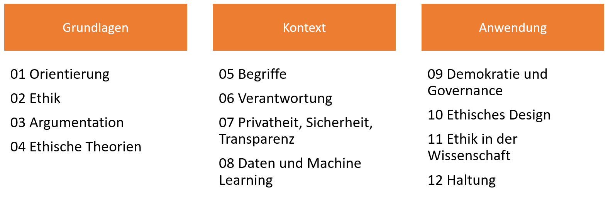
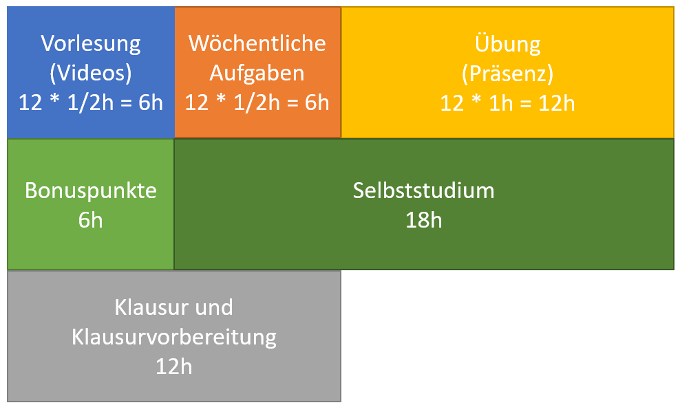
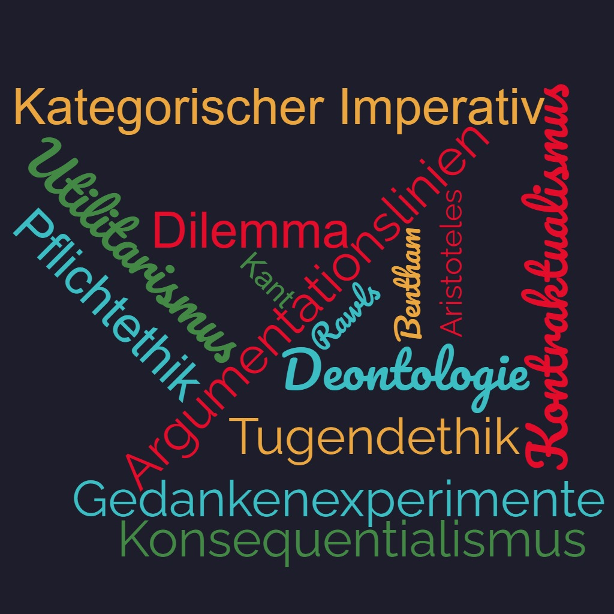
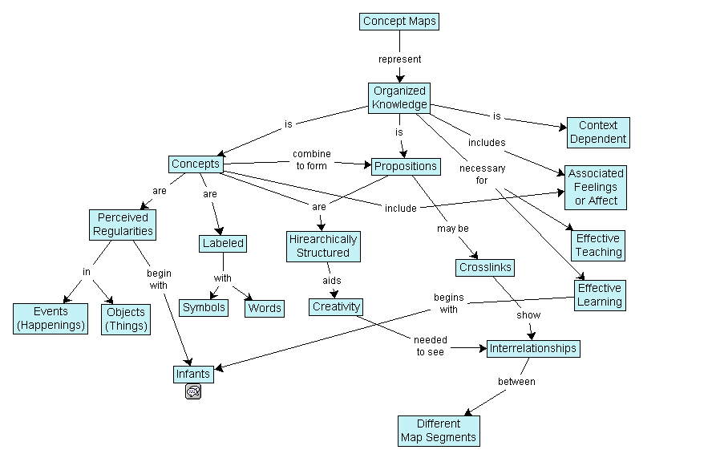
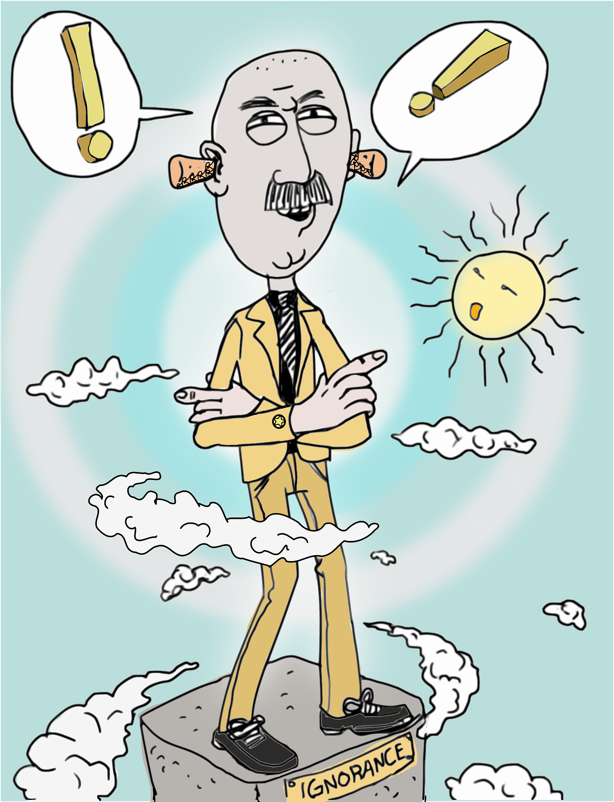
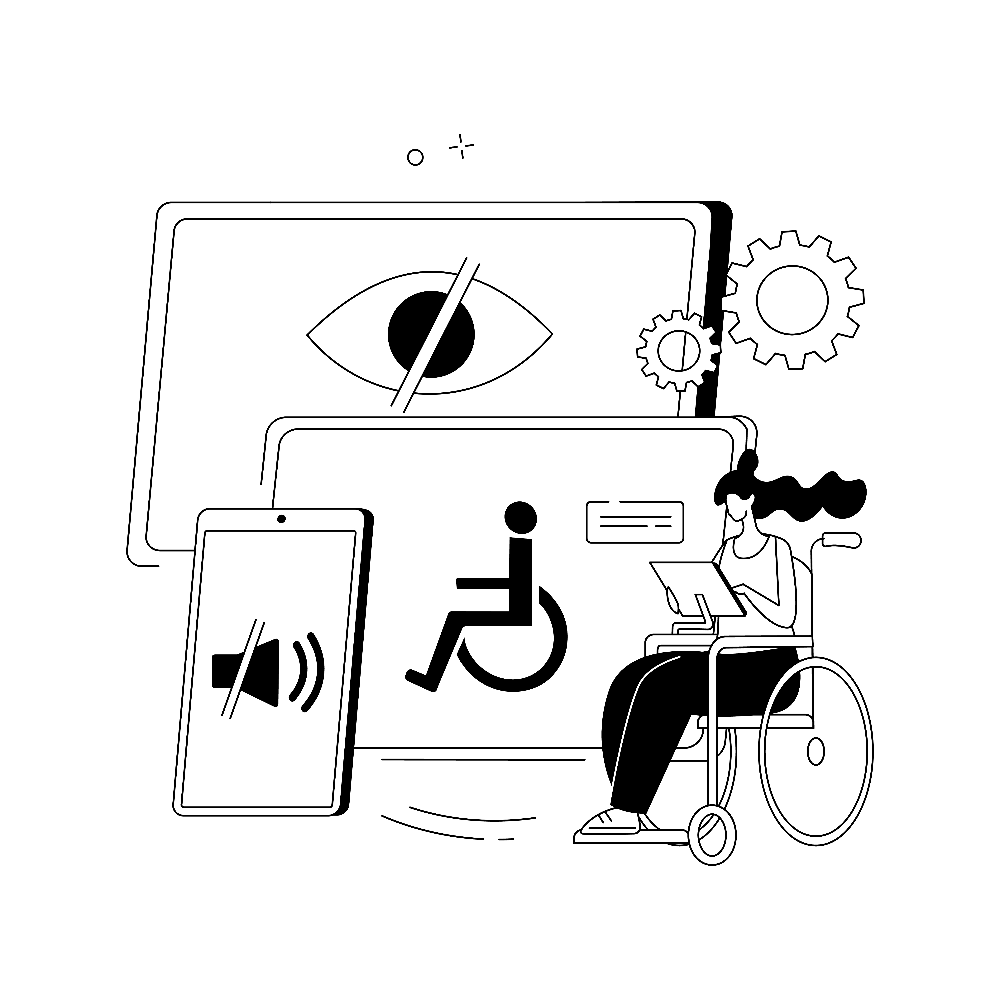

<!--
author:   Gregor Große-Bölting

email:    ggb@informatik.uni-kiel.de

icon:     img/Logo_cau-norm-de-lilagrey-rgb-0720_2022.png

version:  0.2.0

language: de

narrator: Deutsch Female

comment:  Vorlesungsinhalte "Ethik in der Informatik": Eine einführende Veranstaltung in die Ethik für Informatikstudierende.

tags:     Ethik, Informatik, Privatheit, Verantwortung, Forschungsethik, Machine Learning, Daten
\-->

# infEthik-01a: Ethik in der Informatik

Längst haben Informatiksysteme in den unterschiedlichsten Facetten den Alltag erreicht. Sie helfen bei der Navigation auf der Straße oder bei der Verarbeitung immer größer werdender Wissensbestände. Lernende Maschinen entscheiden darüber, ob ein Kredit vergeben oder eine Versicherung abgeschlossen werden kann. Sie optimieren Warenflüsse und Roboter oder Softwaresysteme übernehmen die Arbeit von Menschen in allen Bereichen: in gefährlichen, wie als Minensucher oder Feuerwehrfrau, im klassischen Niedriglohnsektor, aber auch im Journalismus oder der Justiz.

Damit kommt Informatiker:innen eine besondere Verantwortung als Entwickler:innen dieser Systeme zu: Sie müssen absehen und bewerten können, welche Personengruppen ein von ihnen entwickeltes System betrifft und was mögliche Folgen sind. Der damit verbundene Diskurs erfolgt im Anschluss an das philosophische Arbeitsfeld der Ethik, so dass als besondere Erschwernis für Informatiker:innen der solide Umgang mit Begriffen und Praktiken aus einem anderen Fach zu erlernen ist.

**Inhalte**

* Einführung in das Thema und Verhältnis zu bzw. Verortung in anderen Bereichsethiken
* Grundsätzliche Positionen in der Ethik und wichtige Begriffe
* Ziele und Techniken ethischer Argumentation
* Ethische Fragestellungen in der Informatik: Verantwortung, Transparenz, Sicherheit und Verzerrungen
* Standesethik und ethische Richtlinien
* Fallstudien und Anwendungsbereiche
* Ethisches Design von Anwendungen
* Umgang mit (individuellen) Dilemmasituationen
* Ethik in der Wissenschaft

## Allgemeines

Die zwölf Themen der Vorlesung teilen sich in drei große Bereiche auf: Grundlagen, Kontext und Anwendung.

Im Grundlagenbereich werden Sie mit wichtigen Voraussetzungen der ethischen Argumentation vertraut gemacht. Beginnend mit einer Diskussion der Wissenschaften Ethik und Informatik, erfolgt die Auseinandersetzung mit den *disclosive ethics*, die unsere Beschäftigung im Laufe des Semesters rahmen. Sie werden wichtige ethische Theorien kennenlernen und unter anderem anhand der Methode des Gedankenexperiments ausprobieren. 

Der Kontextbereich stellt den Bezug zwischen den ethischen Grundlagen und der Informatik anhand zentraler Begriffe her: Verantwortung, Transparenz, Sicherheit und Privatheit werden den Kern von allein zwei Vorlesungen bilden. Daneben wird das wichtige Thema diskutiert, was Daten und die Verarbeitung von Daten -- beispielsweise im Bereich des Machine Learning -- ethisch problematisch werden lässt. Zudem werden fundamentale Begriffe der Ethik diskutiert und die Frage in den Blick genommen, was Begriffe überhaupt sind und warum sie für die ethische Argumentation gleichermaßen schwierig wie notwendig sind.

Der Anwendungsbereich zeigt dann auf, welche Rolle ethische Entscheidungen in wirtschaftlichen und akademischen Projekten spielen. Dabei wird thematisiert, wie man Projekte in dem jeweiligen Umfeld unter ethischen Gesichtspunkten entwerfen kann und welche Fallstricke es dabei möglicherweise gibt. Es wird darauf eingegangen, wie man mit individuellen Dilemmasituationen umgehen kann: Was tut man bspw., wenn der Arbeitgeber etwas eindeutig unethisches von einem verlangt? Wie kann mit so einer Situation umgegangen werden? Zu Beginn des Blocks wird außerdem diskutiert, wie der Zusammenhang zwischen Ethik und Politik ist und warum die ethische Anwendung von Informationssystemen einen Beitrag zu unserem demokratischen Beisammensein leistet.

### Zeitplanung

Das Modul *Ethik in der Informatik* ist in den jeweiligen Studienordnungen mit 2 ECTS verbucht, was einem Workload von etwa 60 Stunden entspricht. Diese 60 Stunden verteilen sich in der Veranstaltung jeweils wie folgt auf die einzelnen Bestandteile:

Bitte berücksichtigen Sie diesen Zeitaufwand für Ihre Semesterplanung.

### Veranstaltungsorganisation

Die Vorlesungsinhalte werden als Videos zur Verfügung gestellt, jede Woche etwa 20 bis 30 Minuten. Die Übung arbeitet die Inhalte der Vorlesung auf und vertieft sie; teilweise werden auch in der Übung Inhalte eingeführt. Die Teilnahme an den Übungen ist freiwillig, wird aber dringend empfohlen. Bitte beachten Sie, dass die Übungssitzungen jeweils eine Zeitstunde in Anspruch nehmen.

Die Vorbereitungsaufgabe und Vorlesungen sollten zur jeweiligen Woche, die im Moodle angegeben ist, vorbereitet werden. Weitere Hinweise entnehmen Sie bitte den umfangreichen Informationen im Moodle.

### Technische Hinweise

Die Vorlesungsvideos werden über die Videoplattform der CAU zur Verfügung gestellt. Sollten Sie Probleme mit dem Ton (kann in Firefox passieren) oder der Darstellung der Videos (bekanntes Problem mit Safari) haben, dann  können Sie entweder einen anderen Browser ausprobieren oder unter folgendem Link die gesamte Playlist der Veranstaltung aufrufen: [infEthik-01a Playlist](https://videoportal.rz.uni-kiel.de/Mediasite/Channel/bc72d51b5e514e05a34dd254a4e2c2dd5f/browse/null/title-az/null/0/null).

* Aktuell ist noch ein Login im Mediaportal der CAU für die Ansicht der Videos notwendig. Das wird (nach einer weiteren Überarbeitung der Videos) im Laufe des Semester nicht mehr notwendig sein.
* Wenn die Videos bei der Wiedergabe knistern, verwenden Sie bitte einen anderen Browser!
* Die Videos lassen sich auch beschleunigt wiedergeben…

### Wie Sie erfolgreich an dieser Veranstaltung teilnehmen

* Nehmen Sie an der Übung teil!
* Bringen Sie bitte einen Laptop o.ä. mit. 
* Erledigen Sie die wöchentlichen Aufgaben zur Vorbereitung der Übung (ca. 30 Minuten Bearbeitungszeit).
* Beteiligen Sie sich und stellen Sie Fragen.
* Nehmen Sie an einem der Workshops teil und sammeln Sie Bonuspunkte!

## Zur Vertiefung

Literatur und Quellen werden bei den einzelnen Vorlesungen genannt. Zur generellen Einführung in das Thema eignen sich die folgenden Artikel/Bücher:

* J. Sullins: [Information Technology and Moral Values](https://plato.stanford.edu/entries/it-moral-values/), In: The Stanford Encyclopedia of Philosophy (Spring 2021 Edition)
* M. Noorman: [Computing and Moral Responsibility](https://plato.stanford.edu/entries/computing-responsibility/), In: The Stanford Encyclopedia of Philosophy (Spring 2020 Edition)
* P. Grimm, Tobias Keber, Oliver Zöllner: Digitale Ethik. Reclam. Stuttgart, 2019
* K. Hao: Empire of Ai. Dreams and Nightmares in Sam Altman's OpenAI. Penguin Publishing Group. 2025.
* S. Vallor: Technology and the Virtues. Oxford University Press. Oxford, 2018
* R. Elliott Smith: Rage Inside the Machine. Bloomsbury Business. London, 2019
* K. Crawford: Atlas of AI. Yale University Press. New Haven/London, 2021.
* C. D'Ignazio, Lauren F. Klein: Data Feminism. MIT Press. Cambridge/London, 2020.
* B.-Ch. Han: Infokratie. Digitalisierung und die Krise der Demokratie. Matthes & Seitz. Berlin, 2021.
* K. Chayka: Filterworld. How Algorithms Flattened Culture. Knopf Doubleday Publishing Group. 2025.
* E. Pariser: Filter Bubble. Wie wir im Internet entmündigt werden. Carl Hanser. München, 2012.
* P. Schaar: Das digitale Wir. Unser Weg in die transparente Gesellschaft. Körber-Stiftung. Hamburg, 2015.
* S. Vallor: The AI Mirror. How to Reclaim our Humanity in an Age of Machine Thinking. Oxford University Press. Oxford, 2024.

Weitere Hinweise finden Sie bei den einzelnen Themen der Veranstaltung. Diese Liste wird nach und nach erweitert.

### Ethik in der Informatik in der Popkultur

Falls Sie weitere Vorschläge haben, dann schreiben Sie diese gerne in den [Mattermost-Channel](https://elearn.informatik.uni-kiel.de/mod/url/view.php?id=4154); die Liste wird nach und nach ergänzt. Voraussetzung für die Aufnahme in die Liste ist ein klarer Bezug zur Informatik auf der einen und ethischen bzw. gesellschaftlichen Problemstellungen auf der anderen Seite.

**In Filmen...**

* [Ex Machina](https://www.imdb.com/title/tt0470752/)
* [Her](https://www.imdb.com/title/tt1798709/)
* [Ghost in the Shell](https://www.imdb.com/title/tt0113568/)
* [Blade Runner](https://www.imdb.com/title/tt0083658/) und [Blade Runner 2049](https://www.imdb.com/title/tt1856101/)

**In Serien...**

* [Black Mirror](https://www.imdb.com/title/tt2085059/)
* [Westworld](https://www.imdb.com/title/tt0475784/)

**In Dokumentationen...**

* [Das Dilemma mit den Sozialen Medien](https://de.wikipedia.org/wiki/Klara_und_die_Sonne)(Netflix)
* [Coded Bias](https://de.wikipedia.org/wiki/Klara_und_die_Sonne)(Netflix)
* <iframe width="640" height="360" src="https://www.youtube.com/embed/jZjmlJPJgug" title="Facial Recognition: Last Week Tonight with John Oliver (HBO)" frameborder="0" allow="accelerometer; autoplay; clipboard-write; encrypted-media; gyroscope; picture-in-picture" allowfullscreen></iframe>
* <iframe width="640" height="360" src="https://www.youtube.com/embed/F8aegvTVy5g" title="Die Schwachstelle von KI – wir Menschen  | ZDF Magazin Royale" frameborder="0" allow="accelerometer; autoplay; clipboard-write; encrypted-media; gyroscope; picture-in-picture" allowfullscreen></iframe>

**In Büchern (inkl. Graphic Novels und Comics)...**

* [Träumen Androiden von elektrischen Schafen?](https://de.wikipedia.org/wiki/Tr%C3%A4umen_Androiden_von_elektrischen_Schafen%3F) (Romanvorlage von Blade Runner, s. o.)
* [Ghost in the Shell](https://de.wikipedia.org/wiki/Ghost_in_the_Shell) (Manga, Vorlage für den gleichnamigen Film, s. o.)
* [Klara und die Sonne](https://de.wikipedia.org/wiki/Klara_und_die_Sonne)

**In Musik...**

* [Twitter Thread](https://twitter.com/alxndrt/status/1450739426515111936) mit diversen Musikempfehlungen

## 01 Orientierung

In dieser ersten Vorlesung heißt es: Ankommen und durchatmen! Worum geht es überhaupt in dieser Veranstaltung und was sind die Rahmenbedingungen? Machen Sie sich mit den Informationen im Moodle vertraut, finden Sie eine Übungsgruppe und lesen Sie sich die allgemeinen Informationen in diesem Dokument durch. 

Wenn sie so weit sind, kommen Sie hierher zurück und schauen Sie sich die Videos der ersten Woche an. Wir starten langsam mit einem Video-Essay, der die intensive Nutzung von Smartphones und die damit verbundenen, unsichtbaren Kosten hinterfragt. Weiter geht es mit einigen Definitionen: Was ist Ethik? Was ist Informatik? Und wie hängen die beiden zusammen? Unter allen Videos (außer dem ersten) finden Sie ein Quiz, mit dem Sie ihr Verständnis überprüfen können. 

Machen Sie sich außerdem bitte Gedanken über die Vorbereitungsaufgabe. Wir freuen uns auf die ersten Übungssitzungen mit Ihnen!

### Vorbereitungsaufgabe

Wo begegnen Ihnen ethisch oder gesellschaftlich problematische Software-Anwendungen in den Medien? Sammeln Sie Beispiele und teilen Sie News-Artikel oder YouTube-Videos über den [infEthik-Mattermost-Kanal](https://wetalk.informatik.uni-kiel.de/home/channels/infethik-01a-ethik-in-der-informatik). Schreiben Sie einen kurzen Kommentar (1 Satz!), warum es sich um eine problematische Anwendung handelt.

### 01-01 Technologie(n) und ihre Folgen

Technologie beeinflusst unser individuelles und gesellschaftliches Leben – zum Guten und zum Schlechten. Dabei sind wir weder als Nutzer:innen und noch weniger als Entwickler:innen hilflos der technologischen Entwicklung ausgeliefert: Wir haben immer die Möglichkeit tätig zu werden und zu versuchen es besser zu machen. Der folgende Video-Essay gibt dafür ein Beispiel, der insbesondere die Nutzer:innen-Perspektive anspricht, bevor wir uns im Laufe des Semesters immer mehr der professionellen Informatiker:innen-Perspektive annähern. 

<iframe width="900" height="600" src="https://www.youtube-nocookie.com/embed/ad-skW0SWeE?si=YMZG0WVP6UblqZ3u" title="YouTube video player" frameborder="0" allow="accelerometer; autoplay; clipboard-write; encrypted-media; gyroscope; picture-in-picture; web-share" referrerpolicy="strict-origin-when-cross-origin" allowfullscreen></iframe>

### 01-02 Was ist Informatik?

<iframe title="01-02 Was ist Informatik?" width="900" height="600" frameborder="0" scrolling="auto" marginheight="0" marginwidth="0" src="https://videoportal.rz.uni-kiel.de/Mediasite/Play/a65bfe247eef478ebc5d82130124681d1d" allowfullscreen msallowfullscreen allow="fullscreen"></iframe>

[Videolink](https://videoportal.rz.uni-kiel.de/Mediasite/Play/a65bfe247eef478ebc5d82130124681d1d)

[Folien: Was ist Informatik?](https://cloud.rz.uni-kiel.de/index.php/s/8swYCdswM9pXPPa)

---

                           {{1}}
**Quiz**

Welche Aussagen über **Informatik** sind korrekt? 

  [[ ]] Informatik als Disziplin ist eindeutig definiert.
  [[X]] Informatik als Disziplin kann ganz unterschiedlich verstanden werden. 
  [[ ]] Informatik ist ein einfaches Konzept.
  [[X]] Informatik als Strukturwissenschaft versucht Phänomene der Wirklichkeit in Strukturen zu überführen, die dann digital verarbeitet werden können.
  [[ ]] Die drei Paradigmen der Informatik nach Eden (2009) lauten: *Rationalist*, *Pragmatist* und *Scientific*.

Welche Aussagen über **Wissenschaft** sind korrekt? 

  [[X]] Etwas ist nur dann wissenschaftlich, wenn andere die Möglichkeit haben, die Ergebnisse und das Vorgehen zu überprüfen. 
  [[ ]] Wissenschaftliche Argumentation zeichnet sich durch die Verwendung von Behauptungen aus. 
  [[ ]] Wissenschaft beschränkt sich auf das Feststellen beobachtbarer Tatsachen.
  [[X]] Wissenschaft versucht aus den beobachtbaren Tatsachen allgemeine Strukturen und Beziehungen abzuleiten. 
  [[X]] Die wissenschaftliche Methode ist ohne Transparenz nicht denkbar.

### 01-03 Was ist Ethik?

<iframe title="01-03 Was ist Ethik?" width="900" height="600" frameborder="0" scrolling="auto" marginheight="0" marginwidth="0" src="https://videoportal.rz.uni-kiel.de/Mediasite/Play/7ea5599413ef4687b144e81e49ca23fc1d" allowfullscreen msallowfullscreen allow="fullscreen"></iframe>

[Videolink](https://videoportal.rz.uni-kiel.de/Mediasite/Play/7ea5599413ef4687b144e81e49ca23fc1d)

[Folien: Was ist Ethik?](https://cloud.rz.uni-kiel.de/index.php/s/nTZxoqWdAwy9fxA)

---

                           {{1}}
**Quiz**

Welche Aussagen zu Ethik sind korrekt?

  [[ ]] Der Begriff wird einheitlich verwendet.
  [[X]] Ethik beschäftigt sich mit dem richtigen Handeln.
  [[ ]] Ethik ist ein einfaches Konzept.
  [[X]] In der Informatikethik werden u.a. die Handlungsnormen und Werte identifiziert, systematisiert und problematisiert.
  [[X]] Ethik reflektiert über und systematisiert existierende Moral.

Entscheiden Sie, um was für eine Art der Fragestellung es sich bei den folgenden Fragen handelt (Moral, Ethik, Metaethik):

Welche Schlüsse kann ich aus der Auswertung von Benutzerdaten schließen, sodass diese weiter „natürlich“ und wertfrei bleiben?

  [[Ethik]]

Sollte ich meine Benutzerdaten an die Hersteller des Programms weitergeben?

  [[Moral]]

### Quellen und vertiefende Literatur

* Broy, Manfred. 1998. Informatik. Eine Grundlegende Einführung. Springer Berlin Heidelberg. 
* Denning, Peter J. 2005. “Is Computer Science Science?” Commun. ACM 48 (4): 27–31.
* Eden, Amnon H. 2007. “Three Paradigms of Computer Science.” Minds and Machines 17 (2): 135–67.
* Forneck, Hermann-Josef. 1990. “Entwicklungstendenzen und Problemlinien der Didaktik der Informatik.” Beiträge Zur Didaktik Der Informatik, G. Cyranek, HJ Forneck and H. Goorhuis, Eds. Diesterweg, Frankfurt Am Main, 18–53.
* Prechtl, Peter, and Franz-Peter Burkard. 2015. Metzler Lexikon Philosophie: Begriffe und Definitionen. Springer-Verlag.
* Schneider, Yannick, and Andreas Mühling. 2017. “Das Konzept Nature of Computer Science.” In Informatische Bildung zum Verstehen und Gestalten der digitalen Welt, 123–26. Gesellschaft für Informatik, Bonn.

## 02 Ethik

In dieser Vorlesung soll ein präziseres Bild davon vermittelt werden, was Ethik *in der* Informatik ausmacht und wie wir grundsätzlich methodisch vorgehen, um als Informatiker:innen zu ethischen Einschätzungen zu gelangen. 

**Lernziele** des Abschnitts *02 Ethik*:

* Sie können die Art der Ethik dieser Veranstaltung im Verhältnis zur Ethik allgemein und zum Begriff der angewandten Ethik einordnen. 
* Sie können den Begriff des Artefakts definieren und seine Schwierigkeiten in der Anwendung auf die Informatik darstellen. 
* Sie kennen den Unterschied zwischen direkten und indirekten Stakeholdern. 
* Sie können die *disclosive ethics* auf eine gegebene Technologie oder Fallstudie anwenden.
* Sie kennen die Werte nach Brey (2000) und können sie auf die Diskussion von Artefakten anwenden.

### Vorbereitungsaufgabe

Wenden Sie die ersten drei Schritte (*disclosure level*) der Methode zum Analysieren von Technologie auf einen Alltagsgegenstand oder -software an. Nehmen Sie sich etwas Einfaches vor, dass Sie jeden Tag verwenden und bei dem der ethische Gehalt nicht auf den ersten Blick klar ist. 

Notieren Sie sich in maximal drei Sätzen Ihre ethische Intuition. Erstellen Sie ein einfaches Schaubild mit Stakeholdern, Werten und den *eingebauten Konsequenzen* des Artefakts selbst. 

Notieren Sie sich schließlich, ob Sie eine ethische Problemstellung identifizieren konnten, die Ihnen vor der Analyse nicht klar war. Falls Sie nichts dergleichen finden konnten: Können Sie beschreiben, woran das liegt?

### 02-01 ... *in* der Informatik

<iframe title="02-01 ... *in* der Informatik" width="900" height="600" frameborder="0" scrolling="auto" marginheight="0" marginwidth="0" src="https://videoportal.rz.uni-kiel.de/Mediasite/Play/43a08c74487f4b45bf1b8113af38a2451d" allowfullscreen msallowfullscreen allow="fullscreen"></iframe>

[Videolink](https://videoportal.rz.uni-kiel.de/Mediasite/Play/43a08c74487f4b45bf1b8113af38a2451d)

[Folien: ... *in* der Informatik](https://cloud.rz.uni-kiel.de/index.php/s/fCCHMXGAzaSseQ8)

---

                           {{1}}
**Quiz**

Angewandte Ethik beinhaltet: 

  [[X]] konkrete Hilfestellungen zur Urteilsfindung
  [[ ]] den Vergleich verschiedener Ethiken
  [[ ]] Ethik für allgemeine Bereiche/Sachverhalte
  [[X]] verschiedene gesonderte Bereiche (wie z.B. die Medizin)
  [[X]] Analyse und Kritik von Praktiken

---

Welcher Fall beschreibt ein Bottom-Up Vorgehen und welcher ein Top-Down Vorgehen?

Ethische Prinzipien der allgemeinen Ethik werden in einem Bereich angewandt.

  [[Top-Down]]

Aus konkrete Praktiken eines Bereiches werden Handlungsnormen abgeleitet.

  [[Bottom-Up]]

### 02-02 Disclosive ethics

<iframe title="02-02 Disclosive ethics" width="900" height="600" frameborder="0" scrolling="auto" marginheight="0" marginwidth="0" src="https://videoportal.rz.uni-kiel.de/Mediasite/Play/ce47f4d671d541a48e7fde2ec4e7bca81d" allowfullscreen msallowfullscreen allow="fullscreen"></iframe>

[Videolink](https://videoportal.rz.uni-kiel.de/Mediasite/Play/ce47f4d671d541a48e7fde2ec4e7bca81d)

[Folien: Disclosive ethics](https://cloud.rz.uni-kiel.de/index.php/s/t5DEAsMqzaFSAmX)

---

                           {{1}}
**Quiz**

Die "Toolview" (im Unterschied zu den "Disclosive Ethics") sagt, 

  [[ ]] ...dass Technik gut oder böse ist
  [[X]] ...dass erst der/die Nutzende entscheidet, ob Technik gut oder böse ist

---

Der "Disclosure" Schritt wird definiert als:

  [[ ]] Eine Technologie wird anhand der Bedürfnisse der Stakeholder analysiert. Erfüllt die Technologie alle Bedürfnisse?
  [[X]] Eine Technologie wird unter Einbeziehung der relevanten, moralischen Werte der Stakeholder analysiert. Werden Werte von der Technologie untergraben?
  [[ ]] Durch die relevanten, moralischen Werte der Stakeholder wird eine Technologie analysiert. Werden alle Werte gestärkt?

### 02-03 Technologie analysieren

<iframe title="02-03 Technologie analysieren" width="900" height="600" frameborder="0" scrolling="auto" marginheight="0" marginwidth="0" src="https://videoportal.rz.uni-kiel.de/Mediasite/Play/b3d870992a914a4596356b2d9506d7881d" allowfullscreen msallowfullscreen allow="fullscreen"></iframe>

[Videolink](https://videoportal.rz.uni-kiel.de/Mediasite/Play/b3d870992a914a4596356b2d9506d7881d)

[Folien: Technologie analysieren](https://cloud.rz.uni-kiel.de/index.php/s/Bo22BJdmdQs8R2Y)

---

                           {{1}}
**Quiz**

Was wird in der Kontextanalyse betrachtet?

  [[ ]] Es geht um die Umgebung, in welcher das Problem auftritt (z.B. in einem Büro, in der Schule,...)
  [[X]] Es werden die betroffenen Personengruppen identifiziert.
  [[X]] Es geht darum, zu erkennen, was die Interessen der Stakeholder sind und was wir darüber noch nicht wissen.
  [[ ]] Es sollen die Werte der einzelnen Stakeholder identifiziert werden.

Wozu sollte ein Fall in eine Theorie eingeordnet werden?

  [[X]] Durch das herausbilden einer neuen Theorie können in Zukunft ähnliche Fälle leichter gelöst werden.
  [[X]] Z.B. Werte können auf verschiedene Weisen ausgelegt werden, eine Theorie macht transparent, wie er hier ausgelegt wird.
  [[X]] Theorien helfen bei der Bewertung vom Verhalten der Stakeholder.

Was passiert im Application Level?

  [[ ]] Es werden passende Programme gesucht, die das Problem lösen.
  [[X]] Verhaltensalternativen werden gesammelt und anschließend bewertet.
  [[ ]] Es wird ein Programm geschrieben, dass die identifizierten Konflikte auflöst.
  [[X]] In der Konsensfindung wird eine Entscheidung gewählt, die nicht von einer einzelnen Person getroffen werden sollte.

### Quellen und vertiefende Literatur

* Brey, Philip. 2000. “Disclosive Computer Ethics.” ACM SIGCAS Computers and Society 30 (4): 10–16. 
* ———. 2010. “Values in Technology and Disclosive Computer Ethics.” In The Cambridge Handbook of Information and Computer Ethics, edited by Luciano Floridi, 41–58. Cambridge University Press.
* Crawford, Kate. 2021. The Atlas of AI: Power, Politics, and the Planetary Costs of Artificial Intelligence. Yale University Press.
* Fenner, Dagmar, ed. 2022. Einführung in Die Angewandte Ethik. 2. vollst. überarb. u. erw. Aufl. Stuttgart: utb GmbH.
* Hao, Karen. 2025. Empire of AI: Dreams and Nightmares in Sam Altman’s OpenAI. New York: Penguin Press.
* Herkert, Joseph R. 2005. “Ways of Thinking about and Teaching Ethical Problem Solving: Microethics and Macroethics in Engineering.” Science and Engineering Ethics 11 (3): 373–85. 
* Introna, Lucas D. 2006. “Maintaining the Reversibility of Foldings: Making the Ethics (Politics) of Information Technology Visible.” Ethics and Information Technology 9 (1): 11–25.
* Midgley, Mary. 1992. “Philosophical Plumbing.” Royal Institute of Philosophy Supplement 33 (September): 139–51.
* Preston, Beth. 2022. “Artifact.” In The Stanford Encyclopedia of Philosophy, edited by Edward N. Zalta and Uri Nodelman, Winter 2022. Metaphysics Research Lab, Stanford University.
* Winner, Langdon. 1980. “Do Artifacts Have Politics?”. Daedalus 109 (1): 121–36.

## 03 Argumentation

Mit dem Thema *Argumentation* führt die dritte Vorlesung die Beschäftigung mit ethischen Grundlagen fort. Argumentieren ist in der Ethik sehr wichtig und wird uns das gesamte Semester begleiten. Durch richtiges Argumentieren können unterschiedliche Standpunkte erkannt, analysiert und diskutiert werden. Es ermöglicht eine kritische, rationale und reflektierte Auseinandersetzung mit moralischen Problemen und unterschiedlichen Perspektiven. 

Im ersten Abschnitt wird die Frage erläutert, *warum* Argumentation wichtig ist und was eine konstruktive Argumentationshaltung ausmacht. Anschließend werden im zweiten Abschnitt einige Grundbegriffe und -methoden eingeführt, insbesondere das Toulmin-Schema zur Strukturierung von Argumenten. Dieses wird dann in den Abschnitten drei und vier zur Anwendung gebracht, die sich mit der Formulierung und dem Verstehen von schriftlichen Argumenten beschäftigen. 

**Lernziele** des Abschnitts *03 Argumentation*:

* Sie haben ein grundlegendes Verständnis erlangt, wie ethische Texte zu lesen sind und können die grobe Vorgehensweise beschreiben.
* Sie wissen, was eine *These*, ein *Argument* und ein *Beleg* ist und wie diese sich unterscheiden.
* Sie können die wesentlichen Merkmale von *Fakten- und Normenaussagen* nennen und den Unterschied erklären.
* Sie können das Toulmin-Schema anwenden, um gegebene Argumente zur analysieren oder um selbst eigene Argumente zu formulieren.
* Sie können erläutern, warum Argumentation in der Ethik so einen hohen Stellenwert hat, dass dem Thema eine eigene Vorlesung gewidmet ist. 

### Vorbereitungsaufgabe

In dieser Woche beschäftigen wir uns mit dem Lesen und Verfassen von Argumentationen, einem Thema, dass uns die gesamte Veranstaltung über beschäftigen wird. Gut zu argumentieren ist zudem Voraussetzung für das Bestehen der Prüfungsleistung.

Lesen Sie dazu bitte den folgenden Text: [Moshe Y. Vardi: I Was Wrong about the Ethics Crisis](https://cacm.acm.org/opinion/i-was-wrong-about-the-ethics-crisis/)

Beantworten Sie außerdem die beiden Fragen:

1. Welche Argumente benennt der Text, um seine Position zu belegen? Versuchen Sie, die Argumente in eigenen Worten, in Stichpunkten oder als Fließtext aufzuschreiben.
2. Wie haben Sie den Text gelesen, um sich dessen Sinn (argumentative Struktur etc.) zu erschließen? Verfassen Sie eine kurze Beschreibung Ihres Vorgehens.

**Bonus**: 

* Lesen Sie die Kommentare: Welche Argumente finden Sie überzeugend? Wie würden Sie selbst den Text kommentieren?
* Moshe Vardi antwortet in dem Text auf einen früheren Text von sich selbst, [Moshe Y. Vardi: Are We Having An Ethics Crisis in Computing?](https://dl.acm.org/doi/10.1145/3292822). Lesen Sie auch diesen Text.

### 03-01 Warum argumentieren?

<iframe title="03-01 Warum argumentieren?" width="900" height="600" frameborder="0" scrolling="auto" marginheight="0" marginwidth="0" src="https://videoportal.rz.uni-kiel.de/Mediasite/Play/bc304ba080a2466dafef68519a3715881d" allowfullscreen msallowfullscreen allow="fullscreen"></iframe>

[Videolink](https://videoportal.rz.uni-kiel.de/Mediasite/Play/bc304ba080a2466dafef68519a3715881d)

[Folien: Warum argumentieren?](https://cloud.rz.uni-kiel.de/index.php/s/MB9s3mqSa3k8B2j)

---

                           {{1}}
**Quiz**

Wir argumentieren um...

  [[X]] meinen Standpunkt zu erklären
  [[ ]] recht zu haben 
  [[X]] den Weg zu ethischen Schlüssen zu erläutern 
  [[ ]] Pluralität aus dem Weg zu gehen 

Was bedeutet es, Recht zu haben?

  [[X]] In der Informatik zum Beispiel, eine Aussage beweisen zu können.
  [[ ]] Eine allgemeingültige Wertaussage zu treffen.
  [[X]] Schlüssig zu argumentieren, da es nicht immer eine Wahrheit gibt.

Das "Principle of Charity" meint, dass...

  [[ ]] ...wir auch mal anderen Leuten recht geben sollten, damit sie sich wohl fühlen.
  [[X]] ...wir Aussagen nicht absichtlich falsch verstehen.

### 03-02 Strukturiertes denken

<iframe title="03-02 Strukturiertes denken" width="900" height="600" frameborder="0" scrolling="auto" marginheight="0" marginwidth="0" src="https://videoportal.rz.uni-kiel.de/Mediasite/Play/088bc05bde274eefa89a8681ea1d90ac1d" allowfullscreen msallowfullscreen allow="fullscreen"></iframe>

[Videolink](https://videoportal.rz.uni-kiel.de/Mediasite/Play/088bc05bde274eefa89a8681ea1d90ac1d)

[Folien: Strukturiertes denken](https://cloud.rz.uni-kiel.de/index.php/s/jAjjZAzrJDCSd7t)

---

                           {{1}}
**Quiz**

Welche Aussagen zu Fakten- und Normenaussagen sind korrekt?

  [[X]] Faktenaussagen sind beschreibend.
  [[ ]] Faktenaussagen bringen eine Norm zum Ausdruck.
  [[ ]] Faktenaussagen lassen sich nicht auf "Wahr" oder "Falsch" überprüfen.
  [[X]] Faktenaussagen lassen sich überprüfen.
  [[ ]] Faktenaussagen beinhalten Forderungen.
  [[X]] Faktenaussagen richten sich auf eine Tatsache.
  [[ ]] Normenaussagen richten sich auf eine Tatsache.
  [[X]] Normenaussagen beinhalten Forderungen.
  [[X]] Normenaussagen bringen eine Norm zum Ausdruck.
  [[ ]] Normenaussagen sind beschreibend.
  [[X]] Normenaussagen lassen sich nicht auf "Wahr" oder "Falsch" überprüfen.
  [[ ]] Normenaussagen lassen sich überprüfen.

**Liegt in den folgenden Fällen ein naturalistischer Fehlschluss vor?**

Das Klonen von Tieren ist technisch möglich. Die Natur klont alle Tage. Das heißt das Klonen von Tieren ist moralisch in Ordnung.

  [(X)] Ja
  [( )] Nein

Wir wollen die Zahl der Verkehrsunfälle verringern. Durch ein Verbot von Handys ohne Freisprecheinrichtung geht die Anzahl der Unfälle um x % zurück. Also sollte man ein Verbot von Handys ohne Freisprecheinrichtung beim Fahren einführen.

  [( )] Ja
  [(X)] Nein

---

Was macht das Toulmin-Schema aus?

  [[ ]] Ein Claim braucht einen Modaloperator 
  [[X]] Die Verbindung zwischen Claim und Grounds wird mit einem Warrent gesichert 
  [[X]] Modaloperatoren ermöglichen eine differenziertere Betrachtung 
  [[ ]] Alle Warrents brauchen mindestens zwei Backings 

Syllogismen - was stimmt?

  [[X]] aus einer normativen und einer deskriptiven Prämisse wird ein normativer Schluss gezogen 
  [[ ]] aus einer normativen und einer deskriptiven Prämisse wird ein deskriptiver Schluss gezogen 
  [[ ]] zwischen Seins- und Sollensaussagen gibt es keine analytische Beziehung 
  [[X]] nur auf der Sollen-Ebene gibt es wahr oder falsch 

---

**Normative Aussage oder deskriptive Aussage?**

"Studierende sollten ihre Vorbereitungsaufgaben machen."

  [[normativ]]

"Die Vorbereitungsaufgabe hilft beim Verstehen der Vorlesung."

  [[deskriptiv]]

### 03-03 Argumente und Argumentationen formulieren

<iframe title="03-03 Argumente und Argumentationen formulieren" width="900" height="600" frameborder="0" scrolling="auto" marginheight="0" marginwidth="0" src="https://videoportal.rz.uni-kiel.de/Mediasite/Play/fcd64136840a409eacd3009f648254f71d" allowfullscreen msallowfullscreen allow="fullscreen"></iframe>

[Videolink](https://videoportal.rz.uni-kiel.de/Mediasite/Play/fcd64136840a409eacd3009f648254f71d)

[Folien: Argumente und Argumentationen formulieren](https://cloud.rz.uni-kiel.de/index.php/s/gT9cnk4bbajW9iJ)

---

                           {{1}}
**Quiz**

Welche der folgenden Vorteile bietet das Rogerian Argument gegenüber anderen Argumentationsstrukturen?

  [[X]] Es hilft die eigene Position zu reflektieren.
  [[ ]] Es ist leichter die Gegenseite immer wieder falsch dazustellen.
  [[X]] Konsensorientierung hilft verschiedene Positionen anzunähern.
  [[ ]] Es ist besonders geeignet für kürzere Meinungsbeiträge.
  [[X]] Es erleichtert das Einnehmen der Gegenposition durch vorherige Annäherung.

Wie hilft uns das Paragraphing beim Texte schreiben?

  [[X]] Ermöglicht die Überführung des Toulmin Schemas in einen Absatz.
  [[ ]] Es erklärt, dass ein Text aus Paragraphen besteht.
  [[X]] Es gibt uns eine grobe Struktur (Topic sentence - supporting sentence - concluding sentence) vor.
  [[ ]] Es gibt uns eine grobe Struktur (Topic sentence - supporting sentence - true sentence) vor.

Vom Toulmin-Schema zum Paragraphen:

  [[ ]] Unser Claim steht im Topic sentence.
  [[ ]] Das Backing bildet den concluding sentence.
  [[ ]] Warrents/Schlussregeln müssen nicht aufgeschrieben werden, sie gelten im Hintergrund.
  [[X]] Keine der obigen Aussagen stimmt.

### 03-04 Ethische Texte lesen und verstehen

<iframe title="03-04 Ethische Texte lesen und verstehen" width="900" height="600" frameborder="0" scrolling="auto" marginheight="0" marginwidth="0" src="https://videoportal.rz.uni-kiel.de/Mediasite/Play/b1b3c31ffc864280a46b04fbf9dbf0811d" allowfullscreen msallowfullscreen allow="fullscreen"></iframe>

[Videolink](https://videoportal.rz.uni-kiel.de/Mediasite/Play/b1b3c31ffc864280a46b04fbf9dbf0811d)

[Folien: Ethische Texte lesen und verstehen](https://cloud.rz.uni-kiel.de/index.php/s/36aF6opzj3B48XS)

---

                           {{1}}
**Quiz**

Welche der folgenden Fragen sind für den ersten Zugang zu einem Text relevant?

  [[X]] Wer ist der Autor des Textes?
  [[X]] Bezieht sich der Text auf Aktuelles oder Vergangenes?
  [[X]] In welchem Land wurde der Text veröffentlicht?
  [[ ]] Wie fühle ich mich beim Lesen des Textes?
  [[X]] Welches Fazit kann man aus dem Text ziehen?
  [[ ]] Wie lang ist der Text?
  [[ ]] Welche Wörter nutzt der Autor besonders häufig?
  [[X]] Wann ist der Text erschienen?
  [[X]] Was ist das (Haupt-)Thema des Textes?

### Quellen und vertiefende Literatur

* Groff, Jennifer. 2018. “Reengineering Education: Systems Engineering and the LearningGraph as a Means to Develop a Coherent Learning Data Architecture.” PhD thesis.
* Haber, Jonathan. 2020. Critical Thinking. 1st ed. The MIT Press Essential Knowledge Series. Bielefeld: MIT Press.
* Kruse, Otto. 2017. Kritisches Denken Und Argumentieren: Eine Einführung Für Studierende. Studieren, Aber Richtig. Konstanz: UVK Verlagsgesellschaft.
* Midgley, Mary. 2001. Wickedness: A Philosophical Essay. Routledge Classics. London: Routledge.
* Pfeifer, V. 2009. Ethisch Argumentieren: Eine Anleitung Anhand von Aktuellen Fallanalysen. Ethisch Argumentieren / Eine Anleitung Anhand von Aktuellen Fallanalysen. Schöningh.
* Raji, Inioluwa Deborah, Timnit Gebru, Margaret Mitchell, Joy Buolamwini, Joonseok Lee, and Emily Denton. 2020. “Saving Face: Investigating the Ethical Concerns of Facial Recognition Auditing.” In Proceedings of the AAAI/ACM Conference on AI, Ethics, and Society, 145–51. AIES ’20. New York, NY, USA: Association for Computing Machinery. https://doi.org/10.1145/3375627.3375820.
* Regenbogen, Arnim, and Uwe Meyer, eds. 2013. Wörterbuch Der Philosophischen Begriffe. Philosophische Bibliothek. Felix Meiner Verlag.
* Rosenberg, Jay F. 2020. Philosophieren: Ein Handbuch Für Anfänger. 25. - 27. Tausend. Klostermann RoteReihe. Frankfurt am Main: Vittorio Klostermann.
* Strawson, P. F. 1961. “Social Morality and Individual Ideal.” Philosophy 36 (136): 1–17. https://doi.org/10.1017/s003181910005779x.
* Tetens, Holm. 2022. Philosophisches Argumentieren: Eine Einführung. Originalausgabe, 5., unveränderte Auflage. C.h. Beck Paperback 1607. München: C.H. Beck.

## 04 Ethische Theorien

In dieser Woche führt die Vorlesung verschiedene ethische Theorien ein und betrachtet diese kritisch.
Die Theorien können dadurch eine Grundlage bieten (etwa in einem Toulmin Schema) und neue Perspektiven eröffnen einen ethischen Sachverhalt zu betrachten. Sie sind allerdings keine Ideallösung, dank welchen die Ethik fertig und richtig gelöst ist. Wie in der Ethik üblich sind Probleme zu vielschichtig, um sie mit einem einfachen Schema zu lösen. Betrachten Sie die Theorien also immer als Grundlage weiterer Reflexion.

Für das weitere Vorgehen im Semester führt diese Woche eine Methode ein, um ein Urteil in einem ethischen Konflikt zu fällen und zu begründen. Dabei wird auf dem Disclosure Schritt (siehe Vorlesung 02-02) aufbauend mit den Werten der betroffenen Stakeholder gearbeitet. Diese Form der Handlungsbewertung führt nicht zu einem festen Ergebnis, sondern zu einem Beitrag in der Debatte, weshalb ein Schritt sich mit der Reflexion beschäftigt, da auch diese Methode blinde Flecken mit sich bringen kann.

**Lernziele** des Abschnitts *04 Ethische Theorien*:

* Sie haben einen Überblick über ethische Theorien gewonnen.
* Sie kennen die grundlegenden Ideen der Deontologie, des Konsequentialismus und der Tugendethik.
* Sie haben Probleme kennengelernt, die auftreten können, wenn ethische Probleme technisch gelöst werden.
* Sie kennen Typen von Einwänden und können diese Argumenten zuweisen.
* Sie können eine disklosive Handlungsbewertung schrittweise durchführen.

### Vorbereitungsaufgabe

[CSV-Datei mit Daten](https://cloud.rz.uni-kiel.de/index.php/s/pX66t2ArMLJqnAt)

> Willkommen zu Ihrem ersten Arbeitstag beim neuen, wegweisenden Unternehmen für selbstfahrende Autos: Messla. Weil wir bei Messla die Vorreiter in Sachen selbstfahrender Autos sind, müssen wir schneller Innovationen gestalten als alle anderen da draußen. Um unsere Autos bis Ende des Jahres auf die Straße zu bringen, müssen wir den besten Algorithmus finden, um ein Problem zu lösen, das allen unseren "selbstfahrenden" Konkurrenten im Weg steht: Das Trolley-Problem, also die Frage nach der Abwägung zwischen Menschenleben im Fall eines unvermeidlichen Unfalls.

Ihre erste Aufgabe ist es, einen Algorithmus zu entwickeln, der festlegt, wie sich unsere selbstfahrenden Autos im Falle eines unvermeidlichen Zusammenstoßes verhalten sollen. Wir nennen unseren Algorithmus die *Moral Machine*.

Dies wird in 3 Schritten geschehen:

1. Verwenden Sie die Daten, die wir von früheren unvermeidbaren Zusammenstößen haben, um Ihr Modell zu erstellen.
2. Legen Sie die Kriterien fest, nach denen unsere Autos entscheiden sollen, wer getötet und wer gerettet werden soll.
3. Testen Sie Ihr Modell an unseren Daten und sehen Sie, wie gut es funktioniert!

Das sollte doch einfach sein, … oder?

**Aufgabe:** Entwickeln Sie ein (oder mehrere) Argument(e), um ihren fiktiven Vorgesetzten bei Messla zu verdeutlichen, warum die *Moral Machine* in ethischer Hinsicht keine gute Idee ist. Verwenden Sie für die Darstellung ihres Arguments (oder Argumente) das Toulmin-Schema. 

*Hinweis:* Wenn Sie die *Moral Machine* für eine gute Idee halten und das mit dem Toulmin-Schema verargumentieren können, ist das selbstverständlich auch möglich. 

### 04-01 Theorien

Die folgenden drei Videos auf dieser Seite geben Ihnen einen Überblick darüber, wie die wichtigsten ethischen Theorien Deontologie, Konsequentialismus (bzw. Utilitarismus) und Tugendethik Handlungen rechtfertigen. Machen Sie sich über die Videos mit den entsprechenden Handlungsregeln vertraut und lesen Sie gerne den zugehörigen *Ethics Explainer* (jeweils unter den Videos verlinkt), falls nach dem Schauen der Videos Fragen offen geblieben sind.

---

<iframe width="560" height="315" src="https://www.youtube.com/embed/WoHJhwh4mVQ?si=UKWNYR-KTRF3oPec" title="YouTube video player" frameborder="0" allow="accelerometer; autoplay; clipboard-write; encrypted-media; gyroscope; picture-in-picture; web-share" referrerpolicy="strict-origin-when-cross-origin" allowfullscreen></iframe>

[Ethics Explainer: Deontology](https://ethics.org.au/ethics-explainer-deontology/)

---

<iframe width="560" height="315" src="https://www.youtube.com/embed/xJqO4nhmZWc?si=Xgwq7VZ7GyFwQ8Gv" title="YouTube video player" frameborder="0" allow="accelerometer; autoplay; clipboard-write; encrypted-media; gyroscope; picture-in-picture; web-share" referrerpolicy="strict-origin-when-cross-origin" allowfullscreen></iframe>

[Ethics Explainer: Consequentialism](https://ethics.org.au/ethics-explainer-consequentialism/)

---

<iframe width="560" height="315" src="https://www.youtube.com/embed/qs9QiczZvdU?si=CiH1Es8xdX_07Mxn" title="YouTube video player" frameborder="0" allow="accelerometer; autoplay; clipboard-write; encrypted-media; gyroscope; picture-in-picture; web-share" referrerpolicy="strict-origin-when-cross-origin" allowfullscreen></iframe>

[Ethics Explainer: Virtue Ethics](https://ethics.org.au/ethics-explainer-virtue-ethics/)

---

                           {{1}}
**Quiz**

Welche Argumentationslinie kann mit der Phrase "fake it, until you make it" beschrieben werden?

  [( )] Utilitarismus
  [(X)] Tugendethik
  [( )] Deontologie

Wie wird beim Utilitarismus eine moralisch wertvolle Handlung bestimmt?

  [[X]] Es wird der moralische Wert einer Handlung allein anhand der zu erwartenden Konsequenzen bzw. Handlungsfolgen bewertet.
  [[ ]] Es wird der moralische Wert einer Handlung anhand des Prinzips oder der Regel, der beim Handeln gefolgt wird, bewertet.
  [[ ]] Moralisch gutes Handeln gelingt durch die eigene Charakterausbildung und durch Einübung in bzw. die Habitualisierung von guten Verhaltensweisen.
  [[ ]] Moralisch gutes Handeln entsteht, in dem Personen des Urzustands sich für das beste der schlechtestmöglichen Resultate entscheiden.

Wie wird bei der Deontologie eine moralisch wertvolle Handlung bestimmt?

  [[ ]] Es wird der moralische Wert einer Handlung allein anhand der zu erwartenden Konsequenzen bzw. Handlungsfolgen bewertet.
  [[X]] Es wird der moralische Wert einer Handlung anhand des Prinzips oder der Regel, der beim Handeln gefolgt wird, bewertet.
  [[ ]] Moralisch gutes Handeln gelingt durch die eigene Charakterausbildung und durch Einübung in bzw. die Habitualisierung von guten Verhaltensweisen.
  [[ ]] Moralisch gutes Handeln entsteht, in dem Personen des Urzustands sich für das beste der schlechtestmöglichen Resultate entscheiden.

Wie wird bei der Tugendethik eine moralisch wertvolle Handlung bestimmt?

  [[ ]] Es wird der moralische Wert einer Handlung allein anhand der zu erwartenden Konsequenzen bzw. Handlungsfolgen bewertet.
  [[ ]] Es wird der moralische Wert einer Handlung anhand des Prinzips oder der Regel, der beim Handeln gefolgt wird, bewertet.
  [[X]] Moralisch gutes Handeln gelingt durch die eigene Charakterausbildung und durch Einübung in bzw. die Habitualisierung von guten Verhaltensweisen.
  [[ ]] Moralisch gutes Handeln entsteht, in dem Personen des Urzustands sich für das beste der schlechtestmöglichen Resultate entscheiden.

Welcher Argumentationslinie folgen die Akteure in den folgenden Beispielen?

In den Marvelfilmen will Thanos die Hälfte der gesamten Population auslöschen. Er begründet das damit, dass durch die Ressourcenknappheit sonst früher oder später der ganze Planet zugrunde geht.

  [(X)] Utilitarismus
  [( )] Tugendethik
  [( )] Deontologie

In dem Film "Bridge of Spies" vertritt James Donovan als Strafverteidiger Abel, einen russischen Spion, weil auch dieser ein verfassungsmäßiges Recht auf einen Anwalt hat.

  [( )] Utilitarismus
  [( )] Tugendethik
  [(X)] Deontologie

### 04-02 Kritik

<iframe title="04-02 Kritik" width="900" height="600" frameborder="0" scrolling="auto" marginheight="0" marginwidth="0" src="https://videoportal.rz.uni-kiel.de/Mediasite/Play/69e637be6f0d49c695083e06ac4073251d" allowfullscreen msallowfullscreen allow="fullscreen"></iframe>

[Videolink](https://videoportal.rz.uni-kiel.de/Mediasite/Play/69e637be6f0d49c695083e06ac4073251d)

[Folien: Kritik](https://cloud.rz.uni-kiel.de/index.php/s/QxNdM6TcFkP5W5Q)

---

                           {{1}}
**Quiz**

Über "ethische Einhörner" lässt sich sagen, dass...

  [[ ]] sie selten sind, aber anders als echte Einhörner wirklich existieren.
  [[X]] sie eine unerfüllbare Hoffnung sind.
  [[X]] manche Informatiker:innen scheinbar daran glauben, aber eigentlich keine Ethiker:innen sind.
  [[X]] diese Metapher einen Anstoß geben soll, mit Ethiker:innen ins Gespräch zu kommen.

Welche Aussage stimmt?
 
  [[ ]] Solutionismus ist eine gute Eigenschaft, die Menschen dazu motiviert, nach Lösungen zu suchen.
  [[X]] Solutionismus beschreibt das "lösen" von Problemen durch optimierte Algorithmen.

Was sagt uns das Trolley-Dilemma?

  [[ ]] Welche sozialen Beziehungen die betroffenen Menschen haben.
  [[ ]] Welche emotionalen Folgen für den/die Zugfahrer*in folgen.
  [[ ]] Welche Auswirkungen der Einzelfall auf die Gesellschaft hat.
  [[ ]] Wieso die Menschen sich in der Situation befinden.
  [[X]] Wie viele Menschen betroffen sind.

### 04-03 Disklosive Handlungsbewertung

<iframe title="04-03 Disklosive Handlungsbewertung" width="900" height="600" frameborder="0" scrolling="auto" marginheight="0" marginwidth="0" src="https://videoportal.rz.uni-kiel.de/Mediasite/Play/a6ba1fa8df874d7899226954409f585f1d" allowfullscreen msallowfullscreen allow="fullscreen"></iframe>

[Videolink](https://videoportal.rz.uni-kiel.de/Mediasite/Play/a6ba1fa8df874d7899226954409f585f1d)

[Folien: Disklosive Handlungsbewertung](https://cloud.rz.uni-kiel.de/index.php/s/bfLxaYCo3RTm9Rw)

---

                           {{1}}
**Quiz**

Warum muss ein Prinzip formuliert werden?

  [[X]] Um eine Übertragbarkeit auf andere Situationen zu erleichtern.
  [[ ]] Damit keine lange Beschreibung verfasst werden muss.
  [[X]] So werden sich Gedanken darüber gemacht, was vom Kontext wirklich relevant ist.

Was muss für den paarweisen Vergleich beachtet werden?

  [[X]] Von allen Stakeholdern werden die stärksten Argumente genutzt.
  [[ ]] Im Vergleich müssen die betrachteten Stakeholder entgegengesetzt zu dem Prinzip stehen.
  [[X]] Für einen besseren Vergleich werden den Argumenten Typen zugeordnet.
  [[ ]] Wenn eine Stakeholder keine Argumente verfassen kann (etwa Tiere), müssen sie nicht gelistet werden.
  [[ ]] Wenn die Stakeholdergruppe besonders groß ist, wirkt ihr Argument stärker.
  [[X]] Wenn ein Stakeholder einen Einwand gegen das Prinzip hat, der nicht widerlegt werden konnte, wird das Prinzip abgelehnt.

Nach dem Urteil...

  [[ ]] sind wir fertig mit unserer Analyse, das Urteil ist der Beschluss.
  [[X]] sollte der Systemische Check aufzeigen, wie das Problem in der Gesellschaft verortet ist.
  [[X]] wird betrachtet, welche Stakeholder Rechtfertigungen einfordern können.
  [[ ]] wird sich eine Theorie ausgesucht, die zum Urteil passt, um es zu begründen.
  [[X]] wird die Debatte betrachtet, für welche das Urteil ein Beitrag ist.

### Quellen und vertiefende Literatur

* Bertram, G. W., ed. 2016. Philosophische Gedankenexperimente: Ein Lese- Und Studienbuch. Reclam-Taschenbuch. Reclam.
* Brey, Philip. 2000. “Disclosive Computer Ethics.” ACM SIGCAS Computers and Society 30 (4): 10–16. https://doi.org/10.1145/572260.572264.
* ———. 2010. “Values in Technology and Disclosive Computer Ethics.” In: The Cambridge Handbook of Information and Computer Ethics, edited by Luciano Floridi, 41–58. Cambridge University Press.
* Crawford, Kate. 2021. The Atlas of AI: Power, Politics, and the Planetary Costs of Artificial Intelligence. Yale University Press. http://www.jstor.org/stable/j.ctv1ghv45t.
* Forst, Rainer. 1999. “The Basic Right to Justification: Towards a Constructivist Conception of Human Rights.” Constellations 6 (1): 35–60. https://doi.org/10.1111/1467-8675.00119.
* Gambelin, Olivia. 2020. “Brave: What It Means to Be an AI Ethicist.” AI and Ethics 1 (1): 87–91. https://doi.org/10.1007/s43681-020-00020-5.
* Kohlberg, Lawrence. 2020. Die Psychologie Der Moralentwicklung. Edited by Wolfgang Althof, Gil G. Noam, and Fritz Oser. 9. Auflage. Beiträge Zur Soziogenese Der Handlungsfähigkeit. Frankfurt am Main: Suhrkamp.
* Midgley, Mary. 1983. “Duties Concerning Islands.” In: Environmental Philosophy: A Collection of Readings. Edited by Robert Elliot. St. Lucia, Queensland [u.a.]: Univ. of Queensland Press.
* Morozov, Evgeny. 2014. To Save Everything, Click Here: The Folly of Technological Solutionism. Paperback 1. publ. New York, NY: PublicAffairs.
* Raji, Inioluwa Deborah, Morgan Klaus Scheuerman, and Razvan Amironesei. 2021. “You Can’t Sit with Us: Exclusionary Pedagogy in AI Ethics Education.” In Proceedings of the 2021 ACM Conference on Fairness, Accountability, and Transparency, 515–25. FAccT ’21. New York, NY, USA: Association for Computing Machinery. https://doi.org/10.1145/3442188.3445914.
* Scanlon, Thomas. 2000. What We Owe to Each Other. First Harvard University Press pbk. edition. Cambridge, Mass: Belknap Press of Harvard University Press.

## 05 Begriffe

Unser Denken und Diskutieren sind geprägt von Begriffen, die wir meist ganz unbewusst und unreflektiert nutzen. Diese Vorlesung soll ein Bewusstsein dafür schaffen, was Begriffe eigentlich sind und warum es häufig sinnvoll ist, genauer über die Bedeutung nachzudenken, besonders im Gespräch mit anderen Personen.

Im Rahmen der weiteren Videos werden grundlegende Begriffe der Ethik eingeführt und im Detail betrachtet. Diese sollen kommende Diskussionen zum einen erleichtern und zum anderen überhaupt erst ermöglichen. Eine genaue Betrachtung von Begriffen, wie etwa dem des Konfliktes, kann aufzeigen, dass mehr dahinter steckt und somit dem eigenen Denken neue Wege aufzeigen.

**Lernziele** des Abschnitts *04 Begriffe*:

* Sie kennen die definitorischen Merkmale von Begriffen.
* Sie wissen, was *Ambiguität* bedeutet.
* Sie kennen den Unterschied zwischen *Mittelkonflikt* und *Zielkonflikt* in der Ethik.
* Sie können die Begriffe *Wert* und *Interesse* definieren und voneinander abgrenzen.
* Sie haben die Unterschiede der beiden Konfliktarten *Interessenkonflikt* und *Wertekonflikt* verstanden und können Konflikte zuordnen.
* Sie können die unterschiedlichen *Wert-Typen* benennen und erklären.
* Sie haben verstanden, was *Normen* sind und wie diese sich von *Werten* unterscheiden.

### Vorbereitungsaufgabe 

Beschäftigen Sie sich mit ELIZA, in dem Sie die [Wikipedia-Seite](https://de.wikipedia.org/wiki/ELIZA) des Programms lesen und es [selbst ausprobieren](https://sites.google.com/view/elizaarchaeology/try-eliza).

Führen Sie anschließend die ersten Schritte einer disklosiven Analyse durch (s. 02-03), d.h. die Stakeholder- und Werteanalyse. Verwenden Sie für die Werteanalyse vor allem die in Vorlesung 05-03 vorgestellten Werte des *value sensitive design* (s. Tabelle unter dem Vorlesungsvideo). 

### 05-01 Vom Begriff des Begriffs

<iframe title="05-01 Vom Begriff des Begriffs" width="900" height="600" frameborder="0" scrolling="auto" marginheight="0" marginwidth="0" src="https://videoportal.rz.uni-kiel.de/Mediasite/Play/6965444c438c4670b0adeee2920b4ca51d" allowfullscreen msallowfullscreen allow="fullscreen"></iframe>

[Videolink](https://videoportal.rz.uni-kiel.de/Mediasite/Play/6965444c438c4670b0adeee2920b4ca51d)

[Folien: Vom Begriff des Begriffs](https://cloud.rz.uni-kiel.de/index.php/s/dZRj4EJs5WTMjNa)

---

                           {{1}}
**Quiz**

Welche Aussagen sind definitorische Merkmale von Begriffen?

  [[ ]] Ein Begriff oder ein Konzept funktioniert immer ohne Bezug zu anderen Konzepten.
  [[X]] Begriffe sind Bausteine der Gedanken.
  [[X]] Ein Begriff oder ein Konzept funktioniert nie ohne Bezug zu anderen Konzepten.
  [[X]] Begriffe können auch als Konzepte bezeichnet werden.
  [[ ]] Begriffe können nicht als Konzepte bezeichnet werden.

Was bedeutet der Begriff Ambiguität?

  [[ ]] Geschwindigkeit
  [[ ]] Vielfalt
  [[ ]] Eindeutigkeit
  [[ ]] Wahrhaftigkeit
  [[X]] Mehrdeutigkeit
  [[ ]] Volumen

Welche der folgenden Eigenschaften muss ein System erfüllen, um (nach Floridi und Sanders) als moralischer Akteur angesehen zu werden?

  [[X]] Interaktivität
  [[ ]] Versatilität
  [[X]] Autonomie
  [[X]] Adaptivität
  [[ ]] Dualität
  [[ ]] Dignität

### 05-02 Einige wichtige Begriffe

<iframe title="05-02 Einige wichtige Begriffe" width="900" height="600" frameborder="0" scrolling="auto" marginheight="0" marginwidth="0" src="https://videoportal.rz.uni-kiel.de/Mediasite/Play/62ed5c8c7bc844c194b053e2f5da0a2e1d" allowfullscreen msallowfullscreen allow="fullscreen"></iframe>

[Videolink](https://videoportal.rz.uni-kiel.de/Mediasite/Play/62ed5c8c7bc844c194b053e2f5da0a2e1d)

[Folien: Einige wichtige Begriffe](https://cloud.rz.uni-kiel.de/index.php/s/8zWDdKRBJc2aGib)

---

                           {{1}}
**Quiz**

Welcher der folgenden Teile ist nicht Teil eines Gedankenexperiments?

  [[ ]] Einleitung durch philosophische Fragestellung
  [[ ]] Kontrafaktisches Szenario
  [[X]] Unterscheidung zur realen Situation
  [[ ]] Auswertung des Szenarios in Bezug auf die Fragestellung

Welche der folgenden Aussagen treffen auf ein moralisches Dilemma zu? Kreuzen Sie die richtigen Antworten an!

  [[X]] Ein Dilemma ist eine Konfliktsituation für einen Akteur mit mehreren unterschiedlichen Handlungsmöglichkeiten, die sich gegenseitig ausschließen.
  [[X]] In einer Dilemmasituation gibt es moralische Gründe für jede Handlungsmöglichkeit.
  [[X]] Eine Dilemmasituation besteht aus einer moralischen Entscheidung.
  [[X]] Keine einzelne Entscheidung ist moralisch zu 100% richtig.
  [[ ]] Man ist nicht gezwungen eine unmoralische Entscheidung zu treffen.
  [[ ]] Bei einem Dilemma geht es darum sich zwischen zwei angenehmen Optionen zu entscheiden.
  [[ ]] Bei einem Dilemma gibt es immer eine richtige Lösung.
  [[X]] In einer Dilemmasituation müssen alle Handlungsmöglichkeiten durchführbar sein.

### 05-03 Werte, Interessen und Normen

<iframe title="05-03 Werte, Interessen und Normen" width="900" height="600" frameborder="0" scrolling="auto" marginheight="0" marginwidth="0" src="https://videoportal.rz.uni-kiel.de/Mediasite/Play/395b9ca7d6534130ad40318cd2f704d91d" allowfullscreen msallowfullscreen allow="fullscreen"></iframe>

[Videolink](https://videoportal.rz.uni-kiel.de/Mediasite/Play/395b9ca7d6534130ad40318cd2f704d91d)

[Folien: Werte, Interessen und Normen](https://cloud.rz.uni-kiel.de/index.php/s/NsifEqzHjxXPQKN)

---

                           {{1}}

| Human value                      | Definition                                                                     |
|----------------------------------|-----------------------------------------------------------------------------|
| Human welfare                    | Refers to people's physical, material, and psychological well-being         |
| Ownership and property           | Refers to a right to possess an object (or information), use it, manage it, derive income from it and bequeath it |
| Privacy                          | Refers to a claim, an entitlement, or a right of an individual to determine what information about himself or herself can be communicated to others |
| Freedom from bias                | Refers to systematic unfairness perpetrated on individuals or groups, including pre-existing social bias, technical bias, and emergent social bias |
| Universal usability              | Refers to making all people successful users of information technology      |
| Trust                            | Refers to expectations that exist between people who can experience good will, extend good will toward others, fell vulnerable, and experience betrayal |
| Autonomy                         | Refers to people's ability to decide, plan, and act in ways that they believe will help them to achieve their goals |
| Informed consent                 | Refers to garnering people's agreement, encompassing criteria of disclosure and comprehension (for "informed") and voluntariness, competence and agreement (for "consent") | 
| Accountability                   | Refers to properties that ensure that the actions of a person, people, or institution may be traced uniquely to the person, people, or institution |
| Courtesy                         | Refers to treating people with politeness and consideration                 |
| Identity                         | Refers to people's understanding of who they are over time, embracing both continuity and discontinuity over time |
| Calmness                         | Refers to a peaceful and composed psychological state                       |
| Environmental sustainability     | Refers to sustaining ecosystems such that they meet the needs of the present |

Quelle: Batya Friedmann, Peter H. Kahn Jr. and Alan Borning, "Value Sensitive Design and Information Systems", in *Human-Computer Interaction in Management Information Systems: Foundations*, ed. Ping Zhang and Dennis F. Galetta (Armonk, NY: M. E. Sharpe, 2006), 364.

---

                           {{2}}
**Quiz**

Welches Wort muss bei der folgenden Aussage ergänzt werden?
Ein/e ??? entspringt aus einem bestimmten Bedürfnis.

  [[X]] Interesse
  [[ ]] Norm
  [[ ]] Wert

Welche Konfliktart beschreibt die nachfolgende Aussage?
Konflikte beruhen auf der Knappheit von Gütern oder Positionen, die von den Parteien gleichermaßen geschätzt werden.

  [[X]] Interessenkonflikte
  [[ ]] Wertekonflikte

Was sind Werttypen?

  [[ ]] Alle numerischen Datentypen. Boolean, Char und Date.
  [[X]] Verschiedene Begründungen für unsere Wertevorstellungen.

Enthalten die folgenden Aussagen Normen oder Werte? (Eingabe: Wert, Norm, Beides, Keines)

Das Leben ist schützenswert.

  [[Wert]]

Wirf keinen Müll in die Landschaft!

  [[Norm]]

Um die Sicherheit unserer Daten zu schützen sollten wir große Firmen bei der Erfassung von Daten mehr einschränken.

  [[Beides]]

### Quellen und vertiefende Literatur

* Aristoteles. 1987. Physik. Edited by Hans Günter Zekl. Vol. 1. Philosophische Bibliothek 380. Hamburg: Meiner.
* Bauer, T. 2018. Die Vereindeutigung Der Welt: Über Den Verlust an Mehrdeutigkeit Und Vielfalt. [Was Bedeutet Das Alles?]. Reclams Universal-Bibliothek. Reclam Verlag. https://books.google.de/books?id=ddN2DwAAQBAJ.
* Bertram, G. W., ed. 2016. Philosophische Gedankenexperimente: Ein Lese- Und Studienbuch. Reclam-Taschenbuch. Reclam.
* Brey, Philip. 2000. “Disclosive Computer Ethics.” ACM SIGCAS Computers and Society 30 (4): 10–16. https://doi.org/10.1145/572260.572264.
* ———. 2010. “Values in Technology and Disclosive Computer Ethics.” In The Cambridge Handbook of Information and Computer Ethics, edited by LucianoEditor Floridi, 41–58. Cambridge University Press.
* Engels, Helmut. 2015. “Gedankenexperimente.” In Handbuch Philosophie Und Ethik. Band i: Didaktik Und Methodik, edited by Julian Nida-Rümelin, Irina Spiegel, and Markus Tiedemann, 187–96. Paderborn: Brill | Schöningh.
* Floridi, Luciano, and J. W. Sanders. 2004. “On the Morality of Artificial Agents.” Minds and Machines 14 (August): 349–79. https://doi.org/10.1023/B:MIND.0000035461.63578.9d.
* Friedman, Batya, and David G. Hendry. 2026. Value Sensitive Design: Shaping Technology with Moral Imagination. 2nd ed. The MIT Press.
* Jonas, Hans. 1997. Das Prinzip Leben: Ansätze Zu Einer Philosophischen Biologie. 2nd ed. Frankfurt am Main: Suhrkamp Verlag.
* Margolis, Eric, and Stephen Laurence. 2021. “Concepts.” In The Stanford Encyclopedia of Philosophy, edited by Edward N. Zalta, Spring 2021. https://plato.stanford.edu/archives/spr2021/entries/concepts/; Metaphysics Research Lab, Stanford University.
* McConnell, Terrance. 2018. “Moral Dilemmas.” In The Stanford Encyclopedia of Philosophy, edited by Edward N. Zalta, Fall 2018. https://plato.stanford.edu/archives/fall2018/entries/moral-dilemmas/; Metaphysics Research Lab, Stanford University.
* Pfeifer, V. 2009. Ethisch Argumentieren: Eine Anleitung Anhand von Aktuellen Fallanalysen. Ethisch Argumentieren / Eine Anleitung Anhand von Aktuellen Fallanalysen. Schöningh.
* Regenbogen, Arnim, and Uwe Meyer, eds. 2013. Wörterbuch Der Philosophischen Begriffe. Philosophische Bibliothek. Felix Meiner Verlag.
* Seidel, Tina, and Andreas Krapp, eds. 2014. Pädagogische Psychologie: Mit Online-Materialien Zum Download. 6., vollständig überarbeitete Aufl. Weinheim: Beltz.
* Stahl, Bernd Carsten, Job Timmermans, and Brent Daniel Mittelstadt. 2016. “The Ethics of Computing: A Survey of the Computing-Oriented Literature.” ACM Computing Surveys 48 (4): 55:1–38. https://doi.org/10.1145/2871196.
* Willems, Ulrich. 2015. Wertkonflikte Als Herausforderung Der Demokratie. Wiesbaden: Springer VS. https://doi.org/10.1007/978-3-658-10301-9.

## 06 Verantwortung

**Lernziele** des Abschnitts *06 Verantwortung*:

*

### Vorbereitungsaufgabe

Informieren Sie sich über den Fall und die Fallgeschichte des Therac-25 Linearbeschleunigers, bspw. bei dem entsprechenden [Wikipedia-Eintrag](https://de.wikipedia.org/wiki/Therac-25). 

Überlegen Sie sich anschließend:

* Welche Aspekte erschweren in diesem Fall die Verantwortungszuschreibung?
* Wem würden Sie (ohne eine vollständige Analyse vorzunehmen!) die Hauptverantwortung in diesem Fall zuordnen?

### 06-01 Der klassische Blick auf Verantwortung

<iframe title="06-01 Der klassische Blick auf Verantwortung" width="900" height="600" frameborder="0" scrolling="auto" marginheight="0" marginwidth="0" src="https://videoportal.rz.uni-kiel.de/Mediasite/Play/b66bef9fdd034f35be01a67223dddfd51d" allowfullscreen msallowfullscreen allow="fullscreen"></iframe>

[Videolink](https://videoportal.rz.uni-kiel.de/Mediasite/Play/b66bef9fdd034f35be01a67223dddfd51d)

[Folien: Der klassische Blick auf Verantwortung](https://cloud.rz.uni-kiel.de/index.php/s/AmEjgDMLj32sniA)

---

                           {{1}}
**Quiz**

Wann gilt eine Person nach Lenk und Ropohl als verantwortlich?

  [[X]] Die Person hat selbst gehandelt.
  [[ ]] Die Person hat vorher einen Artikel darüber gelesen.
  [[ ]] Die Person musste so handeln.
  [[X]] Die Person hatte die Möglichkeit, relevante Normen und Werte zu kennen.

Was ist Verantwortungsattribution?

  [[ ]] Die Verteilung von Verantwortung auf Einzelpersonen, die für ein Geschehen verantwortlich sind.
  [[X]] Die Zuweisung von Verantwortung zu einer Person(-engruppe), die an Bedingungen geknüpft ist.

Wann gilt eine Person nach Matthias als verantwortlich?

  [[X]] Die Person wurde nicht gezwungen.
  [[ ]] Die Person kann keine Gründe für ihr Handeln nennen.
  [[X]] Die Person kann für ihre Handlungen Lob oder Tadel empfangen.

### 06-02 Probleme des Verantwortungsbegriffs

<iframe title="06-02 Probleme des Verantwortungsbegriffs" width="900" height="600" frameborder="0" scrolling="auto" marginheight="0" marginwidth="0" src="https://videoportal.rz.uni-kiel.de/Mediasite/Play/ff6d6b282c614065b7af0fcb1085eccc1d" allowfullscreen msallowfullscreen allow="fullscreen"></iframe>

[Videolink](https://videoportal.rz.uni-kiel.de/Mediasite/Play/ff6d6b282c614065b7af0fcb1085eccc1d)

[Folien: Probleme des Verantwortungsbegriffs](https://cloud.rz.uni-kiel.de/index.php/s/942AmoZWPZFNnAW)

---

                           {{1}}
**Quiz**

Was ist eine Verantwortungslücke?

  [[X]] Sie entsteht, wenn keiner beteiligten Person zugeschrieben werden kann, Kontrolle zu haben.
  [[ ]] Sie entsteht, wenn keiner beteiligten Person zugeschrieben werden kann, Bescheid zu wissen.
  [[ ]] Sie entsteht, wenn keiner beteiligten Person zugeschrieben werden kann, frei zu sein.

Hierbei handelt es sich um ein Problem der vielen Hände:

  [[ ]] Das Entwicklerteam hat nicht bedacht, dass ihr Programm einen weiteren Use Case hat.
  [[X]] Die Entwickelnden wissen nicht, was genau das Endprodukt sein wird.
  [[X]] Der Entwickler einer Funktion ist unbesorgt, seine wird im Endprodukt nicht direkt zum Problem führen.
  [[ ]] Die Entwicklerin ist unbesorgt, solange alles so angewandt wird, wie sie denkt, gibt es keine Probleme.

Zu welchem Problem gehören die anderen beiden Fälle, der oberen Frage?
 
  [[ ]] Bugs sind (nicht) unvermeidlich
  [[ ]] Der Computer als Sündenbock
  [[X]] Dual Use

Was ist problematisch an unserem Umgang mit Bugs?

  [[ ]] Die Produkte funktionieren schlechter, das wirkt sich negativ auf den Ruf der Firma aus.
  [[X]] Sie sind etwas ganz natürliches und gehören zum Code dazu.
  [[ ]] Wie echte Käfer können sie sich vermehren und sollten deshalb früh gefangen werden.
  [[X]] Da sie unvermeidlich sind, lohnen sich Schutzvorkehrungen kaum.

### 06-03 Erweiterung(en) des Verantwortungsbegriffs

<iframe title="06-03 Erweiterung(en) des Verantwortungsbegriffs" width="900" height="600" frameborder="0" scrolling="auto" marginheight="0" marginwidth="0" src="https://videoportal.rz.uni-kiel.de/Mediasite/Play/3840ad823d3e4773a4dfd383f66ac87b1d" allowfullscreen msallowfullscreen allow="fullscreen"></iframe>

[Videolink](https://videoportal.rz.uni-kiel.de/Mediasite/Play/3840ad823d3e4773a4dfd383f66ac87b1d)

[Folien: Erweiterung(en) des Verantwortungsbegriffs](https://cloud.rz.uni-kiel.de/index.php/s/gi3XrAYKx9wapW6)

---

                           {{1}}
**Quiz**

Welche Arten von Verantwortung werden vorgestellt?

  [[X]] Nutzungsverantwortung
  [[ ]] Wissendenverantwortung
  [[X]] Gestaltungsverantwortung
  [[X]] Rechenschaftsverantwortung
  [[ ]] Zeugenverantwortung

Über Verantwortung gilt...

  [[X]] … dass sie nicht binär ist.
  [[ ]] … dass nur eine Person verantwortlich sein kann.
  [[ ]] … dass es Intentionalität braucht.

Wie wird dem Dual Use Problem entgegengewirkt?

  [[ ]] Jedes Gerät darf nur auf die vorhergesehene Art genutzt werden.
  [[X]] Nutzung und Design werden entkoppelt, beide können Verantwortung tragen.
  [[ ]] Eine umfassendere Testung soll auf alle möglichen Probleme aufmerksam machen.

### 06-04 Methode zur Verantwortungsattribution

<iframe title="06-04 Methode zur Verantwortungsattribution" width="900" height="600" frameborder="0" scrolling="auto" marginheight="0" marginwidth="0" src="https://videoportal.rz.uni-kiel.de/Mediasite/Play/050bd92836cf46ccbfea282f7249b88c1d" allowfullscreen msallowfullscreen allow="fullscreen"></iframe>

[Videolink](https://videoportal.rz.uni-kiel.de/Mediasite/Play/050bd92836cf46ccbfea282f7249b88c1d)

[Folien: Methode zur Verantwortungsattribution](https://cloud.rz.uni-kiel.de/index.php/s/JN4Ey96wqJ86mr3)

---

                           {{1}}
**Quiz**

Welche Dimension ist gesucht? (Kausale Beteiligung, Entscheidungsmacht, Nutzung, Betroffenheit)

Der Akteur hat zu Entstehung der Situation beigetragen.

  [[Kausale Beteiligung]]

Der Akteur nutzt das System.

  [[Nutzung]]

Der Akteur konnte das System gestalten und verändern.

  [[Entscheidungsmacht]]

Der Akteur trägt die Konsequenzen.

  [[Betroffenheit]]

Was sollte man sich in der Reflexion fragen?

  [[ ]] Habe ich alle Werte gefunden?
  [[X]] Welche Vorannahmen habe ich getroffen?
  [[X]] Wurden die unsichtbaren Stakeholder in die Kartierung aufgenommen?
  [[ ]] Was folgt ökonomisch?

### Quellen und vertiefende Literatur

* [Peter Parker Principle](https://knowyourmeme.com/memes/with-great-power-comes-great-responsibility) erklärt
* Anders, Günther. 2002. Die Antiquiertheit Des Menschen Bd. I: Über Die Seele Im Zeitalter Der Zweiten Industriellen Revolution. 2nd ed. München: C.H.Beck.
* Fabio, Udo Di, ed. 2025. Grundgesetz. 55. Auflage, Stand: 11. August 2025, Sonderausgabe. Dtv 5003. [München]: C.H. Beck.
* Floridi, Luciano. 2016. “Faultless Responsibility: On the Nature and Allocation of Moral Responsibility for Distributed Moral Actions.” Philosophical Transactions of the Royal Society A: Mathematical, Physical and Engineering Sciences 374 (2083): 20160112. https://doi.org/10.1098/rsta.2016.0112.
* Forst, Rainer. 1999. “The Basic Right to Justification: Towards a Constructivist Conception of Human Rights.” Constellations 6 (1): 35–60. https://doi.org/10.1111/1467-8675.00119.
* Lenk, Hans, ed. 1993. Technik Und Ethik. 2., rev. und erw. Aufl. Universal-Bibliothek 8395. Stuttgart: Reclam.
* Matthias, Andreas. 2004. “The Responsibility Gap: Ascribing Responsibility for the Actions of Learning Automata.” Ethics and Information Technology 6 (3): 175–83. https://doi.org/10.1007/s10676-004-3422-1.
* Midgley, Mary. 2001. Wickedness: A Philosophical Essay. Routledge Classics. London: Routledge.
* Misselhorn, Catrin. 2018. “Maschinenethik und "Artificial Morality": Können und sollen Maschinen moralisch handeln?” Aus Politik Und Zeitgeschichte, no. 68: 29–33.
* Nissenbaum, Helen. 1996. “Accountability in a Computerized Society.” Science and Engineering Ethics 2 (1): 25–42. https://doi.org/10.1007/bf02639315.
* Novitzky, Peter, Ben Kokkeler, and Peter-Paul Verbeek. 2018. “The Dual-Use of Drones.” Tijdschrift Voor Veiligheid 17 (1-2): 79–95. https://doi.org/10.5553/tvv/187279482018017102007.
* Talbert, Matthew. 2026. “Moral Responsibility.” In The Stanford Encyclopedia of Philosophy, edited by Edward N. Zalta and Uri Nodelman, Summer 2026. https://plato.stanford.edu/archives/sum2026/entries/moral-responsibility/; Metaphysics Research Lab, Stanford University.
* Waelbers, Katinka. 2008. “Technological Delegation: Responsibility for the Unintended.” Science and Engineering Ethics 15 (1): 51–68. https://doi.org/10.1007/s11948-008-9098-x.

## 07 Privatheit, Sicherheit und Transparenz

**Lernziele** des Abschnitts *07 Privatheit, Transparenz und Sicherheit*:

* Sie können die Begriffe *Privatheit*, *Transparenz* und *Sicherheit* definieren und voneinander abgrenzen.
* Sie haben Grimms Zwiebelmodell der Privatsphäre verstanden.
* Sie sind in der Lage mehrere Beispiele für die Verankerung der Privatheit in den bundesdeutschen Grundrechten zu nennen.
* Sie haben die Funktionen der Privatsphäre verstanden und können die einzelnen Funktionen erklären.
* Sie kennen die Begriffe *Panoptismus*, *Machtasymmetrie* und *chilling effects* und können die Zusammenhänge erklären.
* Sie können erklären, warum der Begriff *Transparenz* positiv und negativ verstanden werden kann.
* Sie wissen, welche Wertekonflikte in Bezug auf *Sicherheit* entstehen können.

### Vorbereitungsaufgabe

Selbstkontrollfragen:

1. Nennen Sie Beispiele für die Verankerung der Privatheit in den bundesdeutschen Grundrechten!
2. Nennen und erläutern Sie kurz zwei Funktionen der Privatsphäre für das Zusammenleben der Menschen!
3. Inwiefern ist Machtasymmetrie ein wesentliches Kennzeichen von panoptistischen Systemen?
4. Transparenz kann positiv und negativ verstanden werden. Erläutern Sie, warum die Wertung vom Begriff der Öffentlichkeit/Privatheit abhängt!
5. Nennen Sie einen typischen Wertekonflikt, der im Zusammenhang mit Sicherheit in der Öffentlichkeit häufig diskutiert wird!

Mit den Selbstkontrollfragen oben steht Ihnen ein Instrument zur Verfügung, um ihr Verständnis des Stoffes zur überprüfen und Sie können mit den kurzen Fragestellungen üben prägnante Antworten zu formulieren.

Ihre Vorbereitungsaufgabe in dieser Woche lautet:

1. Beantworten Sie *eine* Selbstkontrollfrage.
2. Bitten Sie eine:n Mitstudierende darum Ihnen die Antwort zur Verfügung zu stellen, damit Sie Feedback äußern können: Versuchen Sie positive und negative Aspekte zu benennen. Formulieren Sie ihre Hilfe konstruktiv, das heißt mit konkreten Vorschlägen, wie die Antwort verbessert werden könnte.

### 07-01 Privatheit

<iframe title="07-01 Privatheit" width="900" height="600" frameborder="0" scrolling="auto" marginheight="0" marginwidth="0" src="https://videoportal.rz.uni-kiel.de/Mediasite/Play/3d5f745ac320408d92f6aa99cfaa40841d" allowfullscreen msallowfullscreen allow="fullscreen"></iframe>

[Videolink](https://videoportal.rz.uni-kiel.de/Mediasite/Play/3d5f745ac320408d92f6aa99cfaa40841d)

[Folien: 07-01 Privatheit](https://cloud.rz.uni-kiel.de/index.php/s/Eoxi9F4N7fGWJim)

---

                           {{1}}
**Quiz**

Welche Faktoren führen dazu, dass in Grimms Zwiebelmodell der Privatsphäre selbst die intimsten Bereiche direkt an Gesellschaft, Staat und Wirtschaft anliegen?

  [[X]] Soziale Medien
  [[X]] Digitalisierung
  [[ ]] Staatliche Vorschriften
  [[ ]] Fehlende Aluhüte

Was sind die Funktionen von Privatsphäre?

  [[ ]] Verstärken von "Chilling effects"
  [[X]] Freiheit und Autonomie
  [[X]] Kreative Entfaltung und Selbstbestimmung
  [[ ]] Ungefilterte Sammlung von Daten für Firmen und Staat
  [[X]] Identitäts- und Meinungsbildung

Was zeichnet ein panoptisches System aus?

  [( )] Machtsymmetrie der beteiligten Parteien.
  [(X)] Machtasymmetrie der beteiligten Parteien.

### 07-02 Transparenz

<iframe title="07-02 Transparenz" width="900" height="600" frameborder="0" scrolling="auto" marginheight="0" marginwidth="0" src="https://videoportal.rz.uni-kiel.de/Mediasite/Play/904854f41d924cdb8e44c6c83c63315b1d" allowfullscreen msallowfullscreen allow="fullscreen"></iframe>

[Videolink](https://videoportal.rz.uni-kiel.de/Mediasite/Play/904854f41d924cdb8e44c6c83c63315b1d)

[Folien: 07-02 Transparenz](https://cloud.rz.uni-kiel.de/index.php/s/2QSZXGwGHDDiHnT)

---

                           {{1}}
**Quiz**

Was sind Probleme, die in Bezug zu Transparenz auftreten können?

  [[X]] Schränkt die Privatheit ein und verhindert vertrauensvollen Austausch
  [[X]] Überforderung der Rezipienten durch zu viele Informationen
  [[ ]] Rezipienten müssen sich weniger mit System beschäftigen
  [[X]] Rezipienten müssen sich mehr mit dem System selbst auseinandersetzen
  [[ ]] Experten des Systems werden überflüssig

### 07-03 Sicherheit

<iframe title="07-03 Sicherheit" width="900" height="600" frameborder="0" scrolling="auto" marginheight="0" marginwidth="0" src="https://videoportal.rz.uni-kiel.de/Mediasite/Play/a7046cbf67174351820ee34f5c917bbb1d" allowfullscreen msallowfullscreen allow="fullscreen"></iframe>

[Videolink](https://videoportal.rz.uni-kiel.de/Mediasite/Play/a7046cbf67174351820ee34f5c917bbb1d)

[Folien: 07-03 Sicherheit](https://cloud.rz.uni-kiel.de/index.php/s/ZR7bM9f3c6StgPo)

---

                           {{1}}
**Quiz**

Kreuzen Sie die richtigen Aussagen an!

  [[ ]] Absolute Sicherheit ist die oberste Priorität für jeden Informatiker!
  [[X]] Durch Tests lässt sich die Sicherheit eines Systems verbessern.
  [[X]] Meist muss man einen Kompromiss aus Sicherheit, Privatheit und Transparenz nutzen, um Programme oder Systeme zu realisieren.
  [[ ]] Sicherheit fordert meist keine Einbußen für Freiheit oder Transparenz.
  [[X]] Qualitätskontrollen erhöhen die Sicherheit eines Systems.
  [[ ]] Transparenz kann in der Informatikethik meist vernachlässigt werden.
  [[ ]] Code Reviews und Pair Programming erhöhen das Risiko unsichere Systeme zu bauen.
  [[X]] Sichere Systeme zu bauen ist ein Ideal in der Informatikethik.

### Quellen und vertiefende Literatur

* Ananny, Mike, and Kate Crawford. 2018. [“Seeing without knowing: Limitations of the transparency ideal and its application to algorithmic accountability.”](https://doi.org/10.1177/1461444816676645) New Media & Society.
* Arendt, H. 2008. Vita activa oder Vom tätigen Leben. Piper.
* Cooke, Maeve. 1999. [“A space of one’s own: autonomy, privacy, liberty.”](https://journals.sagepub.com/doi/abs/10.1177/019145379902500102)Philosophy & Social Criticism.
* DeCew, Judith. 2018. “Privacy.” [“Privacy.”](Https://plato.stanford.edu/archives/spr2018/entries/privacy/) In The Stanford Encyclopedia of Philosophy, edited by Edward N. Zalta, Spring 2018. Metaphysics Research Lab, Stanford University.
* Foucault, Michel. 2007. Überwachen und Strafen, die Geburt des Gefängnisses. Überwachen und Strafen. 1. Aufl., [Nachdr.]. 2271. Frankfurt am Main: Suhrkamp.
* Grimm, Petra, Tobias O. Keber, and Oliver Zöllner. 2019. Digitale Ethik: Leben in vernetzten Welten. Kompaktwissen XL. Stuttgart: Reclam, Philipp, jun. GmbH, Verlag.

## 08 Daten und Maschinelles Lernen

Im achten Abschnitt werden Daten aus einer ethischen Perspektive betrachtet. Insbesondere geht es darum, welche Folgen der unachtsame Gebrauch von Daten im Kontext des maschinellen Lernens haben kann.

Dafür wird im ersten Kapitel der Begriff *Objektivität* mit seinen verschiedenen Verständnisweisen vorgestellt.

Im zweiten Kapitel wird untersucht, woher die Daten eigentlich kommen. Dabei geht es weniger um die legalen und moralischen Arten, an Daten zu gelangen, sondern vielmehr um die problematischen Wege wie z.B. *Ghost Work*.

Wenn analoge Daten in digitale Daten umgewandelt werden, ist damit meist ein Informationsverlust verbunden. Das Kapitel 3 beschäftigt sich genauer mit Reduktion, Verzerrungen und Präferenzenstarrheit in Daten und zeigt, warum und welche Probleme entstehen können.

Das letzte Kapitel dieses Abschnitts betrachtet Möglichkeiten und Ideen, wie der Umgang mit Daten verbessert werden kann.

**Lernziele** des Abschnitts *08 Daten und Maschinelles Lernen*:

* Sie können verschiedene Verständnisweisen des Begriffs *Objektivität* nennen.
* Sie wissen, warum objektiv-ethisch urteilende Maschinen und Algorithmen nicht möglich sind und können es begründen.
* Sie kennen mehrere (ethisch) problematische Aspekte von *Ghost Work*.
* Sie haben Verstanden, was unter dem Begriff *Bias* verstanden wird.
* Sie können folgenden Satz erläutern: "Maschinelles Lernen ist konservativ."
* Sie sind in der Lage rauszufinden, ob eine datengetriebene Lösung für ein Problem Sinn ergibt.

### Vorbereitungsaufgabe

* [negativewords.txt](https://cloud.rz.uni-kiel.de/index.php/s/RW45JTFXj3qdqJG)
* [positivewords.txt](https://cloud.rz.uni-kiel.de/index.php/s/s3i9jW9swpQ9dLB)
* [reviews-small.txt](https://cloud.rz.uni-kiel.de/index.php/s/mtLEjcKzP4RbEWD)

**Hinweise:**

1. Die Bearbeitung aller unten angegebenen Aufgaben kann je nach Vorkenntnissen deutlich mehr als eine halbe Stunde benötigen. Sollten Sie nur wenig Zeit zur Verfügung haben, dann lesen Sie sich den gesamten Text durch, bearbeiten aber nur Teil 5!
2. Für die Bearbeitung der Aufagben werden zusätzliche Dateien benötigt, die sie oben finden.

> Willkommen zu Ihrem ersten Arbeitstag bei Mamazon, dem innovativen Technologieunternehmen. Hier bei Mamazon möchten wir so viel wie möglich von unseren Kunden erfahren, um sicherzustellen, dass sie mit unseren Produkten zufrieden sind. Um dies zu erreichen, möchten wir alle Bewertungen analysieren, die für jedes Produkt abgegeben werden. Unser Ziel ist es, den von Ihnen dazu entwickelten Algorithmus so zu nutzen, dass wir Produkte mit mehr positiven Bewertungen pushen können, indem wir sie in den Suchergebnissen höher platzieren. Für alle Produkte mit mehr negativen Bewertungen können wir Ihren Algorithmus nutzen, um diese abzustrafen, indem wir sie in den Suchergebnissen niedriger darstellen.

**Teil 1**

Für einen guten Start in das Projekt werden Sie eine Funktion "totalReviewSentiment" schreiben, die die Stimmung (engl. sentiment) von Mamazon-Bewertungen analysieren kann. Dazu stehen Ihnen zwei Textdateien zur Verfügung (Ordner: data): positivewords.txt und negativewords.txt. Sie beginnen mit der Erstellung je eines "Wörterbuchs" (irgendeine Art von assoziativem Array, bspw. ein Python Dict oder eine Java HashMap) für alle positiven  und negativen Wörter. Notieren Sie für jede der Mamazon-Bewertungen, wie viele positive und wie viele negative Wörter Sie finden.

Ihre Funktion erhält drei Parameter: positiveWordFile, negativeWordFile und reviewsFile. Es handelt sich dabei um Strings, die jeweilse den Namen dieser Dateien darstellen. Ihre Funktion muss folgende Aufgaben erfüllen:

1. Die Wörterbücher zum Speichern der positiven und negativen Wörter erstellen.
2. Öffnen und Lesen der Bewertungsdatei.
3. Analysieren aller Wörter in der Datei.
4. Zählen, wie viele positive und negative Wörter enthalten sind.
5. Ausgabe der Anzahl der positiven und negativen Wörter aus.
6. Ausgabe eines Strings, aus dem hervorgeht, ob die Mehrheit der Bewertungen positiv oder negativ war. Wenn es mehr positive Bewertungen gibt, wird "The Reviews are Mostly Positive" zurückgegeben. Wenn es mehr negative Bewertungen gibt, wird "The Reviews are Mostly Negative" zurückgegeben.

**Hinweis:** Je nachdem, wie weit Sie in Ihrem Studium sind haben oder haben Sie noch nicht über Techniken wie stopword removal, stemming, bag of words, etc. gehört, die in diesem Fall zum Einsatz gebracht werden könnten. Es steht Ihnen frei diese Techniken zu nutzen, allerdings wird nur eine einfache Lösung erwartet und die Musterlösung entsprechend gestalltet sein. Keep it simple!

**Teil 2**

Versuchen Sie, Ihre Funktionen mit Hilfe von Funktionsdekomposition in mehrere kleinere Unterfunktionen zu zerlegen, die jeweils für eine Aufgabe zuständig sind. Erstellen Sie eine "Hauptfunktion", die alle Ihre Unterfunktionen aufruft, um die gleichen Ergebnisse wie in Teil 1 zu erzielen.

**Teil 3**

Erstellen Sie nun eine Funktion, die die Stimmung einer einzelnen Mamazon-Bewertung analysiert. Diese Funktion nimmt eine String review und berechnet die Stimmung. Dazu erhält die Funktion als weitere Parameter posWordsDict und negWordsDict, die jeweils die schon bekannten Wörterbücher mit positiven und negativen Wörtern enthalten.

Um die Stimmung zu berechnen, berechnen Sie zunächst nur die positive Stimmung. Diese kann berechnet werden, indem die Anzahl der positiven Wörter durch die Anzahl der positiven * negativen Wörter einer Rezension geteilt wird.

Beispiel 1: In einer Review tauchen 3 positive und 2 negative Wörter auf. Der Wert für die positive Stimmung wäre dann Anzahl der positiven Wörter / Anzahl der positiven * negativen Wörter --> 3/5 --> 0.6

Beispiel 2: In einer Review tauchen 6 positive und 12 negative Wörter auf. Der Wert für die positive Stimmung wäre dann Anzahl der positiven Wörter / Anzahl der positiven * negativen Wörter --> 6/18 --> 0.33

(Daraus ergibt sich, dass der Wert für die negative Stimmung 1 - positive Stimmung ist.)

Wir gehen davon aus, dass eine Review gut ist, wenn ihre positive Stimmung > 0.5 ist. Berechnen Sie den Anteil der guten von allen Reviews aus der reviews.txt-Datei.

**Teil 4**

Viele Hacker und Hersteller von Produkten für Mamazon haben herausgefunden, wie sie unseren Algorithmus austricksen können. Sie haben verschiedene Wege gefunden, um ihre Produkte in unserem Empfehlungsalgorithmus weiter nach oben zu bringen. Einer davon ist das Verfassen von gefälschten Bewertungen, die unser Algorithmus für positiv hält (auch wenn sie nicht echt sind).

Um sich auf diese Art von Tricksereien vorzubereiten, schlüpfen wir in die Rolle des Hackers. Versuchen Sie, mehrere Beispiele für Bewertungen zu finden, die Sie in Ihre obige Funktion eingeben können, die für einen Menschen "positiv" erscheinen, für Ihren Algorithmus aber "negativ" sind und umgekehrt. Welche interessanten Trends stellen Sie fest? Wie haben Sie herausgefunden, wie Sie den Algorithmus "austricksen" können?

**Teil 5**

a) Reflektieren und bewerten Sie den hier vorgestellten Ansatz Stimmungen anhand von vorgegebenen Wörterbüchern zu bestimmen: Wo hat dieser Ansatz Grenzen? Können Sie sich andere Methoden vorstellen, die besser funktionieren und wo haben diese Grenzen?

b) Ist es überhaupt sinnvoll Stimmungen in dieser Art zu bewerten? Was geht dadurch verloren?

c) Sind die in diesem Beispiel verwendeten Daten "objektiv"? Falls ja: Was macht sie zu objektiven Daten? Falls nein: Was verhindert ihre Objektivität?

### 08-01 Objektivität

<iframe title="08-01 Objektivität" width="900" height="600" frameborder="0" scrolling="auto" marginheight="0" marginwidth="0" src="https://videoportal.rz.uni-kiel.de/Mediasite/Play/9426a3fd3fd44ae1b6d50bcabbcf433a1d" allowfullscreen msallowfullscreen allow="fullscreen"></iframe>

[Videolink](https://videoportal.rz.uni-kiel.de/Mediasite/Play/9426a3fd3fd44ae1b6d50bcabbcf433a1d)

[Folien: Objektivität](https://cloud.rz.uni-kiel.de/index.php/s/9c9SXxRP8a3iia3)

---

                           {{1}}
**Quiz**

Objektivität ist schwer bis gar nicht zu erreichen.

  [(X)] Wahr
  [( )] Falsch

Deshalb kann Objektivität in der Informatik vernachlässigt werden.

  [( )] Wahr
  [(X)] Falsch

Objektiv (moralisch)- urteilende Maschinen oder Algorithmen sind möglich, da sie nicht wie Menschen innerhalb von Werte- und Normgebilden aufwachsen.

  [( )] Wahr
  [(X)] Falsch

Normative Schlüsse sind niemals objektiv, da sie normative Prämissen und damit auch Werteurteile erfordern.

  [(X)] Wahr
  [( )] Falsch

### 08-02 Woher kommen eigentlich die Daten?

<iframe title="08-02 Woher kommen eigentlich die Daten?" width="900" height="600" frameborder="0" scrolling="auto" marginheight="0" marginwidth="0" src="https://videoportal.rz.uni-kiel.de/Mediasite/Play/ac1d3da55dd4490aaa3a0ab0bb37f8f41d" allowfullscreen msallowfullscreen allow="fullscreen"></iframe>

[Videolink](https://videoportal.rz.uni-kiel.de/Mediasite/Play/ac1d3da55dd4490aaa3a0ab0bb37f8f41d)

[Folien: Woher kommen eigentlich die Daten?](https://cloud.rz.uni-kiel.de/index.php/s/jy7Ez2semPzLtrW)

---

                           {{1}}
**Quiz**

Welche der Aussagen über "Ghost Worker" sind richtig?

  [[ ]] Datenkontrolle von Verbraucherschutzportalen.
  [[X]] Sie erstellen und verifizieren Trainingsdaten für Maschinelles Lernen.  
  [[X]] Sie erledigen Moderationsarbeiten in sozialen Netzwerken.
  [[X]] Sie werden für ihre Arbeit meist sehr schlecht bezahlt.
  [[ ]] Sie werden von den Firmen fest angestellt.
  [[X]] Es gibt weltweit ca. 100 Millionen Ghost Worker.
  [[ ]] Ca. 10% von ihnen haben einen Bachelor- oder höheren Abschluss.
  [[X]] Sie werden erst nach Erledigung der Arbeit bezahlt (unabhängig vom Aufwand).

### 08-03 Reduktion, Verzerrungen und Präferenzenstarrheit

<iframe title="08-03 Reduktion, Verzerrungen und Präferenzenstarrheit" width="900" height="600" frameborder="0" scrolling="auto" marginheight="0" marginwidth="0" src="https://videoportal.rz.uni-kiel.de/Mediasite/Play/b2ae583e999a47168b1fe1988c2eace81d" allowfullscreen msallowfullscreen allow="fullscreen"></iframe>

[Videolink](https://videoportal.rz.uni-kiel.de/Mediasite/Play/b2ae583e999a47168b1fe1988c2eace81d)

[Folien: Reduktion, Verzerrungen und Präferenzenstarrheit](https://cloud.rz.uni-kiel.de/index.php/s/Hr2N4HWPykbn2Wp)

---

                           {{1}}
**Quiz**

Welche Aussagen über Bias im Kontext von Machine Learning sind richtig?

  [[X]] Systematische Verzerrung durch einen Algorithmus.
  [[ ]] Firmware, die von ihrem Betriebssystem geladen wird.
  [[X]] Maschinelle Bevorzugung von einzelnen Individuen oder Gruppen durch einen Algorithmus.
  [[ ]] Bias kann nicht unvorhergesehen auftreten und ist immer gewollt.
  [[X]] Es ist unklar, wie sich Bias in Daten verhindern lässt.
  [[X]] Bias legitimiert sich selbst und verstärkt sich dadurch, dass Algorithmen menschliches Verhalten nachbilden und imitieren.
  [[ ]] Abstraktion von Daten ist neutral und kann keine Ursache für Bias sein.
  [[X]] Maschinelles Lernen ist konservativ.

### 08-04 Wie machen wir es besser?

<iframe title="08-04 Wie machen wir es besser?" width="900" height="600" frameborder="0" scrolling="auto" marginheight="0" marginwidth="0" src="https://videoportal.rz.uni-kiel.de/Mediasite/Play/c9287cd3e62549ce92a34d3af46569041d" allowfullscreen msallowfullscreen allow="fullscreen"></iframe>

[Videolink](https://videoportal.rz.uni-kiel.de/Mediasite/Play/c9287cd3e62549ce92a34d3af46569041d)

[Folien: Wie machen wir es besser?](https://cloud.rz.uni-kiel.de/index.php/s/dZ5ExBSbHJ9sySE)

---

                           {{1}}
**Quiz**

Wie kann Bias in einem Machine-Learning-Modell reduziert werden?

  [[X]] Durch Erhöhung der Menge an Trainingsdaten.
  [[ ]] Durch Erhöhung der Komplexität des Modells.
  [[X]] Durch Erhöhung der Vielfalt der Trainingsdaten.
  [[X]] Durchführung von Abgleichtests, um sicherzustellen, dass das Modell für verschiedene Bevölkerungsgruppen und Untergruppen genau ist.
  [[X]] Durchführung von Benutzertests, um sicherzustellen, dass das Modell in der Praxis fair und angemessen ist.
  [[ ]] Ignorieren von Feedback und Beschwerden von Benutzern bezüglich möglicher Bias im Modell.
  [[X]] Einbindung von Experten aus unterschiedlichen Bereichen, um mögliche Bias im Modell zu identifizieren und zu korrigieren.

Für welche der folgenden Probleme lässt sich eine sinnvolle datengetriebene Lösung finden?

  [[X]] Verbesserung des Verkehrsfluss in Städten
  [[ ]] Persönliche Konflikte in Familien oder Beziehungen
  [[X]] Verringerung des CO2-Fußabdrucks von Unternehmen
  [[X]] Verbesserung der Patientenversorgung in Krankenhäusern
  [[ ]] Entscheidungen bezüglich der Erziehung von Kindern
  [[ ]] Kreatives Schreiben oder Kunst

### Quellen und vertiefende Literatur

* Benjamin, Ruha. 2019. Race After Technology: Abolitionist Tools for the New Jim Code. Wiley.
* Benjamin, Walter, Rolf Tiedemann, and Theodor W. Adorno. 1992. Sprache und Geschichte: Philosophische Essays. Stuttgart: Reclam, Philipp, jun. GmbH, Verlag.
* D’Ignazio, Catherine, and Lauren F. Klein. 2020. Data Feminism. The MIT Press.
* Doctorow, Cory. 2020. How to Destroy ["Surveillance Capitalism."](https://onezero.medium.com/how-to-destroy-surveillance-capitalism-8135e6744d59) Medium. OneZero.
* Gebru, Timnit, Jamie Morgenstern, Briana Vecchione, Jennifer Wortman Vaughan, Hanna Wallach, Hal Daumé III au2, and Kate Crawford. 2020. [“Datasheets for Datasets.”](https://cacm.acm.org/magazines/2021/12/256932-datasheets-for-datasets/fulltext)
* L. Gray, Mary, and Siddharth Suri. 2019. Ghost Work: How to Stop Silicon Valley from Building a New Global Underclass. Mariner Books.
* Mattu, Jeff Larson, Lauren Kirchner, Surya, Julia Angwin. 2016. [“Machine Bias.”](https://www.propublica.org/article/machine-bias-risk-assessments-in-criminal-sentencing) ProPublica.
* McClelland, Cary. 2019. Silicon City: San Francisco in the Long Shadow of the Valley. Reprint. S.l.: W W NORTON & CO.
* Mitchell, Margaret, Simone Wu, Andrew Zaldivar, Parker Barnes, Lucy Vasserman, Ben Hutchinson, Elena Spitzer, Inioluwa Deborah Raji, and Timnit Gebru. 2019. [“Model Cards for Model Reporting.”](https://doi.org/10.1145/3287560.3287596.) In Proceedings of the Conference on Fairness, Accountability, and Transparency, 220–29. FAT* ’19. New York, NY, USA: Association for Computing Machinery.
* Reiss, Julian, and Jan Sprenger. 2020. [“Scientific Objectivity.”](Https://plato.stanford.edu/archives/win2020/entries/scientific-objectivity/) In The Stanford Encyclopedia of Philosophy, edited by Edward N. Zalta, Winter 2020. Metaphysics Research Lab, Stanford University.
* Washington, Anne L. 2019. [“How to Argue with an Algorithm: Lessons from the COMPAS ProPublica Debate.”](https://papers.ssrn.com/abstract=3357874) Rochester, NY: Social Science Research Network.
* Weinberg, Justin. 2020. “Philosophers On GPT-3 (updated with replies by GPT-3).” DailyNous.com.
* Zuboff, Shoshana. 2018. Das Zeitalter des Überwachungskapitalismus. Frankfurt am Main: Campus Verlag.

Weitere Ressourcen: 

* [FiveThirtyEight: Sience Isn't Broken](https://fivethirtyeight.com/features/science-isnt-broken/#part1)
* [The Guardian: How Cambridge Analytica turned Facebook ‘likes’ into a lucrative political tool](https://www.theguardian.com/technology/2018/mar/17/facebook-cambridge-analytica-kogan-data-algorithm)
* Auf Kartenprojektionen.de kann man verschiedene Projektionen miteinander vergleichen.
* [XKCD](https://xkcd.com/977/) über Kartenprojektionen und was sie über dich (!) aussagen.
* [BR24: OBJECTIVE OR BIASED. On the questionable use of Artificial Intelligence for job applications.](https://interaktiv.br.de/ki-bewerbung/en/)
* ["Redlining" in den USA: Wie Wohnungspolitik rassistische Diskriminierung verschärft hat](https://www.deutschlandfunkkultur.de/redlining-in-den-usa-wie-wohnungspolitik-rassistische-100.html) Beitrag beim Deutschlandfunk.
* Jackson, Candace. 2021. ["What is Redlining?"](https://www.nytimes.com/2021/08/17/realestate/what-is-redlining.html) The New York Times.

## 09 Demokratie und Governance

**Lernziele** des Abschnitts *09 Demokratie und Governance*:

*

### Vorbereitungsaufgabe

Lesen Sie zur Vorbereitung auf die nächste Woche den ["Ethischen Kompass für Informatik-Fachleute"](https://gi.de/fileadmin/GI/Allgemein/PDF/GI_Ethischer_Kompass.pdf) der GI! 

### 09-01 Demokratie und Gesellschaft

<iframe title="09-01 Demokratie und Gesellschaft" width="900" height="600" frameborder="0" scrolling="auto" marginheight="0" marginwidth="0" src="https://videoportal.rz.uni-kiel.de/Mediasite/Play/2847c8002e734108846ffc13f0045afe1d" allowfullscreen msallowfullscreen allow="fullscreen"></iframe>

[Videolink](https://videoportal.rz.uni-kiel.de/Mediasite/Play/2847c8002e734108846ffc13f0045afe1d)

[Folien: Demokratie und Gesellschaft](https://cloud.rz.uni-kiel.de/index.php/s/6mT2KWCDK4A23cX)

---

                           {{1}}
**Quiz**

Was sind Bestandteile der Demokratie?

  [[ ]] Machtkonzentration nur, wenn keine Rechenschaft gegeben werden muss
  [[X]] Minderheitenschutz vor dem Willen der Mehrheit
  [[X]] gleicher Zugang zu öffentlichen Gütern und Ressourcen
  [[ ]] Mehrere mögliche Lebenswege stehen zur Auswahl

Mehrheitsentscheide vs. Minderheitenschutz

  [[ ]] Minderheitenschutz führt zur Oligarchie.
  [[X]] Minderheitenschutz kann mit Mehrheitsentscheiden koexistieren.

Das gilt über Rechtfertigungen:

  [[X]] Jede Person hat ein Recht auf Gründe für Entscheidungen, die sie betreffen.
  [[ ]] Erst eine Rechtfertigung macht eine Person zum Objekt eines Willen.
  [[X]] Gegebene Gründe müssen vernünftig sein.

Das gilt über Liberalismus der Furcht:

  [[ ]] Furch vor staatlicher Grausamkeit hilft den Bürger*innen, sich richtig zu verhalten.
  [[X]] Ökonomische Macht ist auch Macht und kann genauso zum Problem werden, wie staatliche Macht.

Das gilt über Surveillance Capitalism

  [[ ]] Der Staat kontrolliert digitale Infrastruktur.
  [[X]] Die Sammlung von Daten ist ein Geschäftsmodell.
  [[X]] Meinungsbildung beruht auf Informationen, die nun durch Benutzer*innenprofile gesteuert werden können.

Digitale Demokratisierung kann...

  [[X]] … niedrigschwellige Partizipation ermöglichen.
  [[X]] … Transparenz durch investigativem Journalismus ermöglichen.
  [[ ]] … die Demokratie wieder in den Hintergrund rücken, da diese nun weniger Aufmerksamkeit braucht.

### 09-02 Governance und Gesellschaften

<iframe title="09-02 Governance und Gesellschaften" width="900" height="600" frameborder="0" scrolling="auto" marginheight="0" marginwidth="0" src="https://videoportal.rz.uni-kiel.de/Mediasite/Play/2c128b290f924a82955586b8135a9d561d" allowfullscreen msallowfullscreen allow="fullscreen"></iframe>

[Videolink](https://videoportal.rz.uni-kiel.de/Mediasite/Play/2c128b290f924a82955586b8135a9d561d)

[Folien: Governance und Gesellschaften](https://cloud.rz.uni-kiel.de/index.php/s/LaPQddjnr4BRJ8t)

---

                           {{1}}
**Quiz**

Ethische Leitlinien und Codes of Conduct

  [[ ]] Alle Informatiker*innen sollen sich Leitlinien geben.
  [[X]] Codes of Conduct enthalten, im Gegensatz zu Leitlinien, Regeln und Konsequenzen.
  [[X]] Beide sollen das Miteinander regeln.
  [[X]] Proaktiv werden Mitarbeitende vor ihrer Arbeit auf den Code of Conduct hingewiesen.

Was sind Aufgaben von wissenschaftlichen Gesellschaften als demokratischen Akteuren?

  [[X]] Sie sind ein Gegengewicht zu kommerziellen Akteuren.
  [[ ]] Sie sorgen dafür, dass ihre Mitglieder auf Konferenzen keine Minderheiten sein müssen.
  [[X]] Sie vermitteln Interessen durch z.B. Stellungnahmen.

Die Leitlinien der GI besagen, dass...

  [[ ]] … Mitglieder mit Mut für den Schutz der Menschenwürde eintreten sollen, wenn das Gesetz es fordert.
  [[X]] … von IT-Systemen Betroffene and der Gestaltung angemessen beteiligt werden sollen.
  [[X]] … Mitglieder ihre Urteilsfähigkeit entwickeln sollen, um verantwortlich mitwirken zu können. 

### 09-03 Digitale Teilhabe und *digital divide*

<iframe title="09-03 Digitale Teilhabe und *digital divide*" width="900" height="600" frameborder="0" scrolling="auto" marginheight="0" marginwidth="0" src="https://videoportal.rz.uni-kiel.de/Mediasite/Play/26016ad78ace4dfea8c060a0b7110c1a1d" allowfullscreen msallowfullscreen allow="fullscreen"></iframe>

[Videolink](https://videoportal.rz.uni-kiel.de/Mediasite/Play/26016ad78ace4dfea8c060a0b7110c1a1d)

[Folien: Digitale Teilhabe und *digital divide*](https://cloud.rz.uni-kiel.de/index.php/s/rMDiWDCq4WiBA82)

---

                           {{1}}
**Quiz**

Was heißt Zugang zum Internet?

  [[X]] Man muss die Fertigkeiten haben, Gerät und Software zu nutzen und daraus Informationen für ein Ziel zu beziehen.
  [[X]] Man muss einsehen, dass es nützlich ist, das Internet zu nutzen.
  [[ ]] Man muss es als Teil einer Gruppe machen.
  [[X]] Man braucht ein Endgerät, einen Router, etc.
  [[X]] Es muss passende Angebote geben, dass für mich verständlich/nutzbar sind.

Typische Missverständnisse der digitalen Teilhabe

  [[X]] Das Problem löst sich mit der Zeit - vielleicht für den Zugang, aber nicht für alle Dimensionen der Teilhabe (z.B. Fähigkeiten)
  [[ ]] Es geht nur um den Internetzugang - alle Europäer*innen haben einen Zugang, sie wissen nur nicht, wie Suchmaschinen funktionieren.
  [[X]] Das betrifft nur den globalen Süden - auch in Europa wächst das Teilhabe-Problem, wenn auch der westliche Bias im Internet bestehen bleibt.

Verwirklichungschancen sind...
 
  [[X]] … genauso wichtig wie Zugang zu Ressourcen.
  [[X]] … im besten Fall nicht an Alter, Bildung, Einkommen, Behinderung, etc. gebunden.
  [[X]] … besonders wichtig, wenn es um demokratische Grundrechte geht.

### 09-04 (Optional) Beutelsbacher Konsens

<iframe title="09-04 Beutelsbacher Konsens" width="900" height="600" frameborder="0" scrolling="auto" marginheight="0" marginwidth="0" src="https://videoportal.rz.uni-kiel.de/Mediasite/Play/29855a92874246f187773bbdfc9d12dc1d" allowfullscreen msallowfullscreen allow="fullscreen"></iframe>

[Videolink](https://videoportal.rz.uni-kiel.de/Mediasite/Play/29855a92874246f187773bbdfc9d12dc1d)

[Folien: Beutelsbacher Konsens](https://cloud.rz.uni-kiel.de/index.php/s/SCR6Q9BfcJwQXk9)

---

                           {{1}}
**Quiz**

Welche Regeln hat der Konsens gebracht?

  [[X]] Überwältigungsverbot
  [[X]] Was in Wissenschaft und Politik kontrovers ist, muss auch im Unterricht kontrovers erscheinen.
  [[ ]] Der Schüler muss das Wissen erhalten, um politisch aktiv werden zu können.
  [[X]] Der Schüler muss in die Lage versetzt werden, eine politische Situation und seine eigene Interessenslage zu analysieren.

Was folgt daraus?

  [[ ]] Lehrpersonen dürfen ihre Meinung nicht zeigen.
  [[X]] Die Meinung der Lehrperson wird nur dadurch eingeschränkt, dass sie der freiheitlich-demokratischen Grundordnung folgen muss.
  [[X]] Pluralismus ist ein demokratisches Prinzip.
  [[X]] Das Überwältigungsverbot meint nicht, dass alle politisch neutral sind, sondern dass die politische Eigenständigkeit respektiert wird.

### Quellen und vertiefende Literatur

* Brey, Philip. 2000. “Disclosive Computer Ethics.” ACM SIGCAS Computers and Society 30 (4): 10–16. https://doi.org/10.1145/572260.572264.
* Dijk, Jan A. G. M. van. 2006. “Digital Divide Research, Achievements and Shortcomings.” Poetics 34 (4-5): 221–35. https://doi.org/10.1016/j.poetic.2006.05.004.
* European Union., European Commission. Statistical Office of the. 2025. Eurostat Regional Yearbook: 2025 Edition. LU: Publications Office. https://doi.org/10.2785/5478134.
* Fabio, Udo Di, ed. 2025. Grundgesetz. 55. Auflage, Stand: 11. August 2025, Sonderausgabe. Dtv 5003. [München]: C.H. Beck.
* Forst, Rainer. 1999. “The Basic Right to Justification: Towards a Constructivist Conception of Human Rights.” Constellations 6 (1): 35–60. https://doi.org/10.1111/1467-8675.00119.
* Li, Renee, Pavitthra Pandurangan, Hana Frluckaj, and Laura Dabbish. 2021. “Code of Conduct Conversations in Open Source Software Projects on Github.” Proc. ACM Hum.-Comput. Interact. 5 (CSCW1). https://doi.org/10.1145/3449093.
* Markus, M Lynne. 2007. “The Governance of Free/Open Source Software Projects: Monolithic, Multidimensional, or Configurational?” Journal of Management & Governance 11 (2): 151–63.
* Nussbaum, Martha Craven. 2013. Creating Capabilities: The Human Development Approach. First Harvard University Press paperback edition. Cambridge, Massachusetts: The Belknap Press of Harvard University Press.
* Sen, Amartya. 2020. Ökonomie Für Den Menschen: Wege Zu Gerechtigkeit Und Solidarität in Der Marktwirtschaft. 2. Aufl. München: Hanser.
* Shklar, Judith N. 2020. Der Liberalismus Der Furcht. Edited by Axel Honneth, Michael Walzer, Seyla Benhabib, Bernard Williams, and Hannes Bajohr. Dritte Auflage. Berlin: Matthes & Seitz.
* Tourani, Parastou, Bram Adams, and Alexander Serebrenik. 2017. “Code of Conduct in Open Source Projects.” In 2017 IEEE 24th International Conference on Software Analysis, Evolution and Reengineering (SANER), 24–33. https://doi.org/10.1109/SANER.2017.7884606.
* Wehling, Hans-Georg. 2016. “Konsens à La Beutelsbach? Nachlese Zu Einem Expertengespräch.” Widmaier, B./Zorn, P, 19–27.
* Zuboff, S. 2019. The Age of Surveillance Capitalism: The Fight for a Human Future at the New Frontier of Power. PublicAffairs. https://books.google.de/books?id=Xbg9jgEACAAJ.

Weitere Ressourcen:

* [The Guardian: We’re all connected now, so why is the internet so white and western?](https://www.theguardian.com/commentisfree/2017/oct/05/internet-white-western-google-wikipedia-skewed)
* [Contributor Covenant: A Code of Conduct for Digital Communities](https://www.contributor-covenant.org/)
* [Django Code of Conduct](https://www.djangoproject.com/conduct/)
* [Python Software Foundation Code of Conduct](https://policies.python.org/python.org/code-of-conduct/)
* [Mozilla Community Participation Guidelines](https://www.mozilla.org/en-US/about/governance/policies/participation/)

## 10 Design

**Lernziele** des Abschnitts *10 Ethisches Design*:

* Sie können den Zusammenhang zwischen Nudges und der Theorie von Kahnemann erklären.
* Sie können die Begriffe *Nudging*, *Dark Pattern* und *Gamification* erläutern und jeweils passende Beispiele dazu nennen.
* Sie sind in der Lage zu erläutern, was unter (digitaler) *Barrierefreiheit* verstanden wird.
* Sie kennen einige Anforderungen, um digitale *Barrierefreiheit* zu gewährleisten.

### Vorbereitungsaufgabe

Wenden Sie das Verfahren zur Auflösung von Wertekonflikten aus dem Vorlesungsvideo 10-01 auf die folgende (bereits aus Woche 6 bekannte) Fallstudie an. Ermitteln Sie konkrete Designvorschläge um vorhandene Wertekonflikte aufzulösen. Formulieren Sie einen kurzen Fließtext (ca. ein bis zwei Absätze), in dem Sie einen Designvorschlag kurz erläutern und begründen.

>Zhou et al. stellen ein System für die automatische Diagnose von Lungenkrebs vor: 
>
>Das System lernt, Krebszellen auf Mikroskopibildern von Nadelbiopsien zu erkennen, die aus dem Körper der zu diagnostizierenden Personen entnommen wurden. Solche Systeme sollen dort eingesetzt werden, wo kein erfahrener Pathologe zur Verfügung steht (z. B. in wenig entwickelten ländlichen Gebieten). 
>
>Das System ist so konstruiert, dass falsch-negative Diagnosen sehr unwahrscheinlich sind (d. h. der Patient wird für gesund erklärt, obwohl in Wirklichkeit Krebszellen vorhanden sind), aber es gibt dementsprechend viel weniger Vorsichtsmaßnahmen bei falsch-positiven Diagnosen. Auch wenn falsch-positive Diagnosen nicht unmittelbar lebensbedrohlich sind, so können sie doch große finanzielle, praktische und emotionale Probleme für die Betroffenen verursachen, und auch hier müssen wir jemanden finden, der die Verantwortung für solche Fehldiagnosen der Maschine übernimmt. 
>
>Was die Programmierer:innen betrifft, so haben sie alles getan, um falsch-negative Diagnosen zu verhindern, und das ist das Beste, was sie tun konnten. Also können sie auch nicht mit Recht dafür verantwortlich gemacht werden, wenn die Limitationen der Maschine vorher klar bekannt sind. (Matthias, 2004)

### 10-01 Verfahren

<iframe title="10-01 Verfahren" width="900" height="600" frameborder="0" scrolling="auto" marginheight="0" marginwidth="0" src="https://videoportal.rz.uni-kiel.de/Mediasite/Play/e285ddc81e2741ffa46c8efc4d4a5dcd1d" allowfullscreen msallowfullscreen allow="fullscreen"></iframe>

[Videolink](https://videoportal.rz.uni-kiel.de/Mediasite/Play/e285ddc81e2741ffa46c8efc4d4a5dcd1d)

[Folien: Verfahren](https://cloud.rz.uni-kiel.de/index.php/s/dMBCiEFYGWkQTTo)

---

                         {{1}}
**Quiz**

Folgt in Kürze... 

### 10-02 Ethisches Design im Kleinen

<iframe title="10-02 Ethisches Design im Kleinen" width="900" height="600" frameborder="0" scrolling="auto" marginheight="0" marginwidth="0" src="https://videoportal.rz.uni-kiel.de/Mediasite/Play/9e4e908ede704148ae4a496c8699e0801d" allowfullscreen msallowfullscreen allow="fullscreen"></iframe>

[Videolink](https://videoportal.rz.uni-kiel.de/Mediasite/Play/9e4e908ede704148ae4a496c8699e0801d)

[Folien: Ethisches Design im Kleinen](https://cloud.rz.uni-kiel.de/index.php/s/XPrqx5qDbit7pZs)

--- 

[Link zu "Deceptive Pattern"](https://deceptive.design/)

---

                           {{1}}
**Quiz**

Welche Aussagen zur Theorie von Kahnemann (2011) zur Informationsverarbeitung sind korrekt?

  [[X]] System 1 ist schnell, instinktiv und emotional.
  [[ ]] System 1 ist langsam, reflektiert und logisch.
  [[X]] System 2 ist langsam, reflektiert und logisch.
  [[ ]] System 2 ist schnell, instinktiv und emotional.

Welches Informationsverarbeitungssystem nach Kahnemann (2011) versuchen Nudges zu beeinflussen?

  [(X)] System 1
  [( )] System 2

Welches der folgenden Beispiele beschreibt Nudging?

  [[ ]] Ein Plakat, das zum Kauf von Junkfood auffordert.
  [[X]] Eine schockierende Warnung vor Tabakkonsum auf einer Zigarettenpackung.
  [[ ]] Ein Verbot von Plastiktüten in Supermärkten.
  [[ ]] Eine Strafe für ungesunde Ernährung.
  [[ ]] Eine App, die das Nutzerverhalten aufzeichnet.

Welche Ziele verfolgen Dark Patterns?

  [[X]] Manipulation von Nutzerverhalten
  [[ ]] Erhöhung der Nutzerfreundlichkeit
  [[ ]] Verbesserung von Datenschutz und Sicherheit
  [[ ]] Förderung von sozialer Gerechtigkeit
  [[X]] Steigerung des Gewinns von Unternehmen

Welche Kritikpunkte gibt es an Gamification?

  [[X]] Missbrauch von spielerischen Elementen zur Manipulation
  [[X]] Vernachlässigung von langfristigen Zielen zugunsten kurzfristiger Erfolgserlebnisse
  [[ ]] Steigerung von Motivation und Engagement
  [[ ]] Einschränkung von Freiheitsrechten

### 10-03 Barrierefreiheit

<iframe title="10-03 Barrierefreiheit" width="900" height="600" frameborder="0" scrolling="auto" marginheight="0" marginwidth="0" src="https://videoportal.rz.uni-kiel.de/Mediasite/Play/37e6c445bead4ce190962ca041cae4101d" allowfullscreen msallowfullscreen allow="fullscreen"></iframe>

[Videolink](https://videoportal.rz.uni-kiel.de/Mediasite/Play/37e6c445bead4ce190962ca041cae4101d)

[Folien: Barrierefreiheit](https://cloud.rz.uni-kiel.de/index.php/s/o2LTP82YfcX5p67)

---

[Link zum Angebot "Bayern barrierefrei" der Bayerischen Staatsregierung](https://www.barrierefrei.bayern.de/barrierefreiheit-verstehen/beispiele-internet/)

---

                           {{1}}
**Quiz**

Warum sollten Unternehmen ihre Website barrierefrei gestalten?

   [[X]] Um rechtliche Vorgaben zu erfüllen
   [[X]] Um die Nutzerfreundlichkeit für alle Nutzer zu erhöhen
   [[ ]] Um das Image des Unternehmens zu verbessern
   [[ ]] Um Kosten zu sparen

Wie können Unternehmen ihre Website barrierefrei gestalten?

   [[X]] Durch die Verwendung von klaren und einfachen Texten
   [[X]] Durch die Verwendung von Farben mit hohem Kontrast
   [[X]] Durch die Bereitstellung von Alternativtexten für Bilder und Grafiken
   [[X]] Durch die Bereitstellung von Texttranskriptionen und Untertiteln für Audio- und Videodateien

### Quellen und vertiefende Literatur

* Blackwell, Angela Glover. 2016. “The Curb-Cut Effect.” Stanford Social Innovation Review 15: 28–33. https://doi.org/10.48558/YVMS-CC96.
* Bunz, Mercedes. 2015. “School Will Never End: On Infantilization in Digital Environments — Amplifying Empowerment or Propagating Stupidity?” In Postdigital Aesthetics, 191–202. Palgrave Macmillan UK. https://doi.org/10.1057/9781137437204_15.
* Deterding, Sebastian, Dan Dixon, Rilla Khaled, and Lennart Nacke. 2011. “From Game Design Elements to Gamefulness: Defining ‘Gamification’.” In Proceedings of the 15th International Academic MindTrek Conference: Envisioning Future Media Environments, 9–15. MindTrek ’11. ACM. https://doi.org/10.1145/2181037.2181040.
* Friedman, Batya. 1996. “Value-Sensitive Design.” Interactions 3 (6): 16–23. https://doi.org/10.1145/242485.242493.
* Friedman, Batya, and David G. Hendry. 2026. Value Sensitive Design: Shaping Technology with Moral Imagination. 2nd ed. The MIT Press.
* Friedman, Batya, Peter H. Kahn, Alan Borning, and Alina Huldtgren. 2013. “Value Sensitive Design and Information Systems.” In Early Engagement and New Technologies: Opening up the Laboratory, 55–95. Springer Netherlands. https://doi.org/10.1007/978-94-007-7844-3_4.
* Gray, Colin M., Yubo Kou, Bryan Battles, Joseph Hoggatt, and Austin L. Toombs. 2018. “The Dark (Patterns) Side of UX Design.” In Proceedings of the 2018 CHI Conference on Human Factors in Computing Systems, 1–14. CHI ’18. ACM. https://doi.org/10.1145/3173574.3174108.
* Jacobs, Naomi. 2020. “Capability Sensitive Design for Health and Wellbeing Technologies.” Science and Engineering Ethics 26 (6): 3363–91. https://doi.org/10.1007/s11948-020-00275-5.
* Kahneman, Daniel. 2012. Thinking, Fast and Slow. 1st ed. London: Penguin.
* Kim, Tae Wan, and Kevin Werbach. 2016. “More Than Just a Game: Ethical Issues in Gamification.” Ethics and Information Technology 18 (2): 157–73. https://doi.org/10.1007/s10676-016-9401-5.
* Lilley, Mariana, Anne Currie, Andrew Pyper, and Sue Attwood. 2020. “Using the Ethical OS Toolkit to Mitigate the Risk of Unintended Consequences.” In HCI International 2020 – Late Breaking Posters, 77–82. Springer International Publishing. https://doi.org/10.1007/978-3-030-60700-5_10.
* Maier, Maximilian, František Bartoš, T. D. Stanley, David R. Shanks, Adam J. L. Harris, and Eric-Jan Wagenmakers. 2022. “No Evidence for Nudging After Adjusting for Publication Bias.” Proceedings of the National Academy of Sciences 119 (31). https://doi.org/10.1073/pnas.2200300119.
* Mertens, Stephanie, Mario Herberz, Ulf J. J. Hahnel, and Tobias Brosch. 2021. “The Effectiveness of Nudging: A Meta-Analysis of Choice Architecture Interventions Across Behavioral Domains.” Proceedings of the National Academy of Sciences 119 (1). https://doi.org/10.1073/pnas.2107346118.
* Oliver, Mike. 2013. “The Social Model of Disability: Thirty Years On.” Disability &Amp; Society 28 (7): 1024–26. https://doi.org/10.1080/09687599.2013.818773.
* Oosterlaken, Ilse. 2009. “Design for Development: A Capability Approach.” Design Issues 25 (4): 91–102. https://doi.org/10.1162/desi.2009.25.4.91.
* Nussbaum, Martha Craven. 2013. Creating Capabilities: The Human Development Approach. First Harvard University Press paperback edition. Cambridge, Massachusetts: The Belknap Press of Harvard University Press.
* Schmidt, Andreas T., and Bart Engelen. 2020. “The Ethics of Nudging: An Overview.” Philosophy Compass 15 (4). https://doi.org/10.1111/phc3.12658.
* Schrape, Niklas, Sonia Fizek, Paolo Ruffino, and Mathias Fuchs, eds. 2014. Rethinking Gamification. s.l.: meson press eG.
* Sen, Amartya. 2020. Ökonomie Für Den Menschen: Wege Zu Gerechtigkeit Und Solidarität in Der Marktwirtschaft. 2. Aufl. München: Hanser.
* Steen, Marc. 2016. “Organizing Design-for-Wellbeing Projects: Using the Capability Approach.” Design Issues 32 (4): 4–15. https://doi.org/10.1162/desi_a_00412.
* Thaler, Richard H, and Cass R Sunstein. 2009. Nudge: Wie Man Kluge Entscheidungen Anstößt. Ullstein eBooks.
* Wong, Richmond Y., Michael A. Madaio, and Nick Merrill. 2023. “Seeing Like a Toolkit: How Toolkits Envision the Work of AI Ethics.” Proceedings of the ACM on Human-Computer Interaction 7 (CSCW1): 1–27. https://doi.org/10.1145/3579621.

---

**Weitere Verfahren:**

* Betz, Stefanie, Birgit Penzenstadler, Leticia Duboc, Ruzanna Chitchyan, Sedef Akinli Kocak, Ian Brooks, Shola Oyedeji, Jari Porras, Norbert Seyff, and Colin C. Venters. 2024. “Lessons Learned from Developing a Sustainability Awareness Framework for Software Engineering Using Design Science.” ACM Transactions on Software Engineering and Methodology 33 (5): 1–39. https://doi.org/10.1145/3649597.
* Spiekermann, Sarah. 2019. Digitale Ethik: ein Wertesystem für das 21. Jahrhundert. Droemer eBook.
* ———. 2021. “Value-based Engineering: Prinzipien und Motivation für bessere IT-Systeme.” Informatik Spektrum. Springer Science and Business Media LLC. https://doi.org/10.1007/s00287-021-01378-4.

---

**Und weitere Ressourcen und Links:**

* [Link zu "Deceptive Pattern"](https://deceptive.design/)
* [Link zum Angebot "Bayern barrierefrei" der Bayerischen Staatsregierung](https://www.barrierefrei.bayern.de/barrierefreiheit-verstehen/beispiele-internet/)
* [Thaler: The Power of Nudges, For Good and Bad (NYT, 2015)](https://www.nytimes.com/2015/11/01/upshot/the-power-of-nudges-for-good-and-bad.html)
* https://ethicaldesignhandbook.com/
* https://www.smashingmagazine.com/2018/09/dark-patterns-and-other-design-no-nos-for-mobile/
* [Interaktive Bespiele für Dark Patterns von neal.fun](https://neal.fun/dark-patterns/)
* [FAQ der Bundesfachstelle Barrierefreiheit zu rechtlichen Themen](https://www.bundesfachstelle-barrierefreiheit.de/DE/Fachwissen/Informationstechnik/EU-Webseitenrichtlinie/FAQ/faq_node.html)
* [Aktion Mensch über barrierefreie Webseiten](https://www.einfach-fuer-alle.de/vorteile-barrierefreie-website/)
* [WAVE: web accessibility evaluation tool](https://wave.webaim.org/)
* [Online-Kurs von W3C und UNESCO](https://www.edx.org/course/web-accessibility-introduction)
* [Barrierefreiheit im Gaming](https://youtu.be/-baRJ5L4hh4): Microsoft und Sony releasen barrierefreie Controller - Was taugen die und ist das ausreichend?
* [Colorblind-Modus in Diablo 2 Resurrected ist in Wirklichkeit nur Colorblind-Simulator-Modus](https://www.reddit.com/r/Diablo_2_Resurrected/comments/qbwr1y/10_of_men_are_colorblind_yet_blizzard_doesnt/): Statt Menschen mit Rot-Grün-Schwäche zu helfen, simuliert das Spiel nur diese Farbschwäche, was Betroffenen offensichtlich nicht hilft.

## Anhang

### Index

Die folgende Tabelle führt die wichtigsten Begriffe der Vorlesung zusammen mit den/dem Kapitel/n auf, in denen sie vorkommen. Die Tabelle erhebt keinen Anspruch auf Vollständigkeit.

| Begriff                          | Kapitel                                                                     |
|----------------------------------|-----------------------------------------------------------------------------|
| Akteurschaft                     | 05-01                                                                       |
| Ambiguität                       | 05-01                                                                       |
| – Ambiguitätstoleranz            | 05-01                                                                       |
| Artefakt                         | 02-02                                                                       |
| Aussagen                         | 03-02                                                                       |
| – Faktenaussage                  | 03-02                                                                       |
| – Normenaussage                  | 03-02                                                                       |
| Autonomie                        | 05-01, 05-03                                                                |
| Barrierefreiheit                 | 10-03                                                                       |
| Begriff(e)                       | 03-04, 05-01                                                                |
| Bezeichner                       | 05-01                                                                       |
| Bias                             | 08-03                                                                       |
| *capability approach*            | 09-03, 10-01                                                                |
| – *capabaility sensitive design* | 10-01                                                                       |
| *chilling effects*               | 07-01                                                                       |
| *code of conduct*                | 09-02                                                                       |
| *critical thinking*              | 03-01, 03-02                                                                |
| Curb Cut-Effekt                  | 10-03                                                                       |
| *dark pattern*                   | 10-02                                                                       |
| *data sheets*                    | 08-04                                                                       |
| Demokratie                       | 09-01, 09-02, 09-03                                                         |
| – Demokratiedefizit              | 04-02                                                                       |
| Deontologie                      | 04-01                                                                       |
| *digital divide*                 | 09-03                                                                       |
| Digitale Teilhabe                | 09-03                                                                       |
| Dilemma                          | 04-02, 05-02                                                                |
| – Heinz-Dilemma                  | 04-03                                                                       |
| – Trolley-Dilemma                | 04-02                                                                       |
| Dual use                         | 06-02                                                                       |
| Ethik                            | 01-03, 02-01                                                                |
| – Angewandte Ethik               | 02-01                                                                       |
| – Bereichsethik                  | 02-01                                                                       |
| – Disclosive ethics              | 02-02                                                                       |
| – Micro and macro ethics         | 02-01                                                                       |
| – Theorien                       | 04-01                                                                       |
| Fallstudien                      | 02-03                                                                       |
| *gamification*                   | 10-02                                                                       |
| Gedankenexperiment               | 04-02, 05-01                                                                |
| *ghost work*                     | 08-02                                                                       |
| Governance                       | 09-02                                                                       |
| – *project governance*           | 09-02                                                                       |
| Handlungsbegründung              | 04-03                                                                       |
| Infantilisierung                 | 10-02                                                                       |
| Informatik                       | 01-02                                                                       |
| Interesse                        | 05-03                                                                       |
| Konflikt                         |                                                                             |
| – Interessenkonflikt             | 05-03                                                                       |
| – Mittelkonflikt                 | 05-02                                                                       |
| – Wertekonflikt                  | 05-03                                                                       |
| – Zielkonflikt                   | 05-02                                                                       |
| Konsequentialismus               | 04-01                                                                       |
| *large language models* (LLMs)   | 02-02                                                                       |
| Leitlinien                       | 09-02                                                                       |
| Meta-Ethik                       | 01-03                                                                       |
| Mittel                           | 05-02                                                                       |
| *model cards*                    | 08-04                                                                       |
| Moral                            | 01-03                                                                       |
| Naturalistischer Fehlschluss     | 03-02                                                                       |
| Norm                             | 05-03                                                                       |
| *nudge*                          | 10-02                                                                       |
| Objektivität                     | 08-01                                                                       |
| Panoptismus                      | 07-01                                                                       |
| Paragraphing                     | 03-03                                                                       |
| Pflichtethik                     | s. Deontologie                                                              |
| Pluralismus                      | 09-01, 09-02, 09-03                                                         |
| *principle of charity*           | 03-01                                                                       |
| Privatheit                       | 07-01                                                                       |
| Privatsphäre                     | 07-01                                                                       |
| Problem der vielen Hände         | 06-02                                                                       |
| *reasonable rejection test*      | 04-03                                                                       |
| Reduktion(ismus)                 | 08-03                                                                       |
| *responsibility gap*             | s. Verantwortungslücke                                                      |
| Sicherheit                       | 07-03                                                                       |
| *sludge*                         | s. *nudge*                                                                       |
| Stakeholder                      | 02-02                                                                       |
| – direkte/indirekte Stakeholder  | 02-02                                                                       |
| – Stakeholderanalyse             | 02-03                                                                       |
| *surveillance capitalism*        | s. Überwachungskapitalismus                                                 |
| Syllogismus                      | 03-02                                                                       |
| – praktischer Syllogismus        | 03-02                                                                       |
| Transparenz                      | 07-02                                                                       |
| Toulmin-Schema                   | 03-02                                                                       |
| Tugendethik (Virtue ethics)      | 04-01                                                                       |
| Überwachungskapitalismus         | 08-02, 09-01                                                                |
| Utilitarismus                    | 04-01                                                                       |
| Verantwortung                    | 06-01, 06-02, 06-03, 06-04                                                  |
| – Gestaltungsverantwortung       | 06-03, 06-04                                                                |
| – klassischer Verantwortungsbegr.| 06-01                                                                       |
| – Nutzungsverantwortung          | 06-03, 06-04                                                                |
| – Rechenschaftsverantwortung     | 06-03, 06-04                                                                |
| – Verantwortungsattribution      | 06-01                                                                       |
| – Verantwortungslücke            | 06-02                                                                       |
| Wahrheit(en)                     | 03-01                                                                       |
| Werte                            | 02-02, 05-03                                                                |
| – eingebettete Werte             | 02-02                                                                       |
| – *value sensitive design*       | 02-03, 05-03, 10-01                                                         |
| – Werteanalyse                   | 02-03                                                                       |
| – Wertekonflikte                 | 10-01                                                                       |
| – Werturteil                     | 05-03                                                                       |
| Wissenschaft                     | 01-02                                                                       |
| – Strukturwissenschaft           | 01-02                                                                       |
| – wissenschaftliche Gesellschaften | 09-02                                                                      |
| Ziel(e)                          | 05-02                                                                       |
|                                  |                                                                             |

